# Claude-Forge Plugin — Architecture

> ⚠️ AUTO-GENERATED — Do not edit. Edit `template/sections/architecture/` and run `make docs`.

## How it works

The pipeline is built on three core principles:

1. **Files are the API** — Each phase writes a markdown artifact to `.specs/{date}-{name}/`. The next phase reads those files, never the conversation history. This keeps every agent's context small and focused.
2. **State on disk** — All progress is tracked in `state.json`, so pipelines survive context compaction and session restarts. Hooks read this state to enforce constraints.
3. **Engine-driven control** — The Go MCP server (`forge-state-mcp`) owns all orchestration decisions: which phase runs next, skip conditions, retry limits, artifact validation, and checkpoint gating. The LLM follows typed actions returned by `pipeline_next_action` — it cannot invent or skip steps. Shell hooks enforce a complementary set of OS-level invariants (read-only analysis, no parallel commits, session stop guards) that hold regardless of the LLM's behavior.

For the full data flow, state machine, hook architecture, agent input/output matrix, and concurrency model, browse [`docs/architecture/`](./docs/architecture) directly.

---

## Architecture: MCP-driven pipeline engine

claude-forge's defining design principle: the LLM is the **executor**, not the decision-maker.

A Go MCP server (`forge-state-mcp`) owns all pipeline logic — which phase runs next, whether to retry, when to skip, and what to validate. The LLM orchestrator follows a strict **ask → execute → report** loop:

```
User → SKILL.md (LLM executes) → Go Engine (decides next phase) → MCP tools (state + guards)
```

1. Call `pipeline_next_action` — receive a typed action: `spawn_agent`, `checkpoint`, `human_gate`, `exec`, `write_file`, or `done`
2. Execute the action
3. Call `pipeline_report_result` — Engine advances state

The Engine returns typed actions. The LLM cannot invent steps or skip them. If a phase transition condition isn't met — artifact missing, review verdict REVISE, retry limit reached — the Engine enforces it, not a prompt instruction.

### What this means in practice

**Deterministic phase transitions.** Every pipeline decision is a deterministic function of `state.json`. The Engine enforces canonical phase order, tracks revision counts with hard limits, and validates artifacts before advancing. Any pipeline's control flow is reproducible by replaying `NextAction()` calls against saved state.

**Reliable resume.** `pipeline_next_action` returns the exact next step after any interruption — context compaction, session restart, or manual pause. No re-interpretation needed.

**Cross-pipeline knowledge.** The MCP server injects historical data into agent prompts — past review patterns, similar implementations, repo profile. Agents are informed by every prior run, not just the current session.

**Auditable decisions.** Every control-flow decision is logged in `state.json` — what ran, what was skipped, retry counts, timestamps. Fully traceable without digging into conversation history.

### MCP tool surface

The `forge-state` server exposes **47 typed MCP tools** across six categories:

| Category | Examples |
| --- | --- |
| Lifecycle | `pipeline_init`, `pipeline_next_action`, `pipeline_report_result` |
| Phase | `phase_start`, `phase_complete`, `phase_fail`, `skip_phase` |
| Validation | `validate_input`, `validate_artifact` |
| History | `history_search`, `history_get_patterns`, `history_get_friction_map` |
| Analytics | `analytics_pipeline_summary`, `analytics_repo_dashboard`, `analytics_estimate` |
| Code analysis | `ast_summary`, `ast_find_definition`, `dependency_graph`, `impact_scope` |

---

# MCP Data Contracts

This document specifies the exact JSON payloads exchanged between the Claude orchestrator (SKILL.md) and the Go MCP server (`forge-state-mcp`) during a pipeline run. These four tools drive the entire pipeline lifecycle.

> **Source of truth**: The Go structs in `mcp-server/internal/tools/` and `mcp-server/internal/orchestrator/actions.go`. This document mirrors those definitions — update both when changing schemas.

---

## 1. `pipeline_init` — Input Parsing & Resume Detection

Pure detection tool. Parses the raw `/forge` arguments, detects source type, checks for resume candidates. **No side effects on state.**

### Request

| Parameter | Type | Required | Description |
|-----------|------|----------|-------------|
| `arguments` | string | yes | Raw arguments string passed to `/forge` |
| `current_branch` | string | no | Output of `git branch --show-current` |

### Response

**Resume path** (input matches existing `.specs/` directory):

```json
{
  "resume_mode": "auto",
  "workspace": ".specs/20260330-fix-auth-timeout",
  "instruction": "call state_resume_info"
}
```

**New pipeline path**:

```json
{
  "workspace": ".specs/20260401-https-github-com-owner-repo-issues-42",
  "spec_name": "https-github-com-owner-repo-issues-42",
  "source_type": "github_issue",
  "source_url": "https://github.com/owner/repo/issues/42",
  "source_id": "42",
  "core_text": "https://github.com/owner/repo/issues/42",
  "flags": {
    "auto": false,
    "skip_pr": false,
    "debug": false,
    "discuss": false,
    "effort_override": null,
    "current_branch": "main"
  },
  "fetch_needed": {
    "type": "github",
    "fields": ["labels", "title", "body"],
    "instruction": "fetch github issue fields before calling pipeline_init_with_context"
  }
}
```

**Error path** (invalid input):

```json
{
  "errors": ["input too short: minimum 3 characters required"]
}
```

### `source_type` Values

| Value | Trigger |
|-------|---------|
| `github_issue` | URL matching `github.com/.../issues/\d+` |
| `jira_issue` | URL matching `*.atlassian.net/browse/...` |
| `text` | Plain text (default) |
| `workspace` | Input contains `.specs/` |

---

## 2. `pipeline_init_with_context` — Three-Call Confirmation Flow

Implements a multi-call handshake: detect effort → (optional: discuss) → confirm & initialise workspace.

### Request

| Parameter | Type | Required | Description |
|-----------|------|----------|-------------|
| `workspace` | string | yes | Workspace path from `pipeline_init` |
| `source_id` | string | no | Source identifier (e.g., `"42"`, `"SOA-123"`) |
| `source_url` | string | no | Original URL (GitHub/Jira) |
| `external_context` | object | no | Fetched GitHub/Jira fields (see below) |
| `flags` | object | no | Parsed flags from `pipeline_init` |
| `task_text` | string | no | Original task text (text source only) |
| `user_confirmation` | object | no | Confirmed effort + branch decision (second call) |
| `discussion_answers` | string | no | User answers to discussion questions |

**`external_context` object:**

```json
{
  "github_labels": ["bug", "priority-high"],
  "github_title": "Fix auth timeout in middleware",
  "github_body": "requests timeout after 30s",
  "jira_issue_type": "Bug",
  "jira_story_points": 3,
  "jira_summary": "Skip minutes job without integration",
  "jira_description": "..."
}
```

**`user_confirmation` object (confirmation call):**

```json
{
  "effort": "M",
  "workspace_slug": "fix-auth-timeout",
  "use_current_branch": false,
  "enriched_request_body": "..."
}
```

### Response — First Call (effort detection)

Returns `needs_user_confirmation` for the orchestrator to present to the user:

```json
{
  "needs_user_confirmation": {
    "detected_effort": "M",
    "effort_options": {
      "S": {
        "skipped_phases": [
          { "phase_id": "phase-2", "label": "Investigation" },
          { "phase_id": "phase-3b", "label": "Design Review" }
        ],
        "recommended": false
      },
      "M": {
        "skipped_phases": [
          { "phase_id": "phase-4b", "label": "Tasks Review" },
          { "phase_id": "checkpoint-b", "label": "Human Reviews Tasks" }
        ],
        "recommended": true
      },
      "L": {
        "skipped_phases": [],
        "recommended": false
      }
    },
    "current_branch": "main",
    "is_main_branch": true,
    "enriched_request_body": "implement login feature",
    "message": "Detected effort=\"M\". ..."
  }
}
```

### Response — First Call with `--discuss` (text source only)

```json
{
  "needs_discussion": {
    "questions": [
      "What is the main goal of this change?",
      "Are there any constraints or dependencies?",
      "What is the expected scope of changes?"
    ],
    "message": "Please answer the following questions..."
  }
}
```

### Response — Confirmation Call (workspace finalised)

```json
{
  "ready": true,
  "workspace": ".specs/20260401-42-fix-auth-timeout",
  "effort": "M",
  "flow_template": "standard",
  "skipped_phases": ["phase-4b", "checkpoint-b"],
  "request_md_content": "---\nsource_type: github_issue\n...",
  "branch": "feature/42-fix-auth-timeout",
  "create_branch": true
}
```

### Call Discriminator

| `discussion_answers` | `user_confirmation` | Path |
|---|---|---|
| absent | absent | First call → detect effort |
| present | absent | Discussion call → enrich body |
| absent | present | Confirmation call → init workspace |
| present | present | **Error** — ambiguous |

---

## 3. `pipeline_next_action` — Action Dispatch

The core loop driver. Reads `state.json`, runs `Engine.NextAction()` deterministically, returns a typed action for the orchestrator to execute.

### Request

| Parameter | Type | Required | Description |
|-----------|------|----------|-------------|
| `workspace` | string | yes | Workspace path |
| `previous_action_complete` | boolean | no | True after agent/exec/write_file completes |
| `previous_tokens` | number | no | Token count from previous action |
| `previous_duration_ms` | number | no | Duration in ms of previous action |
| `previous_model` | string | no | Model used for previous action |
| `previous_setup_only` | boolean | no | True if previous exec was setup-only |
| `user_response` | string | no | User response for checkpoint actions |

### Response Structure

Every response wraps an `Action` with optional metadata:

```json
{
  "type": "spawn_agent",
  "warning": "",
  "display_message": "Phase 1: Situation Analysis",
  "report_result": null,
  ...action-specific fields...
}
```

When `report_result` is non-null, the engine has recorded a phase result internally (this happens for `pipeline_report_result` calls routed through `pipeline_next_action`):

```json
{
  "report_result": {
    "next_action_hint": "revision_required",
    "verdict_parsed": "REVISE",
    "findings": [
      { "severity": "CRITICAL", "description": "Missing error handling for..." }
    ],
    "warning": "",
    "display_message": ""
  }
}
```

### Action Types

#### `spawn_agent` — Dispatch an LLM subagent

```json
{
  "type": "spawn_agent",
  "agent": "situation-analyst",
  "prompt": "...4-layer assembled prompt...",
  "model": "sonnet",
  "phase": "phase-1",
  "input_files": ["request.md"],
  "output_file": "analysis.md",
  "parallel_task_ids": null
}
```

The `prompt` field contains the **4-layer assembled prompt** (see below). When `parallel_task_ids` is non-empty, the orchestrator spawns one agent per task ID concurrently.

#### `checkpoint` — Pause for human review

```json
{
  "type": "checkpoint",
  "name": "checkpoint-a",
  "present_to_user": "## Design Review\n\n...",
  "options": ["approve", "reject"]
}
```

#### `exec` — Run a shell command

```json
{
  "type": "exec",
  "phase": "pr-creation",
  "commands": ["gh", "pr", "create", "--title", "feat: ...", "--body", "..."],
  "setup_only": false
}
```

#### `write_file` — Write content to disk

```json
{
  "type": "write_file",
  "phase": "phase-5",
  "path": ".specs/20260401-fix-auth/tasks.md",
  "content": "# Tasks\n\n..."
}
```

#### `human_gate` — Wait for external human action

```json
{
  "type": "human_gate",
  "phase": "phase-5",
  "name": "merge-external-pr",
  "present_to_user": "Task 3 requires merging PR #456 in repo-b...",
  "options": ["done", "skip", "abandon"]
}
```

#### `done` — Pipeline complete

```json
{
  "type": "done",
  "summary": "Pipeline completed: 10 phases, 2 skipped",
  "summary_path": ".specs/20260401-fix-auth/summary.md"
}
```

### 4-Layer Prompt Assembly

The `prompt` field in `spawn_agent` actions is assembled from four layers:

```
┌─────────────────────────────────────────────────────┐
│ Layer 1: Agent Instructions                         │
│   (loaded from agents/{name}.md)                    │
├─────────────────────────────────────────────────────┤
│ Layer 2: Input/Output Artifacts                     │
│   ## Input Files                                    │
│   - {workspace}/request.md                          │
│   - {workspace}/analysis.md                         │
│   ## Output File                                    │
│   - {workspace}/design.md                           │
├─────────────────────────────────────────────────────┤
│ Layer 3: Repository Profile                         │
│   ## Repository Context                             │
│   Languages: Go (82%), TypeScript (15%)             │
│   Build command: make build                         │
│   Test command: go test ./...                       │
│   Linter: golangci-lint                             │
├─────────────────────────────────────────────────────┤
│ Layer 4: Data Flywheel (cross-pipeline learning)    │
│   ## Similar Past Pipelines                         │
│   (BM25-scored matches from .specs/index.json)      │
│   ## Past Review Patterns                           │
│   (Levenshtein-merged review findings)              │
│   ## AI Friction Points                             │
│   (from past improvement.md reports)                │
└─────────────────────────────────────────────────────┘
```

Layers 3 and 4 are injected only when data is available. Layer 2 lists file **paths** only — agents read the files themselves.

---

## 4. `pipeline_report_result` — Phase Result Recording

Records metrics, validates artifacts, parses review verdicts, and advances pipeline state.

### Request

| Parameter | Type | Required | Description |
|-----------|------|----------|-------------|
| `workspace` | string | yes | Workspace path |
| `phase` | string | yes | Phase ID (e.g., `"phase-3"`, `"phase-5"`) |
| `tokens_used` | number | no | Tokens consumed by the phase |
| `duration_ms` | number | no | Wall-clock duration in ms |
| `model` | string | no | Model used (e.g., `"sonnet"`, `"opus"`) |
| `setup_only` | boolean | no | True if exec was setup-only (no agent ran) |

### Response

```json
{
  "state_updated": true,
  "artifact_written": "review-design.md",
  "verdict_parsed": "APPROVE_WITH_NOTES",
  "findings": [
    { "severity": "MINOR", "description": "Consider adding error context to..." }
  ],
  "next_action_hint": "proceed",
  "warning": "",
  "display_message": ""
}
```

### `next_action_hint` Values

| Value | Meaning | Orchestrator Action |
|-------|---------|-------------------|
| `proceed` | Phase completed successfully | Continue to next `pipeline_next_action` |
| `revision_required` | Review verdict is REVISE or FAIL | Present findings to user, re-run phase |
| `setup_continue` | Internal setup action completed | Engine re-enters `NextAction` automatically |

### Verdict Parsing

The MCP server parses review verdicts from artifact content:

| Phase | Verdicts | Source |
|-------|----------|--------|
| phase-3b (Design Review) | `APPROVE`, `APPROVE_WITH_NOTES`, `REVISE` | `review-design.md` |
| phase-4b (Tasks Review) | `APPROVE`, `APPROVE_WITH_NOTES`, `REVISE` | `review-tasks.md` |
| phase-6 (Code Review) | `PASS`, `PASS_WITH_NOTES`, `FAIL` | `review-{N}.md` |

---

## Orchestrator Loop — Complete Data Flow

The following shows the exact sequence of MCP tool calls and their payloads for a single phase:

```
Orchestrator                          MCP Server                     Disk
    │                                     │                           │
    │─── pipeline_next_action ───────────►│                           │
    │    { workspace, previous_* }        │── read state.json ───────►│
    │                                     │◄── state data ────────────│
    │                                     │── Engine.NextAction() ────│
    │                                     │── read agent .md ────────►│
    │                                     │── 4-layer prompt build ───│
    │◄── { type: spawn_agent, ... } ──────│                           │
    │                                     │                           │
    │─── Agent(prompt=...) ──────────────────────────────────────────►│
    │                                     │       (agent reads files) │
    │◄── agent output ───────────────────────────────────────────────│
    │                                     │                           │
    │─── Write(analysis.md) ────────────────────────────────────────►│
    │                                     │                           │
    │─── pipeline_next_action ───────────►│                           │
    │    { previous_action_complete: true  │── handleReportResult ────│
    │      previous_tokens: 15000         │── validate artifact ─────►│
    │      previous_duration_ms: 45000 }  │── parse verdict ──────────│
    │                                     │── advance state ─────────►│
    │◄── { type: spawn_agent, ... } ──────│   (next phase action)     │
    │         (next phase)                │                           │
```

> **Key invariant**: The orchestrator never decides which phase to run. It executes the action returned by `pipeline_next_action` and reports the result back. All control flow lives in `Engine.NextAction()`.

## How the Pieces Connect

```
SKILL.md (orchestrator)
  ├── calls mcp__forge-state__validate_input before workspace setup
  ├── invokes agents/ by name via Agent tool
  ├── calls mcp__forge-state__* MCP tools for state transitions
  └── hooks/ enforce constraints automatically
       ├── pre-tool-hook.sh reads state.json → blocks writes in Phase 1-2,
       │     blocks git commit in parallel Phase 5,
       │     blocks checkout/switch to main/master
       ├── post-agent-hook.sh reads state.json → warns on bad output
       ├── post-bash-hook.sh reads state.json → auto-commits state.json+summary.md after post-to-source
       └── stop-hook.sh reads state.json → blocks premature stop
```

## Pipeline flow

```mermaid
flowchart TD
    START(["▶ /forge &lt;input&gt;"])

    %% ── Initialisation ──
    START --> PARSE["🛡️ Input parsing &<br>resume detection"]
    PARSE --> ISRESUME{Resume?}
    ISRESUME -->|yes| RESUME(("Resume at<br>current phase"))
    ISRESUME -->|no| VALID{Input valid?}
    VALID -->|no| REJECT(["❌ Reject — show error"])
    VALID -->|yes| DETECT["🔍 Effort auto-detection<br>& branch state check"]
    DETECT --> ASK{{"👤 Confirm all at once:<br>1. Effort S / M / L<br>2. Branch: new or current<br>3. Workspace slug"}}
    ASK --> INIT["📂 Workspace init<br>state.json + request.md"]
    INIT --> BRANCH["🌿 Create feature branch"]

    %% ── Analysis & Design ──
    BRANCH --> P1
    RESUME -.-> P1
    P1["🔍 Phase 1 — Situation Analysis<br><i>situation-analyst → analysis.md</i>"]
    P1 --> P2
    P2["🔍 Phase 2 — Investigation<br><i>investigator → investigation.md</i>"]
    P2 --> P3

    P3["📐 Phase 3 — Design<br><i>architect → design.md</i>"]
    P3 --> P3R
    P3R["🔎 Phase 3b — Design Review<br><i>design-reviewer → review-design.md</i>"]
    P3R --> DREV{APPROVE?}
    DREV -->|REVISE| P3
    DREV -->|APPROVE| CPA

    CPA{{"👤🔊 Checkpoint A<br>Human reviews design"}}
    CPA -->|approved| P4
    CPA -->|rejected| P3

    %% ── Task Planning ──
    P4["📋 Phase 4 — Task Decomposition<br><i>task-decomposer → tasks.md</i>"]
    P4 --> P4R
    P4R["🔎 Phase 4b — Tasks Review<br><i>task-reviewer → review-tasks.md</i>"]
    P4R --> TREV{APPROVE?}
    TREV -->|REVISE| P4
    TREV -->|APPROVE| CPB

    CPB{{"👤🔊 Checkpoint B<br>Human reviews tasks"}}
    CPB -->|approved| P5
    CPB -->|rejected| P4

    %% ── Implementation ──
    subgraph loop ["🔄 Repeat for each task"]
        P5["⚙️ Phase 5 — Implementation<br><i>implementer → impl-N.md</i>"]
        P5 --> P6
        P6["🔎 Phase 6 — Code Review<br><i>impl-reviewer → review-N.md</i>"]
        P6 --> RESULT{PASS?}
        RESULT -->|"FAIL (≤2 retries)"| P5
    end
    RESULT -->|all PASS| P7

    %% ── Finalisation ──
    P7["🔬 Phase 7 — Comprehensive Review<br><i>comprehensive-reviewer → comprehensive-review.md</i>"]
    P7 --> FV

    FV["✅ Final Verification<br><i>verifier → final-verification.md</i>"]
    FV --> PR["🚀 PR Creation<br>git push · gh pr create"]
    PR --> FS["📝 Final Summary<br><i>verifier → summary.md<br>(includes PR # + Improvement Report)</i>"]
    FS --> FC["🔒 Final Commit<br>amend + force-push<br>(summary.md → PR branch)"]
    FC --> POST{"Source type?"}
    POST -->|GitHub Issue| GH["💬 Post to GitHub Issue"]
    POST -->|Jira Issue| JIRA["💬 Post to Jira Issue"]
    POST -->|Plain text| DONE(["✔🔊 Done"])
    GH --> DONE
    JIRA --> DONE
```



> **Effort level** determines which phases are skipped: Phase 4b and Checkpoint B are skipped for S and M; Phase 7 is additionally skipped for S. See [Effort Levels](#effort-levels-and-skipped-phases) for details.
>
> **Branch creation** happens immediately after workspace init — before any analysis phase begins. The branch name is derived from the workspace slug confirmed by the user.

---

## Pipeline Phase Table

| Phase | Task                      | Agent                  | Input Artifact              | Output Artifact                 | Human Interaction |
| ----- | ------------------------- | ---------------------- | --------------------------- | ------------------------------- | ----------------- |
| 0     | Input Validation          | validate-input + LLM   | User input                  | validation result               | No                |
| 1     | Workspace Setup           | orchestrator           | validated input             | request.md, state.json          | Yes               |
| 2     | Detect Effort Level       | orchestrator           | request.md                  | effort in state.json            | Yes               |
| 3     | Situation Analysis        | situation-analyst      | request.md                  | analysis.md                     | No                |
| 4     | Investigation             | investigator           | analysis.md                 | investigation.md                | No                |
| 5     | Design                    | architect              | investigation.md            | design.md                       | No                |
| 6     | Design Review             | design-reviewer        | design.md                   | review-design.md                | No                |
| 7     | Checkpoint A              | human                  | design.md, review-design.md | approval / revision             | Yes               |
| 8     | Task Decomposition        | task-decomposer        | design.md                   | tasks.md                        | No                |
| 9     | Tasks Review              | task-reviewer          | tasks.md                    | review-tasks.md                 | No                |
| 10    | Checkpoint B              | human                  | tasks.md, review-tasks.md   | approval / revision             | Yes               |
| 11    | Implementation            | implementer            | task spec                   | impl-N.md                       | No                |
| 12    | Code Review               | impl-reviewer          | impl-N.md                   | review-N.md                     | No                |
| 13    | Comprehensive Review      | comprehensive-reviewer | all impl + reviews          | comprehensive-review.md         | No                |
| 14    | Final Verification        | verifier               | comprehensive-review.md     | verification result             | No                |
| 15    | PR Creation               | orchestrator           | commits                     | PR (PR # confirmed)             | No                |
| 16    | Final Summary             | orchestrator           | all artifacts + PR #        | summary.md (includes PR #)      | No                |
| 17    | Final Commit              | orchestrator           | summary.md, state.json      | amend last commit + force-push  | No                |
| 18    | Post to Issue             | orchestrator           | summary.md                  | issue comment                   | No                |
| 19    | Done                      | system                 | summary.md                  | —                               | No                |

---

## Pipeline Phase Execution by Effort Level

Which phases run is primarily determined by effort level. ✅ = phase runs; blank = skipped.

| Phase | Task | Effort S (`light`) | Effort M (`standard`) | Effort L (`full`) |
| ----- | ------------------------- | --------- | -------- | ------------ |
| 0 | Input Validation | ✅ | ✅ | ✅ |
| 1 | Workspace Setup | ✅ | ✅ | ✅ |
| 2 | Detect Effort | ✅ | ✅ | ✅ |
| 3 | Situation Analysis | ✅ | ✅ | ✅ |
| 4 | Investigation | * | ✅ | ✅ |
| 5 | Design | ✅ | ✅ | ✅ |
| 6 | Design Review | ✅ | ✅ | ✅ |
| 7 | Checkpoint A | ✅ | ✅ | ✅ |
| 8 | Task Decomposition | | ✅ | ✅ |
| 9 | Tasks Review | | | ✅ |
| 10 | Checkpoint B | | | ✅ |
| 11 | Implementation | ✅ | ✅ | ✅ |
| 12 | Code Review | | ✅ | ✅ |
| 13 | Comprehensive Review | ✅ | ✅ | ✅ |
| 14 | Final Verification | ✅ | ✅ | ✅ |
| 15 | PR Creation | ✅ | ✅ | ✅ |
| 16 | Final Summary | ✅ | ✅ | ✅ |
| 17 | Final Commit | ✅ | ✅ | ✅ |
| 18 | Post to Source | ✅ | ✅ | ✅ |
| 19 | Done | ✅ | ✅ | ✅ |

> XS effort is not supported; use S for small tasks.
> For effort S, Phase 4 (Investigation) is merged into Phase 3 (Situation Analysis) as a single combined pass. Phase 8 (Task Decomposition) is skipped; a single implementation task is synthesized from the design document instead.
> Checkpoint A is always blocking when design ran. Checkpoint B runs only for effort L. Use `--auto` to allow AI reviewer verdict to auto-approve Checkpoint A.

---

## Human interaction points

The pipeline pauses and returns control to the user at the following points. Points marked **blocking** require a response before the pipeline can continue; points marked **informational** present output with no further input needed.

### Input Validation

| # | Trigger | What the user sees | Blocking |
|---|---------|-------------------|---------|
| 1 | `mcp__forge-state__validate_input` returns an error (empty, too short, malformed URL) | Error messages; pipeline stops | Yes — pipeline aborts |
| 2 | LLM judges input as gibberish or unrelated to software development | Rejection message with specific reason and valid-input examples; pipeline stops | Yes — pipeline aborts |
| 3 | Jira URL provided but `mcp__atlassian__getJiraIssue` tool unavailable | Error with plugin install instructions; pipeline stops | Yes — pipeline aborts |

### Workspace Setup

| # | Trigger | What the user sees | Blocking |
|---|---------|-------------------|---------|
| 4 | Current git branch is not `main`/`master` | Branch name shown; choice to use the current branch or create a new one | Yes — waits for choice |
| 5 | Effort level selection (always required) | User selects effort level (S / M / L) and sees which phases will execute for that choice | Yes — waits for selection |
| 6 | `full` template and `--auto` flag used together | Warning that `full` mandates manual checkpoints; asked to continue without auto-approve or abort | Yes — waits for choice |

### Checkpoint A — Design Review

| # | Trigger | What the user sees | Blocking |
|---|---------|-------------------|---------|
| 7 | Auto-approve conditions met (`--auto` + AI verdict APPROVE or APPROVE_WITH_NOTES, no CRITICAL findings) | One-line notice: "Auto-approving Checkpoint A (AI verdict: …)" | No — informational |
| 8 | Human approval required (AI returned REVISE, or no `--auto`, or `full` template) | Design summary: approach, key changes, risk level, AI verdict, any MINOR findings, workspace path. Asked to approve or give feedback. Sound notification plays. After each revision cycle the updated design is re-presented and the pipeline stops again | Yes — **STOP AND WAIT** |

### Checkpoint B — Tasks Review

| # | Trigger | What the user sees | Blocking |
|---|---------|-------------------|---------|
| 9 | Auto-approve conditions met | One-line notice: "Auto-approving Checkpoint B (AI verdict: …)" | No — informational |
| 10 | Human approval required | Task overview: task count, risk level, AI verdict, any MINOR findings, workspace path. Asked to approve or give feedback. Sound notification plays. After each revision cycle the updated task list is re-presented and the pipeline stops again | Yes — **STOP AND WAIT** |

### Implementation (Phase 5–6 loop)

| # | Trigger | What the user sees | Blocking |
|---|---------|-------------------|---------|
| 11 | A task's impl-reviewer returns FAIL and the per-task retry limit (2) is exhausted | Failure report for that task; asked how to proceed | Yes — waits for instruction |
| 12 | A subagent returns empty or incoherent output and the single retry also fails | Failure reported; `phase-fail` recorded in state | Yes — pipeline stalls until user intervenes |
| 13 | Test suite fails after implementation completes | Failure output presented; `phase-fail` recorded in state | Yes — pipeline stalls |

### Final Verification

| # | Trigger | What the user sees | Blocking |
|---|---------|-------------------|---------|
| 14 | Verifier finds failures it cannot fix | Failure report presented to user | Yes — pipeline stalls |

### Pipeline End

| # | Trigger | What the user sees | Blocking |
|---|---------|-------------------|---------|
| 15 | `summary.md` written successfully | Full contents of `summary.md` displayed (request, branch, PR, task table, improvement report, execution stats). Sound notification plays. | No — informational |

---

> **Skipped checkpoints:** Checkpoint B is skipped for effort S and M (only effort L runs Checkpoint B). Phase 4b (task reviewer) is also skipped for effort S and M. Use `--auto` to allow the AI reviewer verdict to auto-approve Checkpoint A (not available with `full` template).

---

## Directory structure

```
claude-forge/
├── CLAUDE.md              ← AI agent guide (auto-loaded by Claude Code)
├── ARCHITECTURE.md        ← index (full docs in docs/architecture/)
├── BACKLOG.md             ← known issues, improvement candidates
├── README.md              ← project overview and quick start
├── .claude-plugin/
│   └── plugin.json        ← plugin metadata (name, version)
├── .claude/
│   └── rules/
│       ├── git.md         ← Git practices enforced in this repo
│       ├── shell-script.md ← Shell scripting conventions for *.sh files
│       └── docs.md        ← Documentation rules (SSOT, bilingual, VitePress)
├── agents/                ← 10 named agent definitions (.md files)
│   ├── README.md          ← agent roster with roles
│   ├── situation-analyst.md
│   ├── investigator.md
│   ├── architect.md
│   ├── design-reviewer.md
│   ├── task-decomposer.md
│   ├── task-reviewer.md
│   ├── implementer.md
│   ├── impl-reviewer.md
│   ├── comprehensive-reviewer.md
│   └── verifier.md
├── docs/
│   ├── _partials/         ← SSOT content fragments (included by docs/)
│   └── architecture/      ← architecture documentation (13 focused files)
├── hooks/
│   └── hooks.json         ← hook definitions (Setup, SessionStart, PreToolUse, PostToolUse, Stop)
├── mcp-server/            ← Go MCP server source (forge-state binary)
├── scripts/
│   ├── common.sh          ← shared find_active_workspace helper
│   ├── launch-mcp.sh      ← self-healing MCP launcher
│   ├── session-start-hook.sh ← dashboard URL display at session start
│   ├── pre-tool-hook.sh   ← read-only guard, commit blocking, checkout blocking
│   ├── post-agent-hook.sh ← agent output quality validation
│   ├── post-bash-hook.sh  ← auto-commits state.json+summary.md (v1 legacy)
│   ├── setup.sh           ← downloads forge-state-mcp binary from GitHub Releases
│   ├── stop-hook.sh       ← pipeline completion guard
│   └── test-hooks.sh      ← automated test suite (62 tests)
└── skills/
    └── forge/
        └── SKILL.md       ← orchestrator instructions (the main skill)
```

---

## Design decisions

Key choices that shape the plugin's architecture:

- **Agents inherit the user's configured model** — no `model:` key is set in agent frontmatter. Users control model selection via their Claude Code configuration. Pin individual agents to a specific model by adding `model: <name>` to their frontmatter if needed.
- **The orchestrator never reads source code** — only small artifact files, keeping its context window lean.
- **Parallel implementation with mkdir-based locking** — macOS lacks `flock`, so atomic `mkdir` is used instead. Parallel agents skip `git commit`; the orchestrator batch-commits after the group finishes.

See [docs/architecture/technical-decisions.md](./docs/architecture/technical-decisions.md) for full rationale on these and other decisions (fail-open hooks, file-based state, agent separation).

---
