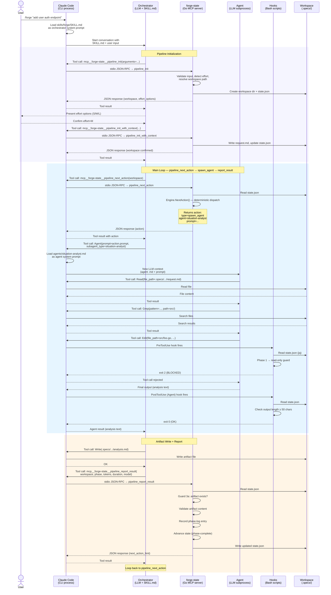

# Claude-Forge Plugin — Architecture

## Overview

A Claude Code plugin that decomposes software development into isolated phases, each executed by a specialized subagent. The main agent acts as a thin orchestrator — routing work, presenting summaries, and managing state — while subagents handle all code reading and writing.

## Core Design Principles

### 1. Files Are the API

Every phase writes its output to a markdown file in the workspace directory. Subsequent phases read only those files — never the conversation history. This means:
- Each subagent starts with a clean context window
- The orchestrator never accumulates large code blocks
- Interruption and resume are possible because all progress is on disk

### 2. Separation of Concerns: Orchestrator vs Agents

| Responsibility | Owner |
|---------------|-------|
| Phase sequencing & control flow | SKILL.md (orchestrator) |
| State transitions | Go MCP server (`mcp__forge-state__*` tools, called by orchestrator) |
| Constraint enforcement | Hook scripts (automatic) |
| Domain expertise (analysis, design, code) | Agent .md files |
| Runtime parameters | Orchestrator → Agent prompt |

The orchestrator passes only `{workspace}`, `{N}`, `{spec-name}`, etc. Agents know what files to read and what format to output from their own definitions.

### 3. State on Disk, Not in Memory

`state.json` is the single source of truth for pipeline progress. This solves three problems:
- **Context compaction**: When Claude compresses conversation history, state survives
- **Session restart**: Re-invoke the skill with a workspace path to resume
- **Hook coordination**: Hooks read state.json to know what phase is active

### 4. Hooks as Guardrails, Not Controllers

Hooks and MCP handler guards enforce invariants that LLM instructions alone cannot guarantee. See the [Guard Catalogue](#guard-catalogue--enforcement-reference) for the complete reference.

| Invariant | Prompt instruction (probabilistic) | Code enforcement (deterministic) |
|-----------|-----------------------------------|----------------------------------|
| Phase 1-2 read-only | "Do NOT write files" in agent.md | PreToolUse hook blocks Edit/Write (exit 2) |
| No parallel git commit | "Do NOT commit" in agent.md | PreToolUse hook blocks git commit when parallel tasks active |
| Checkpoint before complete | "Call $SM checkpoint" in SKILL.md | MCP handler Guard 3e blocks `phase_complete` unless `awaiting_human` |
| Artifact before advance | "Write artifact file" in SKILL.md | MCP handler Guard 3a blocks `phase_complete` when artifact file is missing |
| Pipeline completion | "Write summary.md" in SKILL.md | Stop hook blocks premature stop |

All hooks are **fail-open**: if jq is missing or state.json can't be read, the action is allowed. This prevents hooks from breaking non-pipeline work.

## Component Interaction — Runtime Processing Flow

The following diagram shows how the seven runtime components interact during a single pipeline phase. This is the lower-level view that complements the phase-level Sequence Diagram below.

### Components

| Component | Runtime form | Role |
|-----------|-------------|------|
| **User** | Human at terminal | Invokes `/forge`, reviews checkpoints |
| **Claude Code** | CLI process (`claude`) | Hosts the conversation, dispatches hooks, manages tool permissions |
| **Orchestrator (LLM)** | Claude LLM loaded with `SKILL.md` as system prompt | Thin control loop: calls MCP tools, spawns agents, presents results |
| **forge-state (MCP)** | Go binary (`forge-state-mcp`) running as stdio child process | State machine + orchestration engine. All 44 tools registered here |
| **Agent (LLM)** | Subagent spawned via `Agent` tool (separate LLM context) | Domain expert (analysis, design, implementation, review) |
| **Hooks** | Bash scripts triggered by Claude Code hook system | Deterministic guardrails (pre-tool, post-tool, stop) |
| **Workspace (.specs/)** | Files on disk | Artifact storage, `state.json`, all pipeline outputs |

### Processing Flow — Single Phase



### Key Observations

1. **SKILL.md is not code — it is an LLM system prompt.** Claude Code loads it as the orchestrator's instructions. The LLM follows it non-deterministically (hence the need for hook/guard enforcement).

2. **MCP server communicates via stdio JSON-RPC.** Claude Code spawns `forge-state-mcp` as a child process. All `mcp__forge-state__*` tool calls are routed through this channel.

3. **Agents are separate LLM contexts.** Each `Agent` tool call creates a new Claude LLM subprocess with its own agent `.md` as the system prompt. The agent has no access to the orchestrator's conversation history.

4. **Hooks fire synchronously on tool calls.** Claude Code invokes hook scripts before/after specific tool types. Hooks read `state.json` from disk — they share state with the MCP server but through the filesystem, not direct communication.

5. **The Engine (`orchestrator/engine.go`) is the brain.** `pipeline_next_action` calls `Engine.NextAction()` which makes all dispatch decisions deterministically from `state.json`. The LLM orchestrator merely executes the returned action — it does not choose what to do next.

6. **Three control planes coexist:**
   - **MCP handlers + Engine** → state transitions, action dispatch (deterministic)
   - **Hooks** → tool-call guardrails (deterministic, fail-open)
   - **SKILL.md** → orchestration protocol (non-deterministic, LLM-interpreted)

### MCP Pipeline Tool — Use-Case Mapping

The four `pipeline_*` MCP tools drive the entire pipeline lifecycle. Each tool name
maps to a concrete use case that the orchestrator (SKILL.md) performs:

| MCP Tool | Use Case | What Happens |
|---|---|---|
| `pipeline_init` | **Input parsing & resume detection** | Parse `/forge <input>`, detect source type (GitHub/Jira/text), check `.specs/` for existing workspace to resume, validate input. Returns workspace path, flags, and whether external data fetch is needed. |
| `pipeline_init_with_context` (1st call) | **External data fetch & effort detection** | Fetch GitHub/Jira context if needed. Auto-detect effort level (S/M/L) from task scope. Detect current branch state. Returns effort options and branch info for user confirmation. |
| `pipeline_init_with_context` (2nd call) | **Workspace finalisation & state init** | Receive user's confirmed effort, branch decision, and workspace slug. Create workspace directory, write `request.md` and `state.json`. Record branch setting. After this call, the workspace is ready and the branch is created. |
| `pipeline_next_action` | **Next action dispatch** | Read current `state.json`, run `Engine.NextAction()` to deterministically select the next action (spawn_agent, checkpoint, exec, write_file, or done). Enrich agent prompts with 4-layer assembly. |
| `pipeline_report_result` | **Phase result recording & state transition** | Record phase-log entry, validate artifact exists and meets content constraints, parse review verdicts (APPROVE/REVISE/PASS/FAIL), advance pipeline state to next phase. |

### Ideal Initialisation Flow

The initialisation flow is designed to minimise user interruptions by batching
all confirmation questions into a single prompt:

```
/forge <input>
    │
    ▼
pipeline_init ─── Input parsing & resume detection
    │                (validate input, detect source type, check for resume)
    │
    ▼
pipeline_init_with_context (1st) ─── External data fetch & effort detection
    │                                  (fetch GitHub/Jira data, auto-detect effort)
    │
    ▼
👤 Single user prompt:
    ├── Effort level: S / M / L
    ├── Branch: create new / use current
    └── Workspace slug confirmation
    │
    ▼
pipeline_init_with_context (2nd) ─── Workspace finalisation & state init
    │                                  (write state.json + request.md,
    │                                   return branch name + create_branch flag)
    │
    ▼
Orchestrator: git checkout -b <branch>  (if create_branch is true)
    │
    ▼
pipeline_next_action loop begins (Phase 1)
```

**Branch creation timing:** `pipeline_init_with_context` (2nd call) derives the
branch name deterministically and returns it with `create_branch: true`. The
orchestrator (SKILL.md) then runs `git checkout -b` immediately — not deferred
to Phase 5. This ensures all subsequent phases operate on the feature branch
from the start.

## Sequence Diagram

> **Note:** Shows the full `L` (full) effort flow. Lower effort levels (S, M) skip labelled phases — see the [Effort-driven Flow](#effort-driven-flow) section.

```mermaid
sequenceDiagram
    actor User
    participant Orch as Orchestrator<br>(SKILL.md)
    participant SM as Go MCP server<br>(forge-state)
    participant Hook as Hooks<br>(pre/post/stop)
    participant FS as Workspace<br>(.specs/)
    participant SA as situation-analyst
    participant INV as investigator
    participant ARCH as architect
    participant DR as design-reviewer
    participant TD as task-decomposer
    participant TR as task-reviewer
    participant IMP as implementer
    participant IR as impl-reviewer
    participant CR as comprehensive-reviewer
    participant VER as verifier

    %% ── Input Validation ──
    User->>Orch: /forge <args>
    Orch->>Orch: mcp__forge-state__validate_input (deterministic checks)
    Orch->>Orch: LLM coherence check (semantic)
    Note over Orch: Invalid → stop with error

    %% ── Workspace Setup ──
    Orch->>SM: init {workspace} {spec-name}
    SM->>FS: create state.json
    Orch->>SM: set-effort {workspace} {effort}
    Orch->>SM: set-auto-approve (if --auto)
    Orch->>FS: write request.md

    %% ── Phase 1 ──
    rect rgb(230, 245, 255)
    Note over Orch,SA: Phase 1 — Situation Analysis (read-only)
    Orch->>SM: phase-start phase-1
    Orch->>SA: Agent(workspace)
    Note over Hook: PreToolUse blocks<br>Edit/Write on source files
    SA-->>Orch: analysis output
    Note over Hook: PostToolUse checks<br>output quality
    Orch->>FS: write analysis.md
    Orch->>SM: phase-log phase-1 {tokens} {duration} {model}
    Orch->>SM: phase-complete phase-1
    end

    %% ── Phase 2 ──
    rect rgb(230, 245, 255)
    Note over Orch,INV: Phase 2 — Investigation (read-only)
    Orch->>SM: phase-start phase-2
    Orch->>INV: Agent(workspace)
    Note over Hook: PreToolUse blocks<br>Edit/Write on source files
    INV-->>Orch: investigation output
    Orch->>FS: write investigation.md
    Orch->>SM: phase-log phase-2 {tokens} {duration} {model}
    Orch->>SM: phase-complete phase-2
    end

    %% ── Phase 3 + 3b Loop ──
    rect rgb(255, 245, 230)
    Note over Orch,DR: Phase 3/3b — Design + AI Review (APPROVE/REVISE loop)
    loop max 2 revision cycles
        Orch->>SM: phase-start phase-3
        Orch->>ARCH: Agent(workspace)
        ARCH-->>Orch: design output
        Orch->>FS: write design.md
        Orch->>SM: phase-log phase-3
        Orch->>SM: phase-complete phase-3

        Orch->>SM: phase-start phase-3b
        Orch->>DR: Agent(workspace)
        DR-->>Orch: review-design output
        Orch->>FS: write review-design.md
        Orch->>SM: phase-log phase-3b
        Orch->>SM: phase-complete phase-3b
        break verdict = APPROVE
            Note over DR: APPROVE
        end
        alt verdict = APPROVE_WITH_NOTES (MINOR findings only)
            Note over Orch: Inline revision path
            Orch->>SM: inline-revision-bump design
            Orch->>FS: read design.md
            Orch->>FS: apply MINOR fixes inline (Edit tool)
            Orch->>SM: phase-start phase-3b
            Orch->>DR: Agent(workspace) — re-review only
            DR-->>Orch: review-design output (2nd pass)
            Orch->>FS: write review-design.md
            Orch->>SM: phase-log phase-3b
            Orch->>SM: phase-complete phase-3b
            break verdict = APPROVE or APPROVE_WITH_NOTES
                Note over DR: proceed to Checkpoint A
            end
            Note over DR: REVISE → fall through to full REVISE path
        else verdict = REVISE (CRITICAL findings)
            Note over DR: REVISE → re-run Phase 3
            Orch->>SM: revision-bump design
        end
    end
    end

    %% ── Checkpoint A ──
    rect rgb(255, 230, 230)
    Note over Orch,User: Checkpoint A — Human Reviews Design
    Orch->>SM: checkpoint checkpoint-a
    Note over Hook: checkpoint guard:<br>phase-complete blocked<br>until awaiting_human
    Orch->>User: Present design + AI review
    User-->>Orch: Approved / Feedback
    alt rejected
        Orch->>SM: re-run Phase 3
    else approved
        Orch->>SM: phase-complete checkpoint-a
    end
    end

    %% ── Phase 4 + 4b Loop ──
    rect rgb(255, 245, 230)
    Note over Orch,TR: Phase 4/4b — Tasks + AI Review (APPROVE/REVISE loop)
    loop max 2 revision cycles
        Orch->>SM: phase-start phase-4
        Orch->>TD: Agent(workspace)
        TD-->>Orch: tasks output
        Orch->>FS: write tasks.md
        Orch->>SM: phase-log phase-4
        Orch->>SM: phase-complete phase-4

        Orch->>SM: phase-start phase-4b
        Orch->>TR: Agent(workspace)
        TR-->>Orch: review-tasks output
        Orch->>FS: write review-tasks.md
        Orch->>SM: phase-log phase-4b
        Orch->>SM: phase-complete phase-4b
        break verdict = APPROVE
            Note over TR: APPROVE
        end
        alt verdict = APPROVE_WITH_NOTES (MINOR findings only)
            Note over Orch: Inline revision path
            Orch->>SM: inline-revision-bump tasks
            Orch->>FS: read tasks.md
            Orch->>FS: apply MINOR fixes inline (Edit tool)
            Orch->>SM: phase-start phase-4b
            Orch->>TR: Agent(workspace) — re-review only
            TR-->>Orch: review-tasks output (2nd pass)
            Orch->>FS: write review-tasks.md
            Orch->>SM: phase-log phase-4b
            Orch->>SM: phase-complete phase-4b
            break verdict = APPROVE or APPROVE_WITH_NOTES
                Note over TR: proceed to Checkpoint B
            end
            Note over TR: REVISE → fall through to full REVISE path
        else verdict = REVISE (CRITICAL findings)
            Note over TR: REVISE → re-run Phase 4
            Orch->>SM: revision-bump tasks
        end
    end
    end

    %% ── Checkpoint B ──
    rect rgb(255, 230, 230)
    Note over Orch,User: Checkpoint B — Human Reviews Tasks
    Orch->>SM: checkpoint checkpoint-b
    Orch->>User: Present tasks + AI review
    User-->>Orch: Approved / Feedback
    alt rejected
        Orch->>SM: re-run Phase 4
    else approved
        Orch->>SM: phase-complete checkpoint-b
        Orch->>SM: task-init {workspace} {tasks JSON}
    end
    end

    %% ── Phase 5 + 6 (per task) ──
    rect rgb(230, 255, 230)
    Note over Orch,IR: Phase 5/6 — Implementation + Review (per task)
    Orch->>SM: phase-start phase-5
    loop for each task (sequential or parallel groups)
        Orch->>SM: task-update {N} implStatus in_progress
        Orch->>IMP: Agent(workspace, task N)
        Note over Hook: PreToolUse blocks<br>git commit during<br>parallel execution
        IMP->>FS: write code + impl-{N}.md
        IMP-->>Orch: done
        Orch->>SM: phase-log task-{N}-impl
        Orch->>SM: task-update {N} implStatus completed
        Note over Orch: batch git commit<br>(parallel groups only)

        Orch->>SM: task-update {N} reviewStatus in_progress
        Orch->>IR: Agent(workspace, task N)
        IR-->>Orch: review-{N} output
        Orch->>FS: write review-{N}.md
        Orch->>SM: phase-log task-{N}-review
        alt PASS
            Orch->>SM: task-update {N} reviewStatus completed_pass
        else FAIL (retry <= 2)
            Orch->>SM: task-update {N} reviewStatus completed_fail
            Note over Orch: re-run impl + review
        end
    end
    Orch->>SM: phase-complete phase-5
    Orch->>SM: phase-complete phase-6
    end

    %% ── Phase 7 ──
    rect rgb(240, 230, 255)
    Note over Orch,CR: Phase 7 — Comprehensive Review
    Orch->>SM: phase-start phase-7
    Orch->>CR: Agent(workspace, spec-name)
    CR->>FS: fix code directly (if needed)
    CR-->>Orch: comprehensive-review output
    Orch->>FS: write comprehensive-review.md
    Orch->>SM: phase-log phase-7
    Orch->>SM: phase-complete phase-7
    end

    %% ── Final Verification ──
    rect rgb(240, 230, 255)
    Note over Orch,VER: Final Verification
    Orch->>SM: phase-start final-verification
    Orch->>VER: Agent(workspace, spec-name)
    VER->>FS: fix failures directly (if needed)
    VER-->>Orch: verification result
    Orch->>SM: phase-log final-verification
    Orch->>SM: phase-complete final-verification
    end

    %% ── PR + Summary + Final Commit ──
    rect rgb(245, 245, 245)
    Note over Orch,User: PR Creation + Final Summary + Final Commit
    Orch->>SM: phase-start pr-creation
    Orch->>Orch: git push + gh pr create
    Note over Orch: PR # is now known
    Orch->>SM: phase-complete pr-creation

    Orch->>SM: phase-start final-summary
    Orch->>SM: phase-stats (get metrics)
    Orch->>FS: write summary.md (includes PR #)
    Orch->>FS: append ## Improvement Report to summary.md
    Orch->>SM: phase-complete final-summary

    Orch->>SM: phase-start post-to-source
    opt source_type = github_issue or jira_issue
        Orch->>Orch: post summary comment
    end
    Orch->>SM: phase-complete post-to-source

    Orch->>SM: phase-start final-commit
    Note over Orch,FS: pipeline_report_result called FIRST to advance state.json to "completed"
    Orch->>SM: phase-complete final-commit (via pipeline_report_result)
    Orch->>Orch: git add summary.md state.json
    Orch->>Orch: git commit --amend --no-edit
    Orch->>Orch: git push --force-with-lease
    Note over Orch: PR branch now includes summary.md + state.json in final state
    Note over Hook: Stop hook: allows stop<br>only after summary.md exists
    Orch->>User: Present summary + PR link
    end
```



## Data Flow

> **Note:** The diagram below shows the full linear flow for effort `L` (`full` template). Lower effort levels (S, M) skip labelled phases — see the [Effort-driven Flow](#effort-driven-flow) section for the skip tables.

```
$ARGUMENTS
    │
    ▼
┌──────────────────┐
│ Input Validation  │ mcp__forge-state__validate_input (deterministic)
│                   │ + LLM coherence check (semantic)
└──────┬───────────┘
       │ invalid → stop with error
       ▼
┌──────────────────┐
│ Workspace Setup   │ → request.md, state.json
│ (detects effort,  │   (also sets effort/flowTemplate and calls
│  sets flow        │    skip-phase for each skipped phase upfront)
│  template)        │
└──────┬───────────┘
       │
       ▼
┌──────────────────┐
│ Phase 1           │ situation-analyst → analysis.md
│ Phase 2           │ investigator → investigation.md
└──────┬───────────┘
       │
       ▼
┌──────────────────────────────────────────────────┐
│ Phase 3 ←→ Phase 3b (APPROVE/REVISE loop)         │
│ architect → design.md                              │
│ design-reviewer → review-design.md                 │
└──────┬───────────────────────────────────────────┘
       │ Checkpoint A (human approval)
       ▼
┌──────────────────────────────────────────────────┐
│ Phase 4 ←→ Phase 4b (APPROVE/REVISE loop)         │
│ task-decomposer → tasks.md                         │
│ task-reviewer → review-tasks.md                    │
└──────┬───────────────────────────────────────────┘
       │ [phase-4b, checkpoint-b skipped for effort S and M]
       │ Checkpoint B (human approval; effort L only)
       ▼
┌──────────────────────────────────────────────────┐
│ Phase 5-6 (per task, parallel where safe)          │
│ implementer → code files + impl-{N}.md             │
│ impl-reviewer → review-{N}.md                      │
│ (FAIL → retry, max 2 attempts)                     │
└──────┬───────────────────────────────────────────┘
       ▼
┌──────────────────────────────────────────────────┐
│ Phase 7 — Comprehensive Review                     │
│ comprehensive-reviewer → comprehensive-review.md   │
└──────┬───────────────────────────────────────────┘
       │ [phase-7 skipped for effort S]
       ▼
┌──────────────────┐
│ Final Verification│ verifier (typecheck + test suite)
└──────┬───────────┘
       │
       ▼
┌──────────────────┐
│ PR Creation       │ git push + gh pr create → PR #
└──────┬───────────┘
       │
       ▼
┌──────────────────┐
│ Final Summary     │ → summary.md (includes PR #, Improvement Report)
└──────┬───────────┘
       │
       ▼
┌──────────────────┐
│ Post to Source    │ → GitHub/Jira comment (if applicable)
└──────┬───────────┘
       │
       ▼
┌──────────────────┐
│ Final Commit      │ pipeline_report_result → state.json = "completed"
│                   │ git add summary.md state.json
│                   │ git commit --amend --no-edit
│                   │ git push --force-with-lease
│                   │ (PR branch includes summary.md + state.json in final state)
└──────────────────┘
```

### What Each Agent Reads

The information flow is strictly forward — no agent reads output from a later phase.

| Agent | Reads from workspace |
|-------|---------------------|
| situation-analyst | request.md |
| investigator | request.md, analysis.md |
| architect | request.md, analysis.md, investigation.md (+review-design.md on revision) |
| design-reviewer | request.md, analysis.md, investigation.md, design.md |
| Checkpoint A (orchestrator) | design.md, review-design.md (to present summary to human) |
| task-decomposer | request.md, design.md, investigation.md (+review-tasks.md on revision) |
| task-reviewer | request.md, design.md, investigation.md, tasks.md |
| Checkpoint B (orchestrator) | tasks.md, review-tasks.md (to present summary to human) |
| implementer | request.md, design.md, tasks.md, review-{dep}.md (+review-{N}.md on retry) — plus `## Similar Past Implementations` block injected by orchestrator via `mcp__forge-state__search_patterns` (BM25) |
| impl-reviewer | request.md, tasks.md, design.md, impl-{N}.md, git diff (file-scoped, main...HEAD) |
| comprehensive-reviewer | request.md, design.md, tasks.md, all impl-{N}.md, all review-{N}.md, git diff + selective structural reads |
| verifier | (reads code on feature branch directly) |
| PR Creation (orchestrator) | request.md, design.md, tasks.md (for PR title and body) |
| Final Summary (orchestrator) | reads analysis.md and investigation.md (where present) for the Improvement Report epilogue; fixed input file list regardless of effort level |
| Post to Source (orchestrator) | summary.md, request.md (source metadata for comment target) |

### File-Writing Responsibility

- **Phases 1–4b, 6**: Agent returns output string → orchestrator writes the file
- **Phase 5**: Agent writes code files and impl-{N}.md directly (filesystem interaction required)
- **Phase 7**: Agent writes code fixes directly and returns comprehensive-review.md content
- **Final Verification**: Agent fixes issues directly, no artifact file
- **PR Creation**: Orchestrator handles directly (git push + gh pr create)
- **Final Summary**: Orchestrator writes summary.md (includes PR # obtained from PR Creation)
- **Post to Source**: Orchestrator handles directly (post comment to GitHub/Jira)
- **Final Commit**: Orchestrator calls `pipeline_report_result` first (advances state.json to "completed"), then amends last commit to include summary.md + state.json, then force-pushes (PR branch now includes summary.md + state.json in final state)

### Specs Index System

The specs index provides cross-pipeline learning — surfacing patterns from past runs to guide current agents.

**Components:**

| Component | Role |
|--------|------|
| `indexer.BuildSpecsIndex` | Go function in `mcp-server/indexer/specs_index.go`. Scans all workspace subdirectories within `.specs/` and writes `.specs/index.json`. Extracts `requestSummary`, `reviewFeedback` (from `review-*.md` REVISE verdicts), `implOutcomes`, `implPatterns` (from `impl-*.md` file-modification sections), and `outcome`. Invoked by `mcp__forge-state__refresh_index` after each completed pipeline. |
| `mcp__forge-state__search_patterns` | **Primary scoring path.** BM25 scorer exposed as an MCP tool. Reads `.specs/index.json` and `{workspace}/request.md`, scores past entries using BM25 (IDF-weighted term frequency with length normalisation; `k1=1.5`, `b=0.75`), and emits formatted markdown. Supports two modes: **review-feedback** (default) emits a `## Past Review Feedback` block; **impl** mode emits a `## Similar Past Implementations` block. MCP-only — no shell fallback exists. |

**Data flow:**

```
Completed pipeline
  └─► mcp__forge-state__refresh_index
        └─► indexer.BuildSpecsIndex → .specs/index.json

Next pipeline, Phase 3:
  orchestrator → mcp__forge-state__search_patterns(workspace, top_k=3, mode="review-feedback")
    → injects "## Past Review Feedback" into architect prompt

Next pipeline, Phase 4:
  orchestrator → mcp__forge-state__search_patterns(workspace, top_k=3, mode="review-feedback")
    → injects "## Past Review Feedback" into task-decomposer prompt

Next pipeline, Phase 5 (before each task):
  orchestrator → mcp__forge-state__search_patterns(workspace, top_k=2, mode="impl")
    → injects "## Similar Past Implementations" into implementer prompt
```

This system is append-only and read-only from the agents' perspective. Agents never write to the index; they only consume it via the orchestrator.

## State Machine

```
           ┌─────────┐
           │  setup   │ (initial)
           └────┬─────┘
                │ phase-complete
                ▼
           ┌─────────┐
     ┌────►│ phase-N  │◄────┐
     │     │ pending  │     │
     │     └────┬─────┘     │
     │          │ phase-start│
     │          ▼            │
     │     ┌─────────┐      │
     │     │ phase-N  │      │
     │     │ in_prog  │──────┤ (phase-fail → failed → retry)
     │     └────┬─────┘      │
     │          │ phase-complete
     │          ▼            │
     │     ┌──────────┐     │
     │     │checkpoint │     │
     │     │await_human│─────┘ (rejected → back to phase)
     │     └────┬──────┘
     │          │ phase-complete (approved)
     │          ▼
     └──────── next phase
                │
                ▼
           ┌─────────┐
           │completed │ (terminal)
           └─────────┘
```

State transitions are managed by Go MCP server commands (`mcp__forge-state__*`):
- `phase_start` → sets `in_progress`
- `phase_complete` → sets `completed`, advances to next phase
- `phase_fail` → sets `failed`, records error
- `checkpoint` → sets `awaiting_human`

## Effort-driven Flow

The pipeline adapts its execution based on the effort level. The orchestrator skips non-applicable phases upfront during Workspace Setup using the `skip-phase` command, so `currentPhase` already points past all skipped phases before the first real phase begins.

### Effort Levels and Phase Skip Tables

Three effort levels are supported. `L` runs the full pipeline. Lower levels skip phases:

| Effort | Template | Phases to skip |
|--------|----------|----------------|
| `S` | `light` | `phase-4b`, `checkpoint-b`, `phase-7` |
| `M` | `standard` | `phase-4b`, `checkpoint-b` |
| `L` | `full` | (none) |

**Rationale by effort level:**

- **`S` (light)**: Skips the task-review quality gate (`phase-4b`, `checkpoint-b`) and Comprehensive Review (`phase-7`). Suitable for small, focused tasks where task decomposition is straightforward and comprehensive post-implementation review is not warranted.
- **`M` (standard)**: Skips the task-review quality gate only. Phase 7 (Comprehensive Review) runs. Suitable for medium-sized features where implementation review is valuable but the task breakdown is simple enough not to require a separate quality gate.
- **`L` (full)**: All phases run including both checkpoints and Comprehensive Review. Suitable for large, complex tasks where every quality gate adds value.

### `state.json` Schema Additions

Several top-level fields have been added to `state.json` beyond the initial v1 schema:

```json
{
  "version": 1,
  "effort": "S | M | L | null",
  "flowTemplate": "light | standard | full | null",
  "skippedPhases": ["phase-4b", "checkpoint-b", "phase-7"],
  "autoApprove": false,
  "phaseLog": [
    {"phase": "phase-1", "tokens": 5000, "duration_ms": 30000, "model": "sonnet", "timestamp": "..."}
  ],
  ...
}
```

- `effort` is `null` until set during Workspace Setup. Set via `mcp__forge-state__set_effort`. Valid values: `S`, `M`, `L` (XS is not supported).
- `flowTemplate` is `null` until set during Workspace Setup. Set via `mcp__forge-state__set_flow_template`. Valid values: `light`, `standard`, `full`. Stored in state (not re-derived) to guarantee resume consistency.
- `skippedPhases` is `[]` until populated. Each call to `skip-phase` appends one phase ID to this array.
- `autoApprove` defaults to `false`. Set via `set-auto-approve` when `--auto` flag is present.
- `phaseLog` records per-phase metrics (tokens, duration, model) via `phase-log`. Used by `phase-stats` and the Final Summary Execution Stats table.
- `version` remains `1` — old state files simply lack these fields and the orchestrator treats absence as `null`/`[]`/`false` via the `resume-info` defaults.

**Invariant:** `completedPhases` and `skippedPhases` are mutually exclusive. A phase ID appears in at most one of these arrays. `phase-complete` adds to `completedPhases`; `skip-phase` adds to `skippedPhases`. Neither command modifies the other array.

### The `skip-phase` Command vs `phase-complete`

`phase-complete` and `skip-phase` are both mechanisms for advancing `currentPhase` to the next entry in the canonical PHASES array. They differ in their semantic meaning and side effects:

| Aspect | `phase-complete` | `skip-phase` |
|--------|-----------------|--------------|
| Meaning | Phase ran successfully | Phase was intentionally bypassed |
| Records in | `completedPhases` | `skippedPhases` |
| Advances `currentPhase` | Yes, via `next_phase()` | Yes, via the same `next_phase()` logic |
| Sets `currentPhaseStatus` | `"pending"` for next phase | `"pending"` for next phase |
| When called | After the phase agent completes | During Workspace Setup, before the phase runs |

Because `skip-phase` uses the same `next_phase()` ordering logic as `phase-complete`, the same ordering invariant applies: phases must be processed in canonical PHASES-array order, one call at a time, without gaps.

### Upfront-Skip Pattern

All `skip-phase` calls happen **upfront during Workspace Setup**, in canonical PHASES-array order, before the first real phase begins. This means:

1. The orchestrator determines `{effort}` during Workspace Setup.
2. It calls `mcp__forge-state__set_effort` with `{workspace}` and `{effort}`.
3. For each phase in the skip table (in canonical order), it calls `mcp__forge-state__skip_phase` with `{workspace}` and `<phase>`.
4. By the time the orchestrator reaches the first phase block, `currentPhase` already points past all skipped phases.

The orchestrator still checks a skip gate at each phase block — if the effort level maps to skipping that phase, it proceeds directly to the next block without calling `phase-start` or spawning an agent.

### Effort Detection Priority

The orchestrator detects `{effort}` using this priority order during Workspace Setup:

1. **Explicit flag**: `--effort=<value>` in `$ARGUMENTS` (strip from args before writing `request.md`; valid values: `S`, `M`, `L`; `XS` is rejected at input validation time)
2. **Jira story points**: read `customfield_10016` from the fetched Jira issue. If absent, None, non-numeric, or zero, fall through. Mapping: SP ≤ 4 → S, SP ≤ 12 → M, SP > 12 → L.
3. **Heuristic**: infer from task description complexity.
4. **Default**: `M` (safe fallback — matches current behavior for pipelines started before this feature was deployed)

After detection, call: `$SM set-effort {workspace} {effort}`

### Flow Template Selection

The effort level alone determines the `flowTemplate` string stored in state. XS effort is not supported; the minimum supported effort is S. After lookup, call: `$SM set-flow-template {workspace} {flow_template}`

| Effort | Template | Skipped phases |
|--------|----------|----------------|
| S | `light` | `phase-4b`, `checkpoint-b`, `phase-7` |
| M | `standard` | `phase-4b`, `checkpoint-b` |
| L | `full` | _(none)_ |

New Go helper functions:
- `EffortToTemplate(effort string) string` — maps effort to template name
- `SkipsForEffort(effort string) []string` — returns the canonical skip list for the given effort level

#### Template definitions

| Template | Phases run | Agent count |
|----------|-----------|-------------|
| `light` | Phase 1 → Phase 2 → Phase 3 → Phase 3b → Checkpoint A → Phase 4 → Phase 5 → Phase 6 → Verification → PR | 5+ |
| `standard` | Full pipeline (all phases, both checkpoints except 4b/checkpoint-b) | 10+ |
| `full` | Standard + all checkpoints mandatory (auto-approve disabled even with `--auto`) | 10+ |

#### Skip-set computation

The skip set for any pipeline run is determined entirely by the effort level. Skip sets are emitted as `skip-phase` calls in canonical PHASES-array order during Workspace Setup. The orchestrator computes the list upfront — no runtime re-computation is needed.

### Consolidated Artifact Availability

Single reference for which workspace artifact files are present after a completed pipeline. Derived from the effort-to-template table and the skip sets in [Flow Template Selection](#flow-template-selection).

**Legend:** `✓` agent-produced · `S` orchestrator stub · `—` not produced

`summary.md` is always produced and is omitted from the table.

| effort | template | `analysis.md` | `investigation.md` | `design.md` | `review-design.md` | `tasks.md` | `review-tasks.md` | `impl-{N}.md` | `review-{N}.md` | `comprehensive-review.md` |
|--------|----------|:---:|:---:|:---:|:---:|:---:|:---:|:---:|:---:|:---:|
| S | `light` | ✓ | ✓ | ✓ | ✓ | ✓ | — | ✓ | ✓ | — |
| M | `standard` | ✓ | ✓ | ✓ | ✓ | ✓ | ✓ | ✓ | ✓ | ✓ |
| L | `full` | ✓ | ✓ | ✓ | ✓ | ✓ | ✓ | ✓ | ✓ | ✓ |

### Resume Behaviour

On resume, the orchestrator restores `{effort}` from `resume_info.effort`, `{flow_template}` from `resume_info.flowTemplate`, and `{skipped_phases}` from `resume_info.skippedPhases`. Fallback rules:

- If `effort` is null (pipeline started before effort-only flow was deployed): default to `M` **in-context only** and log a note. Do NOT call `set-effort` — the `skippedPhases` already recorded in state remain authoritative.
- If `flowTemplate` is null: re-derive from effort using `EffortToTemplate` and store **in-context only**. Do NOT call `set-flow-template` — the original `skippedPhases` remain authoritative.
- Retain `{effort}` and `{flow_template}` as in-context variables for the duration of the resumed pipeline.

## Concurrency Model (Phase 5)

When tasks are marked `[parallel]`:
1. Orchestrator launches multiple `implementer` agents simultaneously
2. Hook blocks `git commit` for any Bash call when parallel tasks are `in_progress`
3. After all parallel agents complete, orchestrator does one batch `git commit`
4. The Go MCP server uses mutex-based locking for concurrent state.json updates

Sequential tasks self-commit and run one at a time.

## Hook Architecture

Hooks are defined in `hooks/hooks.json` and scripts live in `scripts/`.

```
hooks.json
  │
  ├── PreToolUse (Edit|Write|Bash) → pre-tool-hook.sh
  │     ├── Phase 1-2: blocks Edit/Write on non-workspace files
  │     ├── Phase 5: blocks git commit when parallel tasks active
  │     ├── Checkpoint guard: blocks phase-complete for checkpoint-a/b
  │     │   unless currentPhaseStatus is awaiting_human
  │     └── Artifact guard: blocks phase-complete when required artifact
  │         file (analysis.md, design.md, etc.) is missing
  │
  ├── PostToolUse (Agent) → post-agent-hook.sh
  │     ├── Checks output length (< 50 chars = warning)
  │     └── Checks verdict presence (APPROVE/REVISE/PASS/FAIL)
  │
  └── Stop → stop-hook.sh
        └── Blocks stop if pipeline active and summary.md missing
```

Environment: `CLAUDE_PROJECT_DIR` (project root), `CLAUDE_PLUGIN_ROOT` (plugin directory).

All hooks use `find_active_workspace()` which finds the most recently updated non-completed `state.json` in `.specs/*/`.

## Human Interaction Points

The pipeline pauses and returns control to the user at the following points. Points marked **blocking** require a response before the pipeline can continue; points marked **informational** present output with no further input needed.

### Input Validation

| # | Trigger | What the user sees | Blocking |
|---|---------|-------------------|---------|
| 1 | `mcp__forge-state__validate_input` returns an error (empty, too short, malformed URL) | Error message; pipeline stops | Yes — pipeline aborts |
| 2 | LLM judges input as gibberish or unrelated to software development | Rejection message with specific reason and valid-input examples; pipeline stops | Yes — pipeline aborts |
| 3 | Jira URL provided but `mcp__atlassian__getJiraIssue` tool unavailable | Error with plugin install instructions; pipeline stops | Yes — pipeline aborts |

### Workspace Setup

| # | Trigger | What the user sees | Blocking |
|---|---------|-------------------|---------|
| 4 | Current git branch is not `main`/`master` | Branch name shown; choice to use the current branch or create a new one | Yes — waits for choice |
| 5 | Effort level was inferred by heuristic | Inferred value with reasoning; asked to confirm or correct | Yes — waits for confirmation |
| 6 | `full` template and `--auto` flag used together | Warning that `full` mandates manual checkpoints; asked to continue without auto-approve or abort | Yes — waits for choice |

### Checkpoint A — Design Review

| # | Trigger | What the user sees | Blocking |
|---|---------|-------------------|---------|
| 7 | Auto-approve conditions met (`--auto` + AI verdict APPROVE or APPROVE_WITH_NOTES, no CRITICAL findings) | One-line notice: "Auto-approving Checkpoint A (AI verdict: …)" | No — informational |
| 8 | Human approval required (no `--auto`, or `full` template, or AI returned REVISE) | Design summary: approach, key changes, risk level, AI verdict, any MINOR findings, workspace path. Asked to approve or give feedback. Sound notification plays. After each revision cycle the updated design is re-presented and the pipeline stops again | Yes — **STOP AND WAIT** |

### Checkpoint B — Tasks Review

| # | Trigger | What the user sees | Blocking |
|---|---------|-------------------|---------|
| 9 | Auto-approve conditions met | One-line notice: "Auto-approving Checkpoint B (AI verdict: …)" | No — informational |
| 10 | Human approval required | Task overview: task count, risk level, AI verdict, any MINOR findings, workspace path. Asked to approve or give feedback. Sound notification plays. After each revision cycle the updated task list is re-presented and the pipeline stops again | Yes — **STOP AND WAIT** |

### Implementation (Phase 5–6 loop)

| # | Trigger | What the user sees | Blocking |
|---|---------|-------------------|---------|
| 11 | A task's impl-reviewer returns FAIL and the per-task retry limit (2) is exhausted | Failure report for that task; asked how to proceed | Yes — waits for instruction |
| 12 | A subagent returns empty or incoherent output and the single retry also fails | Failure reported; `phase-fail` recorded in state | Yes — pipeline stalls until user intervenes |
| 13 | Test suite fails after implementation completes | Failure output presented; `phase-fail` recorded in state | Yes — pipeline stalls |

### Final Verification

| # | Trigger | What the user sees | Blocking |
|---|---------|-------------------|---------|
| 14 | Verifier finds failures it cannot fix | Failure report presented to user | Yes — pipeline stalls |

### Pipeline End

| # | Trigger | What the user sees | Blocking |
|---|---------|-------------------|---------|
| 15 | `summary.md` written successfully | Full contents of `summary.md` displayed (request, branch, PR, task table, improvement report, execution stats). Sound notification plays. | No — informational |

> **Skipped checkpoints:** Checkpoint B is skipped for effort S and M (only effort L runs Checkpoint B). Phase 4b (task reviewer) is also skipped for effort S and M.

## Key Technical Decisions

### Why mkdir-based locking instead of flock?
macOS doesn't ship flock. The mkdir-based lock uses `mkdir` as an atomic operation (POSIX guarantee), with a 5-second timeout and force-break for stale locks. A trap ensures cleanup on unexpected exit.

### Why fail-open hooks?
The plugin may be installed in environments without `jq`, or `state.json` may be missing during non-pipeline work. Fail-closed would block legitimate operations. Each hook checks `command -v jq` and exits 0 if missing.

### Why all agents use model: sonnet?
Cost optimization. The pipeline spawns 10+ agents per run. Using opus for all would be expensive. The system prompts in agent .md files are detailed enough that sonnet produces good results. If a specific agent consistently underperforms, upgrade that one agent to opus.

### Why the orchestrator doesn't read code?
Token economy. If the orchestrator read implementation files, its context would grow with each phase, degrading reasoning quality. By only reading small artifact files (~500 lines total across all phases), the orchestrator stays fast and focused.

This rule extends to diff output: review agents (Phase 6 impl-reviewer, Phase 7 comprehensive-reviewer) self-execute `git diff main...HEAD` inside their own agent context rather than having the orchestrator pre-compute and inject the diff. The diff is consumed in the agent's context, not the orchestrator's — the Token Economy Rule is satisfied.

### Why separate agent files instead of inline prompts?
1. Each agent has a persistent, versionable system prompt
2. Agents can be reused from other skills
3. Model can be configured per-agent in frontmatter
4. The orchestrator SKILL.md stays small (~500 lines vs ~900 with inline prompts)

### Guard migration pattern (shell → Go MCP handler)

When a new guard is added to `pre-tool-hook.sh` (e.g., Rule 3a–3j), the same invariant
must also be enforced inside the corresponding Go MCP tool handler in `mcp-server/tools/`.
The pattern:

1. **Shell hook** (`pre-tool-hook.sh`): guards that fire on bash/edit tool calls. These use
   `state.json` on disk, read with `jq`. They block the bash command via exit 2. This layer
   is always active — even when the MCP server is not installed.

2. **Go handler** (`tools/guards.go`): guards that fire when MCP tools are called. These read
   `state.State` already loaded from `state.ReadState()`. Blocking guards return
   `IsError=true`; non-blocking warnings are included under the `"warning"` JSON key.

The two layers are **independent and complementary**. When the MCP server is in use, the Go
handler fires first. The shell hook still fires on any `Bash` tool calls.

**Migration checklist** when adding a new guard:
- [ ] Add a named check function to `pre-tool-hook.sh` (do not inline in dispatch block)
- [ ] Add a corresponding function in `mcp-server/tools/guards.go` (blocking: returns `error`; warning: returns `string`)
- [ ] Call it from the relevant handler(s) in `mcp-server/tools/handlers.go`
- [ ] Add tests for both the shell guard (`test-hooks.sh`) and the Go guard (`tools/guards_test.go`)
- [ ] Document the new rule in the "Guard Catalogue — Enforcement Reference" section below

### Why are analysis.md and investigation.md separate files?

The two Phase 1–2 output files have distinct roles and a strict data dependency between them:

- **analysis.md** (Phase 1 — situation-analyst): maps the *current state* of the codebase — relevant files, interfaces, types, data flows, and existing tests. It is a read-only survey with no opinion on what should change.
- **investigation.md** (Phase 2 — investigator): builds *on top of* analysis.md — the investigator agent reads analysis.md as an explicit input before adding root cause analysis, edge cases, risks, external dependencies, prior art, ambiguities, and deletion/rename impact.

Merging them into one file would break this sequential dependency: the investigator would have to both read and write the same file, or the Phase 1 content would have to be injected into its prompt instead of residing on disk (violating the Files-Are-the-API principle).

Four additional reasons the split is load-bearing:

1. **Resume semantics** — each file is a separate phase checkpoint. If Phase 2 fails, Phase 1's analysis.md is already on disk and the investigator can retry without re-running the situation analyst.
2. **Consumer granularity** — `task-decomposer` (Phase 4) reads only `investigation.md`; `architect` and `design-reviewer` read both. Separate files let each consumer load exactly what it needs.
3. **Artifact guards** — `pipeline_report_result` validates `analysis.md` on Phase 1 completion and `investigation.md` on Phase 2 completion independently. A single merged file would require one guard to validate two distinct sections, coupling the guard logic to content structure.
4. **Investigation flow** — when the pipeline is run as an investigation (no implementation phases), it ends after Phase 2 and presents both files as the final deliverable to the user. Keeping them separate makes the output navigable as two named documents.

The two-file split is maintained regardless of effort level. Even though both files are produced in the same pipeline run, they serve distinct roles and are consumed by different downstream agents.

### Why inline comment anchors for SKILL.md cross-references?

SKILL.md is consumed by an LLM reading raw Markdown, not a renderer. HTML anchors
(`<a id="...">`) would be invisible in rendered view but visible to the LLM in raw text.
The chosen convention appends `<!-- anchor: <token> -->` to target headings and uses the
token (not the heading text) in all prose references. Tokens are short, lowercase,
hyphenated, and can be searched with `grep anchor:`. This is the stable-label convention
for SKILL.md. When adding new cross-referenced sections, follow this pattern.

---

## Guard Catalogue — Enforcement Reference

This section is the authoritative reference for every enforcement mechanism in claude-forge. Each entry documents **what** is enforced, **which layer** enforces it, and **whether it is deterministic**.

### Enforcement layers

claude-forge uses four enforcement layers, listed from most to least reliable:

| Layer | Mechanism | Determinism | Failure mode |
|---|---|---|---|
| **Go MCP handler** | Guard functions in `tools/guards.go` called by handlers in `tools/handlers.go`. Return `error` (blocking) or `string` (warning). | Deterministic | `IsError=true` MCP response; state not mutated |
| **Go engine** | Decision logic in `orchestrator/engine.go`. Controls phase transitions, auto-approve, retry limits, skip gates. | Deterministic | Returns specific action types; orchestrator must follow |
| **Shell hook** | Bash scripts in `scripts/`. Fire on tool calls via Claude Code hook system. Exit 2 = block. | Deterministic (fail-open if `jq` missing) | Exit 2 blocks the tool call; exit 0 allows |
| **Prompt instruction** | Text in `SKILL.md` or agent `.md` files. Followed by the LLM non-deterministically. | **Non-deterministic** | LLM may skip or misinterpret |

**Design principle:** All critical invariants (data integrity, human approval gates, safety constraints) are enforced by code (layers 1–3). Prompt instructions (layer 4) are used only for orchestration protocol compliance where code enforcement is impractical.

### Blocking guards (prevent state mutation)

These guards return errors and halt progression. The pipeline cannot advance until the condition is satisfied.

| ID | Invariant | Layer | Code location | Trigger |
|---|---|---|---|---|
| 3a | Artifact file must exist before phase-complete | MCP handler | `guards.go:Guard3aArtifactExists` | `phase_complete` for phases with required artifacts |
| 3b | Review file must exist before marking task review as passed | MCP handler | `guards.go:Guard3bReviewFileExists` | `task_update` with `reviewStatus=completed_pass` |
| 3c | Tasks must be initialized before phase-5 starts | MCP handler | `guards.go:Guard3cTasksNonEmpty` | `phase_start` for `phase-5` |
| 3e | Checkpoint requires `awaiting_human` status before completion | MCP handler | `guards.go:Guard3eCheckpointAwaitingHuman` | `phase_complete` for `checkpoint-a`, `checkpoint-b` |
| 3g | Checkpoint B must be done/skipped before task initialization | MCP handler | `guards.go:Guard3gCheckpointBDoneOrSkipped` | `task_init` |
| 3j | Pending revision must be cleared before checkpoint completion | MCP handler | `guards.go:Guard3jCheckpointRevisionPending` | `phase_complete` for `checkpoint-a`, `checkpoint-b` |
| — | Init requires prior input validation | MCP handler | `guards.go:GuardInitValidated` | `init` with `validated=false` |
| — | Artifact content must pass validation | MCP handler | `pipeline_report_result.go` | `pipeline_report_result` for review phases |
| R1 | Source edits blocked during phase-1/2 (read-only) | Shell hook | `pre-tool-hook.sh` Rule 1 | `Edit`/`Write` tool targeting files outside workspace |
| R2 | Git commits blocked during parallel phase-5 execution | Shell hook | `pre-tool-hook.sh` Rule 2 | `Bash` tool with `git commit` while parallel tasks active |
| R5 | Git checkout/switch to main/master blocked during active pipeline | Shell hook | `pre-tool-hook.sh` Rule 5 | `Bash` tool with `git checkout main` or `git switch master` |
| — | Stop signal blocked during active pipeline | Shell hook | `stop-hook.sh` | Claude Code stop when status not in `completed`, `abandoned`, `awaiting_human` |

### Non-blocking warnings (alert but allow)

These checks inject warnings into the conversation but do not prevent the action.

| ID | Check | Layer | Code location | Trigger |
|---|---|---|---|---|
| 3d | Duplicate phase-log entry | MCP handler | `guards.go:Warn3dPhaseLogDuplicate` | `phase_log` |
| 3f | Missing phase-log entry at phase completion | MCP handler | `guards.go:Warn3fPhaseLogMissing` | `phase_complete` for phases requiring logs |
| 3h | Task number not found in state | MCP handler | `guards.go:Warn3hTaskNotFound` | `task_update` |
| 3i | Phase status not `in_progress` at completion | MCP handler | `guards.go:Warn3iPhaseNotInProgress` | `phase_complete` |
| — | Agent output too short (< 50 chars) | Shell hook | `post-agent-hook.sh` | `Agent` tool return during active phase |
| — | Review agent output missing verdict keyword | Shell hook | `post-agent-hook.sh` | `Agent` tool return during `phase-3b`, `phase-4b` |
| — | Impl review output missing PASS/FAIL keyword | Shell hook | `post-agent-hook.sh` | `Agent` tool return during `phase-6` |

### Engine decisions (deterministic branching)

The orchestrator engine (`orchestrator/engine.go`) makes all phase-transition decisions deterministically based on state. The LLM orchestrator receives an action to execute; it does not choose what to do next.

| ID | Decision | Condition | Behavior | Code location |
|---|---|---|---|---|
| D14 | Phase skip | Phase in `skippedPhases` | Returns `done` action with `skip:` prefix; orchestrator calls `phase_complete` | `engine.go` top of `NextAction` |
| D20 | Auto-approve (checkpoint bypass) | `autoApprove == true` AND verdict is `APPROVE` or `APPROVE_WITH_NOTES` | Spawns next phase agent, bypassing checkpoint | `engine.go` phase-3b/4b handlers |
| D21 | Retry limit (2×) | `designRevisions >= 2` or `taskRevisions >= 2` or `implRetries >= 2` | Forces human checkpoint (approve or abandon) | `engine.go` phase-3b/4b/6 handlers |
| D22 | Parallel task dispatch | First pending task has `executionMode == "parallel"` | Spawns all consecutive parallel tasks simultaneously | `engine.go` phase-5 handler |
| D23 | Impl review verdict routing | Parsed verdict from `review-N.md` | FAIL → re-spawn implementer; PASS → next task | `engine.go` phase-6 handler |
| D24 | PR skip | `skipPr == true` | Returns `done` action, bypasses PR creation | `engine.go` pr-creation handler |
| D26 | Post-to-source dispatch | `source_type` from `request.md` frontmatter | GitHub → `gh` command; Jira → checkpoint; text → done | `engine.go` post-to-source handler |

### Artifact validation (deterministic content checks)

The `validation/artifact.go` package validates artifact content when `pipeline_report_result` is called. Validation failures block phase advancement.

| Phase | Required artifact | Content rule |
|---|---|---|
| phase-1 | `analysis.md` | Must contain `## ` heading |
| phase-2 | `investigation.md` | Must contain `## ` heading |
| phase-3 | `design.md` | Must contain `## ` heading |
| phase-3b | `review-design.md` | Must contain `APPROVE`, `APPROVE_WITH_NOTES`, or `REVISE` |
| phase-4 | `tasks.md` | Must contain `## Task` heading |
| phase-4b | `review-tasks.md` | Must contain `APPROVE`, `APPROVE_WITH_NOTES`, or `REVISE` |
| phase-6 | `review-N.md` | Must contain `PASS`, `PASS_WITH_NOTES`, or `FAIL` |
| phase-7 | `comprehensive-review.md` | Must be non-empty |
| final-summary | `summary.md` | Must exist |

Findings markers (`[CRITICAL]`, `[MINOR]`) are counted and accumulated into the pattern knowledge base for historical analysis. This is non-blocking.

### Automated side effects (deterministic actions)

| Action | Layer | Code location | Trigger |
|---|---|---|---|
| Final commit: amend `summary.md` + `state.json` into last commit, then force-push | Shell hook (v1) / Engine exec action (v2) | `post-bash-hook.sh` (v1 legacy) / `engine.go` final-commit action (v2) | After `post-to-source` phase completes; `pipeline_report_result` called first so state.json is in "completed" state when committed |
| Revision counter increment | MCP handler | `pipeline_report_result.go` | `REVISE` verdict in review phases |
| Pattern knowledge accumulation | MCP handler | `pipeline_report_result.go` | Any review phase completion with findings |

### Prompt-only instructions (non-deterministic)

These behaviors are enforced **only** by LLM instructions. They cannot be guaranteed by code because they involve orchestration-level decisions that are impractical to express as state guards.

| Instruction | Location | Why not code-enforced |
|---|---|---|
| Never pass `isolation: "worktree"` to Agent calls | SKILL.md | Claude Code Agent tool parameter; no hook intercept point for Agent tool arguments |
| Always call `pipeline_report_result` after `spawn_agent`, `exec`, `write_file` | SKILL.md | Omission is a no-op (missing metric), not a state corruption; adding a timeout guard would add complexity disproportionate to risk |
| Wait for human response before calling `phase_complete` on checkpoints | SKILL.md | The **wait** itself is prompt-only, but the **gate** is deterministic: Guard 3e blocks `phase_complete` unless `checkpoint()` was called first, so the LLM cannot skip the checkpoint even if it doesn't wait |
| Parse `skip:` prefix from `done` action and call `phase_complete` | SKILL.md | Engine returns the skip signal; if the orchestrator fails to parse it, `pipeline_next_action` returns the same skip signal again (self-correcting loop) |

### Dual-layer enforcement map

Some invariants are enforced at both the shell hook layer and the Go MCP handler layer. This provides defense-in-depth: the MCP handler fires first on MCP tool calls; the shell hook fires independently on `Bash`/`Edit`/`Write` tool calls.

| Invariant | Shell hook | MCP handler |
|---|---|---|
| Artifact must exist before phase advancement | — | Guard 3a (`phase_complete`) + `pipeline_report_result` validation |
| Checkpoint requires human approval | — | Guard 3e (`phase_complete` requires `awaiting_human`) |
| Phase 1-2 read-only | Rule 1 (`pre-tool-hook.sh`) | — (agents don't call MCP tools to edit files) |
| No parallel git commits | Rule 2 (`pre-tool-hook.sh`) | — (git commits go through `Bash` tool, not MCP) |
| No checkout to main/master | Rule 5 (`pre-tool-hook.sh`) | — (branch operations go through `Bash` tool) |
| Review verdict extraction | Shell warning (`post-agent-hook.sh`) | Artifact content validation (`validation/artifact.go`) |

### Fail-open guarantees

All shell hooks are fail-open: if `jq` is not installed or `state.json` cannot be read, the hook exits 0 (allow). This ensures the plugin never blocks legitimate non-pipeline work.

```bash
# Every hook starts with this pattern:
command -v jq >/dev/null 2>&1 || exit 0
```

## Go Package Layering

The `mcp-server/internal/` packages form a strict one-way import DAG. Violating this direction causes an import cycle and a build failure; `import_cycle_test.go` enforces it.

```
tools  →  orchestrator  →  state
  │              │
  └──────────────┴──→  (shared packages: history, profile, prompt, validation, events)
```

**Rules:**
- `state` must never import `orchestrator` or `tools`.
- `orchestrator` must never import `tools`.
- `tools` may import any package below it.
- Shared packages (`history`, `profile`, `prompt`, `validation`, `events`) may import `state` but must not import `orchestrator` or `tools`.

**Why:** `state` is the persistence layer with no domain logic. `orchestrator` contains the pipeline state machine (`Engine.NextAction`). `tools` wraps `orchestrator` in MCP handlers and adds enrichment (agent prompts, history search). Keeping this direction one-way ensures each layer can be tested without mocking its dependents.

Go MCP handlers are NOT fail-open for their own operations — guard failures return `IsError=true`. However, the MCP server being unavailable does not block shell-level operations (the two layers are independent).
