# Claude-Forge Plugin — Architecture

## Overview

A Claude Code plugin that decomposes software development into isolated phases, each executed by a specialized subagent. The main agent acts as a thin orchestrator — routing work, presenting summaries, and managing state — while subagents handle all code reading and writing.

## Core Design Principles

### 1. Files Are the API

Every phase writes its output to a markdown file in the workspace directory. Subsequent phases read only those files — never the conversation history. This means:
- Each subagent starts with a clean context window
- The orchestrator never accumulates large code blocks
- Interruption and resume are possible because all progress is on disk

### 2. Separation of Concerns: Orchestrator vs Agents

| Responsibility | Owner |
|---------------|-------|
| Phase sequencing & control flow | SKILL.md (orchestrator) |
| State transitions | state-manager.sh (called by orchestrator) |
| Constraint enforcement | Hook scripts (automatic) |
| Domain expertise (analysis, design, code) | Agent .md files |
| Runtime parameters | Orchestrator → Agent prompt |

The orchestrator passes only `{workspace}`, `{N}`, `{spec-name}`, etc. Agents know what files to read and what format to output from their own definitions.

### 3. State on Disk, Not in Memory

`state.json` is the single source of truth for pipeline progress. This solves three problems:
- **Context compaction**: When Claude compresses conversation history, state survives
- **Session restart**: Re-invoke the skill with a workspace path to resume
- **Hook coordination**: Hooks read state.json to know what phase is active

### 4. Hooks as Guardrails, Not Controllers

Hooks enforce invariants that LLM instructions alone cannot guarantee:

| Invariant | Prompt instruction (probabilistic) | Hook enforcement (deterministic) |
|-----------|-----------------------------------|----------------------------------|
| Phase 1-2 read-only | "Do NOT write files" in agent.md | PreToolUse blocks Edit/Write (exit 2) |
| No parallel git commit | "Do NOT commit" in agent.md | PreToolUse blocks git commit when parallel tasks active |
| Checkpoint before complete | "Call $SM checkpoint" in SKILL.md | PreToolUse blocks phase-complete for checkpoint phases unless `awaiting_human` (exit 2) |
| Artifact before advance | "Write artifact file" in SKILL.md | PreToolUse blocks phase-complete when required artifact file is missing (exit 2) |
| Pipeline completion | "Write summary.md" in SKILL.md | Stop hook blocks premature stop |

All hooks are **fail-open**: if jq is missing or state.json can't be read, the action is allowed. This prevents hooks from breaking non-pipeline work.

## Sequence Diagram

> **Note:** Shows the full `feature` flow. Other task types skip labelled phases — see the [Task-type-aware Flow](#task-type-aware-flow) section.

```mermaid
sequenceDiagram
    actor User
    participant Orch as Orchestrator<br>(SKILL.md)
    participant SM as state-manager.sh
    participant Hook as Hooks<br>(pre/post/stop)
    participant FS as Workspace<br>(.specs/)
    participant SA as situation-analyst
    participant INV as investigator
    participant ARCH as architect
    participant DR as design-reviewer
    participant TD as task-decomposer
    participant TR as task-reviewer
    participant IMP as implementer
    participant IR as impl-reviewer
    participant CR as comprehensive-reviewer
    participant VER as verifier

    %% ── Input Validation ──
    User->>Orch: /forge <args>
    Orch->>Orch: bash validate-input.sh (deterministic checks)
    Orch->>Orch: LLM coherence check (semantic)
    Note over Orch: Invalid → stop with error

    %% ── Workspace Setup ──
    Orch->>SM: init {workspace} {spec-name}
    SM->>FS: create state.json
    Orch->>SM: set-task-type {workspace} feature
    Orch->>SM: set-auto-approve (if --auto)
    Orch->>FS: write request.md

    %% ── Phase 1 ──
    rect rgb(230, 245, 255)
    Note over Orch,SA: Phase 1 — Situation Analysis (read-only)
    Orch->>SM: phase-start phase-1
    Orch->>SA: Agent(workspace)
    Note over Hook: PreToolUse blocks<br>Edit/Write on source files
    SA-->>Orch: analysis output
    Note over Hook: PostToolUse checks<br>output quality
    Orch->>FS: write analysis.md
    Orch->>SM: phase-log phase-1 {tokens} {duration} {model}
    Orch->>SM: phase-complete phase-1
    end

    %% ── Phase 2 ──
    rect rgb(230, 245, 255)
    Note over Orch,INV: Phase 2 — Investigation (read-only)
    Orch->>SM: phase-start phase-2
    Orch->>INV: Agent(workspace)
    Note over Hook: PreToolUse blocks<br>Edit/Write on source files
    INV-->>Orch: investigation output
    Orch->>FS: write investigation.md
    Orch->>SM: phase-log phase-2 {tokens} {duration} {model}
    Orch->>SM: phase-complete phase-2
    end

    %% ── Phase 3 + 3b Loop ──
    rect rgb(255, 245, 230)
    Note over Orch,DR: Phase 3/3b — Design + AI Review (APPROVE/REVISE loop)
    loop max 2 revision cycles
        Orch->>SM: phase-start phase-3
        Orch->>ARCH: Agent(workspace)
        ARCH-->>Orch: design output
        Orch->>FS: write design.md
        Orch->>SM: phase-log phase-3
        Orch->>SM: phase-complete phase-3

        Orch->>SM: phase-start phase-3b
        Orch->>DR: Agent(workspace)
        DR-->>Orch: review-design output
        Orch->>FS: write review-design.md
        Orch->>SM: phase-log phase-3b
        Orch->>SM: phase-complete phase-3b
        break verdict = APPROVE
            Note over DR: APPROVE
        end
        Note over DR: REVISE → re-run Phase 3
        Orch->>SM: revision-bump design
    end
    end

    %% ── Checkpoint A ──
    rect rgb(255, 230, 230)
    Note over Orch,User: Checkpoint A — Human Reviews Design
    Orch->>SM: checkpoint checkpoint-a
    Note over Hook: checkpoint guard:<br>phase-complete blocked<br>until awaiting_human
    Orch->>User: Present design + AI review
    User-->>Orch: Approved / Feedback
    alt rejected
        Orch->>SM: re-run Phase 3
    else approved
        Orch->>SM: phase-complete checkpoint-a
    end
    end

    %% ── Phase 4 + 4b Loop ──
    rect rgb(255, 245, 230)
    Note over Orch,TR: Phase 4/4b — Tasks + AI Review (APPROVE/REVISE loop)
    loop max 2 revision cycles
        Orch->>SM: phase-start phase-4
        Orch->>TD: Agent(workspace)
        TD-->>Orch: tasks output
        Orch->>FS: write tasks.md
        Orch->>SM: phase-log phase-4
        Orch->>SM: phase-complete phase-4

        Orch->>SM: phase-start phase-4b
        Orch->>TR: Agent(workspace)
        TR-->>Orch: review-tasks output
        Orch->>FS: write review-tasks.md
        Orch->>SM: phase-log phase-4b
        Orch->>SM: phase-complete phase-4b
        break verdict = APPROVE
            Note over TR: APPROVE
        end
        Note over TR: REVISE → re-run Phase 4
        Orch->>SM: revision-bump tasks
    end
    end

    %% ── Checkpoint B ──
    rect rgb(255, 230, 230)
    Note over Orch,User: Checkpoint B — Human Reviews Tasks
    Orch->>SM: checkpoint checkpoint-b
    Orch->>User: Present tasks + AI review
    User-->>Orch: Approved / Feedback
    alt rejected
        Orch->>SM: re-run Phase 4
    else approved
        Orch->>SM: phase-complete checkpoint-b
        Orch->>SM: task-init {workspace} {tasks JSON}
    end
    end

    %% ── Phase 5 + 6 (per task) ──
    rect rgb(230, 255, 230)
    Note over Orch,IR: Phase 5/6 — Implementation + Review (per task)
    Orch->>SM: phase-start phase-5
    loop for each task (sequential or parallel groups)
        Orch->>SM: task-update {N} implStatus in_progress
        Orch->>IMP: Agent(workspace, task N)
        Note over Hook: PreToolUse blocks<br>git commit during<br>parallel execution
        IMP->>FS: write code + impl-{N}.md
        IMP-->>Orch: done
        Orch->>SM: phase-log task-{N}-impl
        Orch->>SM: task-update {N} implStatus completed
        Note over Orch: batch git commit<br>(parallel groups only)

        Orch->>SM: task-update {N} reviewStatus in_progress
        Orch->>IR: Agent(workspace, task N)
        IR-->>Orch: review-{N} output
        Orch->>FS: write review-{N}.md
        Orch->>SM: phase-log task-{N}-review
        alt PASS
            Orch->>SM: task-update {N} reviewStatus completed_pass
        else FAIL (retry <= 2)
            Orch->>SM: task-update {N} reviewStatus completed_fail
            Note over Orch: re-run impl + review
        end
    end
    Orch->>SM: phase-complete phase-5
    Orch->>SM: phase-complete phase-6
    end

    %% ── Phase 7 ──
    rect rgb(240, 230, 255)
    Note over Orch,CR: Phase 7 — Comprehensive Review
    Orch->>SM: phase-start phase-7
    Orch->>CR: Agent(workspace, spec-name)
    CR->>FS: fix code directly (if needed)
    CR-->>Orch: comprehensive-review output
    Orch->>FS: write comprehensive-review.md
    Orch->>SM: phase-log phase-7
    Orch->>SM: phase-complete phase-7
    end

    %% ── Final Verification ──
    rect rgb(240, 230, 255)
    Note over Orch,VER: Final Verification
    Orch->>SM: phase-start final-verification
    Orch->>VER: Agent(workspace, spec-name)
    VER->>FS: fix failures directly (if needed)
    VER-->>Orch: verification result
    Orch->>SM: phase-log final-verification
    Orch->>SM: phase-complete final-verification
    end

    %% ── PR + Summary ──
    rect rgb(245, 245, 245)
    Note over Orch,User: PR Creation + Final Summary + Improvement Report
    Orch->>SM: phase-start pr-creation
    Orch->>Orch: git push + gh pr create
    Orch->>SM: phase-complete pr-creation

    Orch->>SM: phase-start final-summary
    Orch->>SM: phase-stats (get metrics)
    Orch->>FS: write summary.md
    Orch->>FS: append ## Improvement Report to summary.md
    Orch->>SM: phase-complete final-summary

    Orch->>SM: phase-start post-to-source
    opt source_type = github_issue or jira_issue
        Orch->>Orch: post summary comment
    end
    Orch->>SM: phase-complete post-to-source
    Note over Hook: Stop hook: allows stop<br>only after summary.md exists
    Orch->>User: Present summary + PR link
    end
```



## Data Flow

> **Note:** The diagram below shows the full linear flow for the `feature` task type (the default). Other task types (`bugfix`, `investigation`, `docs`, `refactor`) omit labelled phases — see the [Task-type-aware Flow](#task-type-aware-flow) section for the skip tables and flow variations.

```
$ARGUMENTS
    │
    ▼
┌──────────────────┐
│ Input Validation  │ validate-input.sh (deterministic)
│                   │ + LLM coherence check (semantic)
└──────┬───────────┘
       │ invalid → stop with error
       ▼
┌──────────────────┐
│ Workspace Setup   │ → request.md, state.json
│ (detects task     │   (also sets taskType and calls skip-phase
│  type, sets       │    for each skipped phase upfront)
│  skipped phases)  │
└──────┬───────────┘
       │
       ▼
┌──────────────────┐
│ Phase 1           │ situation-analyst → analysis.md
│ Phase 2           │ investigator → investigation.md
└──────┬───────────┘   [phase-2 skipped for docs]
       │
       ▼
┌──────────────────────────────────────────────────┐
│ Phase 3 ←→ Phase 3b (APPROVE/REVISE loop)         │
│ architect → design.md                              │
│ design-reviewer → review-design.md                 │
└──────┬───────────────────────────────────────────┘
       │ [phase-3 skipped for docs (stub written instead); phase-3b and checkpoint-a run for all task types]
       │ Checkpoint A (human approval)
       ▼
┌──────────────────────────────────────────────────┐
│ Phase 4 ←→ Phase 4b (APPROVE/REVISE loop)         │
│ task-decomposer → tasks.md                         │
│ task-reviewer → review-tasks.md                    │
└──────┬───────────────────────────────────────────┘
       │ [phase-4, phase-4b, checkpoint-b skipped for bugfix/docs/investigation]
       │ Checkpoint B (human approval)
       ▼
┌──────────────────────────────────────────────────┐
│ Phase 5-6 (per task, parallel where safe)          │
│ implementer → code files + impl-{N}.md             │
│ impl-reviewer → review-{N}.md                      │
│ (FAIL → retry, max 2 attempts)                     │
└──────┬───────────────────────────────────────────┘
       │ [phase-5, phase-6 skipped for investigation]
       ▼
┌──────────────────────────────────────────────────┐
│ Phase 7 — Comprehensive Review                     │
│ comprehensive-reviewer → comprehensive-review.md   │
└──────┬───────────────────────────────────────────┘
       │ [phase-7 skipped for bugfix/docs/investigation]
       ▼
┌──────────────────┐
│ Final Verification│ verifier (typecheck + test suite)
└──────┬───────────┘  [skipped for investigation]
       │
       ▼
┌──────────────────┐
│ PR Creation       │ git push + gh pr create → PR #
└──────┬───────────┘  [skipped for investigation]
       │
       ▼
┌──────────────────┐
│ Final Summary     │ → summary.md (includes PR #, Improvement Report)
└──────┬───────────┘
       │
       ▼
┌──────────────────┐
│ Post to Source    │ → GitHub/Jira comment (if applicable)
└──────────────────┘
```

### What Each Agent Reads

The information flow is strictly forward — no agent reads output from a later phase.

| Agent | Reads from workspace |
|-------|---------------------|
| situation-analyst | request.md |
| investigator | request.md, analysis.md |
| architect | request.md, analysis.md, investigation.md (+review-design.md on revision) — _investigation.md is optional: absent only if phase-2 was unexpectedly skipped for a non-docs flow; proceed without it_ |
| design-reviewer | request.md, analysis.md, investigation.md, design.md |
| task-decomposer | request.md, design.md, investigation.md (+review-tasks.md on revision) |
| task-reviewer | request.md, design.md, investigation.md, tasks.md |
| implementer | request.md, design.md (may be an orchestrator-written stub for `docs` task type), tasks.md (may be a single-task stub for `bugfix` task type), review-{dep}.md (+review-{N}.md on retry) |
| impl-reviewer | request.md, tasks.md, design.md, impl-{N}.md |
| comprehensive-reviewer | request.md, design.md, tasks.md, all impl-{N}.md, all review-{N}.md, git diff |
| verifier | (reads code on feature branch directly) |
| Final Summary (orchestrator) | artifacts vary by task_type (see Final Summary section); also reads analysis.md and investigation.md (where present) for the Improvement Report epilogue |

### File-Writing Responsibility

- **Phases 1–4b, 6**: Agent returns output string → orchestrator writes the file
- **Phase 5**: Agent writes code files and impl-{N}.md directly (filesystem interaction required)
- **Phase 7**: Agent writes code fixes directly and returns comprehensive-review.md content
- **Final Verification**: Agent fixes issues directly, no artifact file
- **PR Creation / Post to Source**: Orchestrator handles directly (no subagent)

## State Machine

```
           ┌─────────┐
           │  setup   │ (initial)
           └────┬─────┘
                │ phase-complete
                ▼
           ┌─────────┐
     ┌────►│ phase-N  │◄────┐
     │     │ pending  │     │
     │     └────┬─────┘     │
     │          │ phase-start│
     │          ▼            │
     │     ┌─────────┐      │
     │     │ phase-N  │      │
     │     │ in_prog  │──────┤ (phase-fail → failed → retry)
     │     └────┬─────┘      │
     │          │ phase-complete
     │          ▼            │
     │     ┌──────────┐     │
     │     │checkpoint │     │
     │     │await_human│─────┘ (rejected → back to phase)
     │     └────┬──────┘
     │          │ phase-complete (approved)
     │          ▼
     └──────── next phase
                │
                ▼
           ┌─────────┐
           │completed │ (terminal)
           └─────────┘
```

State transitions are managed by `state-manager.sh` commands:
- `phase-start` → sets `in_progress`
- `phase-complete` → sets `completed`, advances to next phase
- `phase-fail` → sets `failed`, records error
- `checkpoint` → sets `awaiting_human`

## Task-type-aware Flow

The pipeline adapts its execution based on the detected task type. The orchestrator skips non-applicable phases upfront during Workspace Setup using the `skip-phase` command, so `currentPhase` already points past all skipped phases before the first real phase begins.

### Task Types and Phase Skip Tables

Five task types are supported. The `feature` type runs the full pipeline. All other types skip one or more phases:

> **Note:** With F13 (effort-aware pipeline), these are now the **task-type supplemental skip sets** that get unioned with a template base skip set. The 20-cell canonical skip sequence table in SKILL.md is the authoritative reference; this table shows only the task-type contribution to the final skip set.

| Task type | Phases to skip (task-type supplemental) |
|-----------|----------------|
| `feature` | (none) |
| `bugfix` | `phase-4`, `phase-4b`, `checkpoint-b`, `phase-7` |
| `investigation` | `phase-3`, `phase-3b`, `checkpoint-a`, `phase-4`, `phase-4b`, `checkpoint-b`, `phase-5`, `phase-6`, `phase-7`, `final-verification`, `pr-creation` |
| `docs` | `phase-2`, `phase-3`, `phase-4`, `phase-4b`, `checkpoint-b`, `phase-7` |
| `refactor` | (none) |

**Rationale by task type:**

- **`bugfix`**: Phase 2 (root-cause investigation) and Phase 3 (fix strategy design) are mandatory. Phase 3b (AI design review) and Checkpoint A (human design review) also run — the fix strategy is reviewed before implementation. The task decomposition loop is skipped; the orchestrator synthesises a single-task `tasks.md` stub after Phase 3. Phase 7 (comprehensive review) is skipped for single-fix bugs.
- **`investigation`**: Ends at Final Summary — no implementation, no PR. Phase 3 produces recommendations if the template is high enough effort; low-effort cells skip it. `post-to-source` still runs so findings are posted back to the source issue.
- **`docs`**: Skips Phase 2 (investigation) and Phase 3 (design by architect). Phase 3b (AI design review) and Checkpoint A (human review) still run on orchestrator-written stubs. Phase 7 is skipped because docs changes carry lower regression risk. The orchestrator synthesises `design.md` and `tasks.md` stubs after Phase 1 completes (see Stub Synthesis below).
- **`refactor`**: Full design loop including Phase 3b and Checkpoint A. Keeps Phase 7 because refactoring carries higher regression risk.

### `state.json` Schema Additions

Several top-level fields have been added to `state.json` beyond the initial v1 schema:

```json
{
  "version": 1,
  "taskType": "feature | bugfix | investigation | docs | refactor | null",
  "effort": "XS | S | M | L | null",
  "flowTemplate": "direct | lite | light | standard | full | null",
  "skippedPhases": ["phase-4", "phase-4b", "checkpoint-b", "phase-7"],
  "autoApprove": false,
  "phaseLog": [
    {"phase": "phase-1", "tokens": 5000, "duration_ms": 30000, "model": "sonnet", "timestamp": "..."}
  ],
  ...
}
```

- `taskType` is `null` until set during Workspace Setup. Set via `scripts/state-manager.sh set-task-type <workspace> <taskType>`.
- `effort` is `null` until set during Workspace Setup. Set via `scripts/state-manager.sh set-effort <workspace> <effort>`. Valid values: `XS`, `S`, `M`, `L`.
- `flowTemplate` is `null` until set during Workspace Setup. Set via `scripts/state-manager.sh set-flow-template <workspace> <flowTemplate>`. Valid values: `direct`, `lite`, `light`, `standard`, `full`. Stored in state (not re-derived) to guarantee resume consistency.
- `skippedPhases` is `[]` until populated. Each call to `skip-phase` appends one phase ID to this array.
- `autoApprove` defaults to `false`. Set via `set-auto-approve` when `--auto` flag is present.
- `phaseLog` records per-phase metrics (tokens, duration, model) via `phase-log`. Used by `phase-stats` and the Final Summary Execution Stats table.
- `version` remains `1` — old state files simply lack these fields and the orchestrator treats absence as `null`/`[]`/`false` via the `resume-info` defaults.

**Invariant:** `completedPhases` and `skippedPhases` are mutually exclusive. A phase ID appears in at most one of these arrays. `phase-complete` adds to `completedPhases`; `skip-phase` adds to `skippedPhases`. Neither command modifies the other array.

### The `skip-phase` Command vs `phase-complete`

`phase-complete` and `skip-phase` are both mechanisms for advancing `currentPhase` to the next entry in the canonical PHASES array. They differ in their semantic meaning and side effects:

| Aspect | `phase-complete` | `skip-phase` |
|--------|-----------------|--------------|
| Meaning | Phase ran successfully | Phase was intentionally bypassed |
| Records in | `completedPhases` | `skippedPhases` |
| Advances `currentPhase` | Yes, via `next_phase()` | Yes, via the same `next_phase()` logic |
| Sets `currentPhaseStatus` | `"pending"` for next phase | `"pending"` for next phase |
| When called | After the phase agent completes | During Workspace Setup, before the phase runs |

Because `skip-phase` uses the same `next_phase()` ordering logic as `phase-complete`, the same ordering invariant applies: phases must be processed in canonical PHASES-array order, one call at a time, without gaps.

### Upfront-Skip Pattern

All `skip-phase` calls happen **upfront during Workspace Setup**, in canonical PHASES-array order, before the first real phase begins. This means:

1. The orchestrator determines `{task_type}` during Workspace Setup.
2. It calls `scripts/state-manager.sh set-task-type {workspace} {task_type}`.
3. For each phase in the skip table (in canonical order), it calls `scripts/state-manager.sh skip-phase {workspace} <phase>`.
4. By the time the orchestrator reaches the first phase block, `currentPhase` already points past all skipped phases.

The orchestrator still checks a skip gate at each phase block — if `{task_type}` maps to skipping that phase, it proceeds directly to the next block without calling `phase-start` or spawning an agent.

**Exception:** Phases that bookend stub synthesis cannot have their stubs written upfront (the stubs depend on earlier-phase outputs). The `skip-phase` calls for those phases are still made upfront, but the actual stub writing happens at the correct point in the orchestrator's execution flow.

### Stub Synthesis Pattern for `docs` and `bugfix`

Because `docs` and `bugfix` flows skip the agent phases that normally produce `design.md` and `tasks.md`, the orchestrator synthesises stub files to satisfy the implementer agent's input requirements.

**`docs` flow** — after Phase 1 completes, before proceeding to Phase 5:

The orchestrator writes a stub `design.md` with front matter `task_type: docs` and `stub: true`, describing the direct documentation edits approach. It also writes a stub `tasks.md` with a single "Apply documentation edits" task. Because all intermediate phases (`phase-2` through `checkpoint-b`) were already skipped during Workspace Setup, `currentPhase` is already `phase-5` at this point.

**`bugfix` flow** — after Phase 3 completes, before proceeding to Phase 5:

The orchestrator writes a stub `tasks.md` with a single "Implement bug fix" task pointing to the Fix Strategy section of `design.md`. Because `phase-3b`, `checkpoint-a`, `phase-4`, `phase-4b`, `checkpoint-b` were already skipped during Workspace Setup, `currentPhase` is already `phase-5` at this point.

**`investigation` flow** — no stub files needed. Phase 5-6-7 are all skipped. The `final-summary` phase writes `summary.md` as the deliverable.

### Task Type Detection Priority

The orchestrator detects `{task_type}` using this priority order during Workspace Setup:

1. **Explicit flag**: `--type=<value>` in `$ARGUMENTS` (strip from description before writing `request.md`)
2. **Jira issue type**: `issuetype.name` from the fetched Jira issue (Bug → bugfix, Story/Epic → feature, etc.)
3. **GitHub labels**: keyword matching on `labels[].name` (bug → bugfix, docs → docs, etc.)
4. **Plain-text heuristic**: keyword scan of the first sentence of `$ARGUMENTS`

When the type is determined by heuristic (cases 2–4), the orchestrator confirms with the user before proceeding. Explicit `--type=` skips confirmation.

### Effort Detection Priority

The orchestrator detects `{effort}` using this priority order during Workspace Setup (immediately after task-type detection):

1. **Explicit flag**: `--effort=<value>` in `$ARGUMENTS` (strip from args before writing `request.md`; valid values: `XS`, `S`, `M`, `L`)
2. **Jira story points**: read `customfield_10016` from the fetched Jira issue. If absent, None, non-numeric, or zero, fall through. Mapping: SP ≤ 1 → XS, 2–3 → S, 5 → M, 8+ → L.
3. **Heuristic**: infer from task description complexity. When both task-type and effort are heuristic, combine into a single confirmation prompt to avoid two sequential prompts.
4. **Default**: `M` (safe fallback — matches current behavior for pipelines started before F13)

After detection, call: `$SM set-effort {workspace} {effort}`

### Flow Template Matrix

The `(task_type, effort)` pair determines the `flowTemplate` string stored in state. The matrix is authoritative — do not re-derive `flowTemplate` from task type alone.

```
             XS       S        M         L
feature    | lite   | light  | standard | full
bugfix     | direct | lite   | light    | standard
refactor   | lite   | light  | standard | full
docs       | direct | direct | lite     | light
investig.  | lite   | lite   | light    | standard
```

After lookup, call: `$SM set-flow-template {workspace} {flow_template}`

#### Template definitions

Phases listed are for `feature` task type. Task-type supplemental skips may remove additional phases (see union rule below). Actual phase sequence for any `(task_type, effort)` cell: see the 20-cell table in SKILL.md.

| Template | Phases run (`feature` task type) | Agent count |
|----------|-----------|-------------|
| `direct` | Stubs → Phase 3b → Checkpoint A → Phase 5 → Verification → PR | 2 |
| `lite` | Phase 1+2 (merged) → Phase 3 → Phase 3b → Checkpoint A → Phase 4 → Phase 5 → Verification → PR | 4+ |
| `light` | Phase 1 → Phase 2 → Phase 3 → Phase 3b → Checkpoint A → Phase 4 → Phase 5 → Phase 6 → Verification → PR | 5+ |
| `standard` | Full pipeline (all phases, both checkpoints) | 10+ |
| `full` | Standard + all checkpoints mandatory (auto-approve disabled even with `--auto`) | 10+ |

#### Union rule for skip-set computation

The final set of phases skipped for any `(task_type, effort)` combination is the **union** of:

- The **template base skip set** (derived from `flowTemplate`), AND
- The **task-type supplemental skip set** (the existing 1D table, unchanged)

Both sets are emitted as `skip-phase` calls in canonical PHASES-array order during Workspace Setup. The orchestrator computes the union upfront — no runtime re-computation is needed.

**Template base skip sets** (in canonical PHASES-array order):

```
direct:   phase-1, phase-2, phase-3, phase-4, phase-4b, checkpoint-b, phase-6, phase-7
          NOTE: phase-3b and checkpoint-a are NOT skipped — they run on orchestrator-written stubs.
lite:     phase-4b, checkpoint-b, phase-6, phase-7
          IMPORTANT: phase-2 is NOT included here. It is skipped by one dedicated call
          inside the Phase 1 execution block, after phase-complete phase-1.
light:    phase-4b, checkpoint-b, phase-7
standard: (no base skips — full pipeline)
full:     (no base skips — same as standard; autoApprove is forced false)
```

**Task-type supplemental skip sets:**

```
feature:       (none)
bugfix:        phase-4, phase-4b, checkpoint-b, phase-7
investigation: phase-3, phase-3b, checkpoint-a, phase-4, phase-4b, checkpoint-b, phase-5, phase-6, phase-7, final-verification, pr-creation
docs:          phase-2, phase-3, phase-4, phase-4b, checkpoint-b, phase-7
refactor:      (none)
```

### Consolidated Artifact Availability

Single reference for which workspace artifact files are present after a completed pipeline. Derived from the 20-cell canonical skip sequence table in SKILL.md — consult that table for the exact `skip-phase` call sequences.

**Legend:** `✓` agent-produced · `✓†` `analyst` agent (merged Phase 1+2) · `S` orchestrator stub · `—` not produced

`summary.md` is always produced and is omitted from the table. `†` Both `analysis.md` and `investigation.md` are written by the `analyst` agent in a single merged Phase 1+2 call; `skip-phase phase-2` is called afterward to advance the state machine.

| task_type | effort | template | `analysis.md` | `investigation.md` | `design.md` | `review-design.md` | `tasks.md` | `review-tasks.md` | `impl-{N}.md` | `review-{N}.md` | `comprehensive-review.md` |
|-----------|--------|----------|:---:|:---:|:---:|:---:|:---:|:---:|:---:|:---:|:---:|
| `feature` | XS | `lite` | ✓† | ✓† | ✓ | ✓ | ✓ | — | ✓ | — | — |
| `feature` | S | `light` | ✓ | ✓ | ✓ | ✓ | ✓ | — | ✓ | ✓ | — |
| `feature` | M | `standard` | ✓ | ✓ | ✓ | ✓ | ✓ | ✓ | ✓ | ✓ | ✓ |
| `feature` | L | `full` | ✓ | ✓ | ✓ | ✓ | ✓ | ✓ | ✓ | ✓ | ✓ |
| `bugfix` | XS | `direct` | S | — | S | ✓ | S | — | ✓ | — | — |
| `bugfix` | S | `lite` | ✓† | ✓† | ✓ | ✓ | S | — | ✓ | — | — |
| `bugfix` | M | `light` | ✓ | ✓ | ✓ | ✓ | S | — | ✓ | ✓ | — |
| `bugfix` | L | `standard` | ✓ | ✓ | ✓ | ✓ | S | — | ✓ | ✓ | — |
| `refactor` | XS | `lite` | ✓† | ✓† | ✓ | ✓ | ✓ | — | ✓ | — | — |
| `refactor` | S | `light` | ✓ | ✓ | ✓ | ✓ | ✓ | — | ✓ | ✓ | — |
| `refactor` | M | `standard` | ✓ | ✓ | ✓ | ✓ | ✓ | ✓ | ✓ | ✓ | ✓ |
| `refactor` | L | `full` | ✓ | ✓ | ✓ | ✓ | ✓ | ✓ | ✓ | ✓ | ✓ |
| `docs` | XS | `direct` | S | — | S | ✓ | S | — | ✓ | — | — |
| `docs` | S | `direct` | S | — | S | ✓ | S | — | ✓ | — | — |
| `docs` | M | `lite` | ✓ | — | S | ✓ | S | — | ✓ | — | — |
| `docs` | L | `light` | ✓ | — | S | ✓ | S | — | ✓ | ✓ | — |
| `investigation` | XS | `lite` | ✓† | ✓† | — | — | — | — | — | — | — |
| `investigation` | S | `lite` | ✓† | ✓† | — | — | — | — | — | — | — |
| `investigation` | M | `light` | ✓ | ✓ | — | — | — | — | — | — | — |
| `investigation` | L | `standard` | ✓ | ✓ | — | — | — | — | — | — | — |

**Notes on stubs (S):** For `direct` template cells, the orchestrator writes `analysis.md`, `design.md`, and `tasks.md` stubs during Workspace Setup before Phase 3b runs. For `bugfix` cells (S/M/L), `tasks.md` is a single-task stub written by the orchestrator after Phase 3 completes (since Phase 4 is skipped). For `docs` cells, `design.md` and `tasks.md` stubs are written after Phase 1 completes (since Phases 2–4 are skipped).

### Resume Behaviour

On resume, the orchestrator restores `{task_type}` from `resume_info.taskType` and `{skipped_phases}` from `resume_info.skippedPhases`. Fallback rules:

- If `taskType` is `null` (pipeline started before this feature was deployed): default to `feature` and log a warning.
- If `skippedPhases` is empty/absent but `taskType` is non-null: re-derive the skip list from the task type skip table.

#### Effort and flowTemplate null-fallback (pre-F13 pipelines)

Pipelines started before F13 will have `effort: null` and `flowTemplate: null` in state. On resume:

- If `effort` is null: set `{effort}` to `M` **in-context only** and log a note. Do NOT call `set-effort` on the running pipeline — the `skippedPhases` were already correctly set by the original 1D task-type dispatch. The effort value is used in-context for Final Summary display only.
- If `flowTemplate` is null: re-derive from `(taskType, M)` using the matrix and store **in-context only**. Do NOT call `set-flow-template` — the original `skippedPhases` remain authoritative. This is in-context only for display and logging.
- Retain `{effort}` and `{flow_template}` as in-context variables for the duration of the resumed pipeline.

## Concurrency Model (Phase 5)

When tasks are marked `[parallel]`:
1. Orchestrator launches multiple `implementer` agents simultaneously
2. Hook blocks `git commit` for any Bash call when parallel tasks are `in_progress`
3. After all parallel agents complete, orchestrator does one batch `git commit`
4. `state-manager.sh` uses mkdir-based file locking for concurrent state.json updates

Sequential tasks self-commit and run one at a time.

## Hook Architecture

Hooks are defined in `hooks/hooks.json` and scripts live in `scripts/`.

```
hooks.json
  │
  ├── PreToolUse (Edit|Write|Bash) → pre-tool-hook.sh
  │     ├── Phase 1-2: blocks Edit/Write on non-workspace files
  │     ├── Phase 5: blocks git commit when parallel tasks active
  │     ├── Checkpoint guard: blocks phase-complete for checkpoint-a/b
  │     │   unless currentPhaseStatus is awaiting_human
  │     └── Artifact guard: blocks phase-complete when required artifact
  │         file (analysis.md, design.md, etc.) is missing
  │
  ├── PostToolUse (Agent) → post-agent-hook.sh
  │     ├── Checks output length (< 50 chars = warning)
  │     └── Checks verdict presence (APPROVE/REVISE/PASS/FAIL)
  │
  └── Stop → stop-hook.sh
        └── Blocks stop if pipeline active and summary.md missing
```

Environment: `CLAUDE_PROJECT_DIR` (project root), `CLAUDE_PLUGIN_ROOT` (plugin directory).

All hooks use `find_active_workspace()` which finds the most recently updated non-completed `state.json` in `.specs/*/`.

## Key Technical Decisions

### Why mkdir-based locking instead of flock?
macOS doesn't ship flock. The mkdir-based lock uses `mkdir` as an atomic operation (POSIX guarantee), with a 5-second timeout and force-break for stale locks. A trap ensures cleanup on unexpected exit.

### Why fail-open hooks?
The plugin may be installed in environments without `jq`, or `state.json` may be missing during non-pipeline work. Fail-closed would block legitimate operations. Each hook checks `command -v jq` and exits 0 if missing.

### Why all agents use model: sonnet?
Cost optimization. The pipeline spawns 10+ agents per run. Using opus for all would be expensive. The system prompts in agent .md files are detailed enough that sonnet produces good results. If a specific agent consistently underperforms, upgrade that one agent to opus.

### Why the orchestrator doesn't read code?
Token economy. If the orchestrator read implementation files, its context would grow with each phase, degrading reasoning quality. By only reading small artifact files (~500 lines total across all phases), the orchestrator stays fast and focused.

### Why separate agent files instead of inline prompts?
1. Each agent has a persistent, versionable system prompt
2. Agents can be reused from other skills
3. Model can be configured per-agent in frontmatter
4. The orchestrator SKILL.md stays small (~500 lines vs ~900 with inline prompts)

### Why inline comment anchors for SKILL.md cross-references?

SKILL.md is consumed by an LLM reading raw Markdown, not a renderer. HTML anchors
(`<a id="...">`) would be invisible in rendered view but visible to the LLM in raw text.
The chosen convention appends `<!-- anchor: <token> -->` to target headings and uses the
token (not the heading text) in all prose references. Tokens are short, lowercase,
hyphenated, and can be searched with `grep anchor:`. This is the stable-label convention
for SKILL.md. When adding new cross-referenced sections, follow this pattern.
