# dev-agent

This is plugin for Claude code.
The entire development pipeline (analysis → investigation → design → AI review → task → AI review → implementation → review) is orchestrated using isolated subagents, preventing context contamination and saving tokens.

## Pipeline Flow

```mermaid
flowchart TD
    MA("**Main Agent — Orchestrator**<br>routes phases · presents summaries<br>holds checkpoints · batch-commits")

    MA --> WS
    WS --> P1
    P1 -->|analysis.md| P2
    P2 -->|investigation.md| P3
    P3 -->|design.md| P3R
    P3R -->|review-design.md| DREV
    DREV -->|"REVISE: re-spawn Plan subagent"| P3
    DREV -->|"APPROVE"| CPA
    CPA -->|approved| P4
    CPA -->|"rejected: re-spawn Plan subagent"| P3
    P4 -->|tasks.md| P4R
    P4R -->|review-tasks.md| TREV
    TREV -->|"REVISE: re-spawn Plan subagent"| P4
    TREV -->|"APPROVE"| CPB
    CPB -->|approved| P5loop
    CPB -->|"rejected: re-spawn Plan subagent"| P4
    P5loop -->|"impl-N.md  (after each task)"| P6loop
    P6loop -->|review-N.md| FAIL
    FAIL -->|"FAIL: re-spawn impl + review"| P5loop
    FAIL -->|"all PASS"| FV
    FV --> FS

    WS["**Workspace Setup**<br>main agent · writes request.md"]

    P1["**Phase 1 — Situation Analysis**<br>① one Explore subagent · read-only"]
    P2["**Phase 2 — Investigation**<br>① one Explore subagent · read-only"]
    P3["**Phase 3 — Design**<br>① one Plan subagent<br>(new subagent spawned per revision)"]
    P3R["**Phase 3b — Design AI Review**<br>① one general-purpose subagent"]
    DREV{"APPROVE /<br>REVISE?"}
    CPA{"**Checkpoint A**<br>👤 human review<br>sees design + AI review"}
    P4["**Phase 4 — Task Decomposition**<br>① one Plan subagent<br>(new subagent spawned per revision)"]
    P4R["**Phase 4b — Tasks AI Review**<br>① one general-purpose subagent"]
    TREV{"APPROVE /<br>REVISE?"}
    CPB{"**Checkpoint B**<br>👤 human review<br>sees tasks + AI review"}

    subgraph impl_loop["Phase 5 — Implementation  🔁 repeats per task"]
        P5loop["general-purpose subagent<br>one invocation per task<br>parallel groups → main agent batch-commits"]
    end

    subgraph review_loop["Phase 6 — Review  🔁 repeats per task"]
        P6loop["general-purpose subagent<br>one invocation per task"]
    end

    FAIL{"PASS / FAIL?"}
    FV["**Final Verification**<br>① one general-purpose subagent<br>full typecheck + test suite"]
    FS["**Final Summary**<br>main agent · writes summary.md"]
```



## Quick Start

Start a new Claude Code session in the terminal and enter the following commands:

```
# register for marketplaces
/plugin marketplace add hiromaily/dev-agent

# install
/plugin install dev-agent

# update
claude plugin update dev-agent@dev-agent

# reload
/reload-plugins
```
