# claude-forge

Spec-Driven Development got you most of the way there.

You write the spec. AI does the implementation. You review. It works — until you realize you're still managing every handoff manually. You kick off analysis, wait for output, hand off context to the next prompt, watch for mistakes, review intermediate work, decide when to proceed — on every task, on every run.

The bottleneck is no longer prompting. It's orchestration.

You start caring about:
- token efficiency
- context isolation
- reproducibility across runs
- structuring artifacts so AI can actually use them

I built **claude-forge** to automate that layer.

It's a Claude Code plugin that replaces ad-hoc AI development workflows with a structured, multi-phase pipeline — isolated subagents, deterministic guardrails, and state that survives restarts.

Instead of writing better prompts, you build a system where AI development can run predictably.

---

## The problem with SDD today

The AI development landscape has evolved through three phases:

**1. Vibe coding** — "Write me a function that does X." Works for small tasks. Breaks as complexity grows. The model loses focus, context fills up, nothing is reproducible.

**2. Spec-Driven Development (SDD)** — Write a spec first, then hand it to AI. Better. But you're still the orchestrator. You manage each handoff, watch for quality regressions, decide when to move on. It's an improvement — but it's still manual.

**3. Pipeline automation** — You describe a task once; the system runs the full workflow, enforces constraints, reviews its own output, and self-reports on where it got stuck.

Anthropic's own research puts it plainly: ["Measuring Agent Autonomy in Practice"](https://www.anthropic.com/research/measuring-agent-autonomy) found a significant _deployment overhang_ — models can handle far more autonomy than humans actually grant them. The bottleneck isn't model intelligence. It's how humans structure workflows around the models.

claude-forge is built for phase 3.

---

## Four things that make it different

### 1. SDD is still manual — claude-forge isn't

SDD tells you *what* to do at each phase. It doesn't *run* the phases. You still decide when to move from analysis to design, when to approve, when to iterate.

claude-forge automates the full handoff chain. Each phase writes a markdown artifact. The next phase reads it. No context sharing, no conversation history — just structured files as the API between agents.

### 2. Improvement loop — automatic, not optional

Most teams measure AI output by the artifact: did it ship? But the real cost is invisible.

AI spent 40% of its tokens re-reading docs it couldn't find quickly. Context had to be re-established multiple times because agents shared a session. You never see this. You just see a PR.

After every run, claude-forge emits an **Improvement Report** — appended to `summary.md` — identifying exactly where the pipeline got stuck:

- Documentation gaps that slowed agents down
- Missing conventions that caused repeated clarification loops
- Token-heavy phases caused by poorly structured context

Most teams de-prioritize this under deadline pressure. claude-forge makes it automatic on every run.

To act on it, feed the report back into a new pipeline:

```text
/forge Review and implement the improvement suggestions in .specs/{date}-{name}/summary.md
```

This turns every completed run into a compounding investment — the codebase progressively gets easier for both humans and future AI runs.

### 3. Flow optimization — effort-aware scaling

Not every task needs 11 phases and 3 review cycles.

claude-forge selects the pipeline template based on effort level (S / M / L) — from a lean light pipeline to a full 11-phase run with mandatory human checkpoints.

A small task doesn't go through task review. A large one doesn't skip it. The workflow adapts to the effort, not the other way around.

### 4. Deterministic guardrails — hooks, not just prompts

LLM instructions are probabilistic. A well-prompted agent *usually* follows them. But "usually" isn't enough when the cost of a mistake is high.

claude-forge enforces critical constraints at the shell level via Claude Code hooks:

- **Read-only guard** — blocks source edits during analysis phases (exit 2)
- **Commit guard** — prevents git commits during parallel task execution
- **Checkpoint gate** — blocks progression until required artifacts exist and human approval is recorded

These aren't instructions the agent can misinterpret. They're hard stops.

---

## Overview

| Dimension | SDD / Single-conversation | claude-forge |
| --- | --- | --- |
| **Context management** | One growing conversation; quality degrades as context fills | Each phase runs in an isolated subagent with a clean context window |
| **State persistence** | Lost on session restart or context compaction | Disk-based `state.json` — resume anytime, survives compaction |
| **Constraint enforcement** | Prompt instructions only (probabilistic) | Two-layer: prompt instructions + deterministic hook scripts |
| **Adaptability** | One-size-fits-all workflow | 3 effort levels (S/M/L) → 3 flow templates (light/standard/full) |
| **Quality gates** | Manual review at the end | Built-in AI review loops (APPROVE/REVISE) + human checkpoints |
| **Concurrency** | Sequential only | Parallel task implementation with atomic locking |
| **Observability** | None | Per-phase token count, duration, and model tracking |
| **Reproducibility** | Depends on conversation history | All artifacts written to `.specs/` — fully auditable |
| **Integration** | Standalone | GitHub Issues, Jira, automatic PR creation, issue commenting |
| **Testing** | Framework itself is untested | Comprehensive automated test suite — run `bash scripts/test-hooks.sh` for count |

---

## Flow

```mermaid
flowchart TD
    START(["▶ /forge"])
    START --> RC{state.json<br>exists?}
    RC -->|yes| RESUME[Load state.json<br>restore variables]
    RC -->|no| IV["🛡️ Input Validation<br>validate_input MCP tool + LLM check"]
    IV -->|invalid| REJECT(["❌ Reject — show error"])
    IV -->|valid| WS[Workspace Setup<br>request.md + state.json]
    RESUME --> REJOIN(("resume at<br>current phase"))
    WS --> BC{"On main<br>branch?"}
    BC -->|"yes (new branch<br>created before Phase 5)"| TE
    BC -->|no| BCASK["👤 Use current branch<br>or create new?"]
    BCASK --> TE

    TE["🔍 Detect task type & effort<br>(👤 confirm if heuristic)"]
    TE --> P1

    REJOIN -.-> P1
    P1["🔍 Phase 1 — Situation Analysis<br><i>situation-analyst</i>"]
    P1 -->|analysis.md| P2
    P2["🔍 Phase 2 — Investigation<br><i>investigator</i>"]

    P2 -->|investigation.md| P3
    P3["📐 Phase 3 — Design<br><i>architect</i>"]
    P3 -->|design.md| P3R
    P3R["🔎 Phase 3b — Design Review<br><i>design-reviewer</i>"]
    P3R -->|review-design.md| DREV{APPROVE?}
    DREV -->|REVISE| P3
    DREV -->|APPROVE| CPA

    CPA{{"👤🔊 Checkpoint A<br>Human reviews design"}}
    CPA -->|approved| P4
    CPA -->|rejected| P3

    P4["📋 Phase 4 — Task Decomposition<br><i>task-decomposer</i>"]
    P4 -->|tasks.md| P4R
    P4R["🔎 Phase 4b — Tasks Review<br><i>task-reviewer</i>"]
    P4R -->|review-tasks.md| TREV{APPROVE?}
    TREV -->|REVISE| P4
    TREV -->|APPROVE| CPB

    CPB{{"👤🔊 Checkpoint B<br>Human reviews tasks"}}
    CPB -->|approved| GITBR["🌿 Create/use<br>feature branch"]
    CPB -->|rejected| P4

    GITBR --> P5

    subgraph loop ["🔄 Repeat for each task"]
        P5["⚙️ Phase 5 — Implementation<br><i>implementer</i>"]
        P5 -->|"impl-N.md"| P6
        P6["🔎 Phase 6 — Code Review<br><i>impl-reviewer</i>"]
        P6 -->|"review-N.md"| RESULT{PASS?}
        RESULT -->|"FAIL (≤2 retries)"| P5
    end
    RESULT -->|all PASS| P7

    P7["🔬 Phase 7 — Comprehensive Review<br><i>comprehensive-reviewer</i>"]
    P7 -->|comprehensive-review.md| FV

    FV["✅ Final Verification<br><i>verifier</i>"]
    FV --> PR["🚀 PR Creation<br>commit · push · gh pr create"]
    PR --> FS["📝 Final Summary<br>summary.md + Improvement Report"]
    FS --> POST{"Source type?"}
    POST -->|GitHub Issue| GH["💬 Post to GitHub Issue"]
    POST -->|Jira Issue| JIRA["💬 Post to Jira Issue"]
    POST -->|Plain text| DONE(["✔🔊 Done"])
    GH --> DONE
    JIRA --> DONE
```



> The diagram above shows the full `feature` flow. Other task types skip phases — see [Task types](#task-types) below.

---

## Pipeline Phase Table

| Phase | Task                      | Agent                  | Input Artifact              | Output Artifact                 | Human Interaction |
| ----- | ------------------------- | ---------------------- | --------------------------- | ------------------------------- | ----------------- |
| 0     | Input Validation          | validate-input + LLM   | User input                  | validation result               | No                |
| 1     | Workspace Setup           | orchestrator           | validated input             | request.md, state.json          | Yes               |
| 2     | Detect Task Type & Effort | orchestrator           | request.md                  | task type, effort in state.json | Yes               |
| 3     | Situation Analysis        | situation-analyst      | request.md                  | analysis.md                     | No                |
| 4     | Investigation             | investigator           | analysis.md                 | investigation.md                | No                |
| 5     | Design                    | architect              | investigation.md            | design.md                       | No                |
| 6     | Design Review             | design-reviewer        | design.md                   | review-design.md                | No                |
| 7     | Checkpoint A              | human                  | design.md, review-design.md | approval / revision             | Yes               |
| 8     | Task Decomposition        | task-decomposer        | design.md                   | tasks.md                        | No                |
| 9     | Tasks Review              | task-reviewer          | tasks.md                    | review-tasks.md                 | No                |
| 10    | Checkpoint B              | human                  | tasks.md, review-tasks.md   | approval / revision             | Yes               |
| 11    | Implementation            | implementer            | task spec                   | impl-N.md                       | No                |
| 12    | Code Review               | impl-reviewer          | impl-N.md                   | review-N.md                     | No                |
| 13    | Comprehensive Review      | comprehensive-reviewer | all impl + reviews          | comprehensive-review.md         | No                |
| 14    | Final Verification        | verifier               | comprehensive-review.md     | verification result             | No                |
| 15    | PR Creation               | orchestrator           | commits                     | PR                              | No                |
| 16    | Final Summary             | orchestrator           | all artifacts               | summary.md                      | No                |
| 17    | Post to Issue             | orchestrator           | summary.md                  | issue comment                   | No                |
| 18    | Done                      | system                 | summary.md                  | —                               | No                |

---

## Pipeline Phase Execution by Effort Level

Which phases run is primarily determined by effort level. ✅ = phase runs; blank = skipped.

| Phase | Task | Effort S (`light`) | Effort M (`standard`) | Effort L (`full`) |
| ----- | ------------------------- | --------- | -------- | ------------ |
| 0 | Input Validation | ✅ | ✅ | ✅ |
| 1 | Workspace Setup | ✅ | ✅ | ✅ |
| 2 | Detect Effort | ✅ | ✅ | ✅ |
| 3 | Situation Analysis | ✅ | ✅ | ✅ |
| 4 | Investigation | ✅ | ✅ | ✅ |
| 5 | Design | ✅ | ✅ | ✅ |
| 6 | Design Review | ✅ | ✅ | ✅ |
| 7 | Checkpoint A | ✅ | ✅ | ✅ |
| 8 | Task Decomposition | ✅ | ✅ | ✅ |
| 9 | Tasks Review | | | ✅ |
| 10 | Checkpoint B | | | ✅ |
| 11 | Implementation | ✅ | ✅ | ✅ |
| 12 | Code Review | ✅ | ✅ | ✅ |
| 13 | Comprehensive Review | | ✅ | ✅ |
| 14 | Final Verification | ✅ | ✅ | ✅ |
| 15 | PR Creation | ✅ | ✅ | ✅ |
| 16 | Final Summary | ✅ | ✅ | ✅ |
| 17 | Post to Source | ✅ | ✅ | ✅ |
| 18 | Done | ✅ | ✅ | ✅ |

> XS effort is not supported; use S for small tasks.
> Checkpoint A is always blocking when design ran. Checkpoint B runs only for effort L. Use `--auto` to allow AI reviewer verdict to auto-approve Checkpoint A.

---

## Human interaction points

The pipeline pauses and returns control to the user at the following points. Points marked **blocking** require a response before the pipeline can continue; points marked **informational** present output with no further input needed.

### Input Validation

| # | Trigger | What the user sees | Blocking |
|---|---------|-------------------|---------|
| 1 | `mcp__forge-state__validate_input` returns `valid: false` (empty, too short, malformed URL) | Error messages from the `errors` field; pipeline stops | Yes — pipeline aborts |
| 2 | LLM judges input as gibberish or unrelated to software development | Rejection message with specific reason and valid-input examples; pipeline stops | Yes — pipeline aborts |
| 3 | Jira URL provided but `mcp__atlassian__getJiraIssue` tool unavailable | Error with plugin install instructions; pipeline stops | Yes — pipeline aborts |

### Workspace Setup

| # | Trigger | What the user sees | Blocking |
|---|---------|-------------------|---------|
| 4 | Current git branch is not `main`/`master` | Branch name shown; choice to use the current branch or create a new one | Yes — waits for choice |
| 5 | Always — effort level selection is required on every run | Detected task type shown for context; user selects effort level (S / M / L) and sees which phases will execute for that choice | Yes — waits for selection |

### Checkpoint A — Design Review

| # | Trigger | What the user sees | Blocking |
|---|---------|-------------------|---------|
| 6 | Auto-approve conditions met (`--auto` + AI verdict APPROVE or APPROVE_WITH_NOTES, no CRITICAL findings) | One-line notice: "Auto-approving Checkpoint A (AI verdict: …)" | No — informational |
| 7 | Human approval required (AI returned REVISE, or no `--auto`) | Design summary: approach, key changes, risk level, AI verdict, any MINOR findings, workspace path. Asked to approve or give feedback. Sound notification plays. After each revision cycle the updated design is re-presented and the pipeline stops again | Yes — **STOP AND WAIT** |

### Checkpoint B — Tasks Review

| # | Trigger | What the user sees | Blocking |
|---|---------|-------------------|---------|
| 8 | Auto-approve conditions met | One-line notice: "Auto-approving Checkpoint B (AI verdict: …)" | No — informational |
| 9 | Human approval required | Task overview: task count, risk level, AI verdict, any MINOR findings, workspace path. Asked to approve or give feedback. Sound notification plays. After each revision cycle the updated task list is re-presented and the pipeline stops again | Yes — **STOP AND WAIT** |

### Implementation (Phase 5–6 loop)

| # | Trigger | What the user sees | Blocking |
|---|---------|-------------------|---------|
| 10 | A task's impl-reviewer returns FAIL and the per-task retry limit (2) is exhausted | Failure report for that task; asked how to proceed | Yes — waits for instruction |
| 11 | A subagent returns empty or incoherent output and the single retry also fails | Failure reported; `phase-fail` recorded in state | Yes — pipeline stalls until user intervenes |
| 12 | Test suite fails after implementation completes | Failure output presented; `phase-fail` recorded in state | Yes — pipeline stalls |

### Final Verification

| # | Trigger | What the user sees | Blocking |
|---|---------|-------------------|---------|
| 13 | Verifier finds failures it cannot fix | Failure report presented to user | Yes — pipeline stalls |

### Pipeline End

| # | Trigger | What the user sees | Blocking |
|---|---------|-------------------|---------|
| 14 | `summary.md` written successfully | Full contents of `summary.md` displayed (request, branch, PR, task table, improvement report, execution stats). Sound notification plays. | No — informational |

---

> **Skipped checkpoints:** Checkpoint A is skipped entirely for `investigation` tasks (all effort levels). Checkpoint B is skipped for all `bugfix`, `docs`, `investigation`, and `refactor` tasks regardless of effort, and is also skipped for effort S and M (only effort L runs Checkpoint B).

---

## Feature list

- **Effort-aware scaling** — effort level (S/M/L) selects one of 3 flow templates (light/standard/full), from a lean pipeline to a full 10+ agent run with mandatory checkpoints
- **Deterministic hook guardrails** — PreToolUse hooks block source edits during analysis, block git commits during parallel execution, and block checkout to main/master during an active pipeline
- **AI review loops** — Design and task plans go through APPROVE/REVISE cycles with dedicated reviewer agents before implementation begins
- **Multi-phase pipeline** — 10 specialist agents across up to 12 phases (analysis → investigation → design → review → tasks → review → implementation → code review → comprehensive review → verification → PR → summary)
- **Parallel implementation** — Tasks marked `[parallel]` run concurrently with mkdir-based atomic locking for state updates
- **Human checkpoints** — Pause for human approval at design and task decomposition stages; skippable with `--auto` (except `full` template)
- **Improvement report** — Always-on retrospective appended to `summary.md` identifying documentation gaps, code readability friction, and AI agent support issues encountered during the run
- **Past implementation pattern injection** — Before each implementer invocation, `mcp__forge-state__search_patterns` (BM25 scorer) scans the specs index for similar past pipelines and injects their file-modification patterns into the prompt, surfacing real implementation examples rather than generic guidance
- **Disk-based state machine** — All progress tracked in `state.json` via the Go MCP server (44 MCP tools including `search_patterns`, `subscribe_events`, `ast_summary`, `ast_find_definition`, `dependency_graph`, `impact_scope`, `validate_input`, `validate_artifact`, `pipeline_init`, `pipeline_init_with_context`, `pipeline_next_action`, `pipeline_report_result`, `profile_get`, `history_search`, `history_get_patterns`, `history_get_friction_map`, `analytics_pipeline_summary`, `analytics_repo_dashboard`, and `analytics_estimate`); pipelines survive context compaction and session restarts
- **Resume and abandon** — Resume an interrupted pipeline from any phase; abandon cleanly when needed
- **Input validation** — Two-layer guard: deterministic `mcp__forge-state__validate_input` MCP tool (empty, too-short, malformed URL) + LLM semantic check blocks nonsensical or non-development requests before any tokens are spent on workspace setup
- **Phase metrics** — Every agent invocation logged with token count, duration, and model; included in the Final Summary
- **Source integration** — Accepts GitHub Issue URLs or Jira Issue URLs as input; posts the final summary back as a comment
- **Automatic PR creation** — Commits, pushes, and opens a GitHub PR with a structured summary; skippable with `--nopr`
- **Debug report** — `--debug` flag appends a `## Debug Report` to `summary.md` with execution flow diagnostics: token outliers, retry counts, revision cycles, and missing phase-log entries
- **Comprehensive test suite** — Automated tests covering state management, all hook scripts, and edge cases
- **Fail-open hooks** — Hooks never block non-pipeline work; gracefully degrade if `jq` is missing

---

## Installation

For the complete step-by-step guide, see [SETUP.md](SETUP.md).

### Quick start — Plugin users (recommended)

```bash
# Step 1: Register the marketplace (one-time)
/plugin marketplace add hiromaily/claude-forge

# Step 2: Install the plugin (binary downloaded automatically)
/plugin install claude-forge
/reload-plugins

# Step 3: Restart Claude Code and verify
/mcp   # forge-state should show as Connected
```

> **Note:** `/plugin marketplace add` only registers the source — you must also run `/plugin install` to activate the plugin and trigger the binary download.

### Quick start — Local development

For contributors building from source:

```bash
# From the claude-forge directory
make setup

# Restart Claude Code and verify
/mcp   # forge-state should show as Connected
```

### Prerequisites

- **Go** — required to build the MCP server binary
- **jq** — required for state management and hook scripts. Install via `brew install jq` (macOS) or your package manager.

### Environment variables

Environment variables are configured automatically when using `make setup`. For manual setup, pass them via `claude mcp add --env`:

| Variable | Required | Description |
| --- | --- | --- |
| `FORGE_AGENTS_PATH` | Yes | Absolute path to the `agents/` directory. Required for `pipeline_next_action` to resolve agent `.md` files at runtime. Set automatically by `make setup`. |
| `FORGE_SPECS_DIR` | No | Override the default `.specs/` directory used by the engine. |
| `FORGE_EVENTS_PORT` | No | Port for the SSE events endpoint (used by `subscribe_events`). |

---

## Quick start

Invoke the skill from any Claude Code session where the plugin is installed:

```text
/forge <describe your task here>
/forge https://github.com/org/repo/issues/123
/forge https://myorg.atlassian.net/browse/PROJ-456
```

When given a GitHub Issue or Jira URL, the pipeline fetches the issue details as context and posts the final summary back as a comment. Plain text input works too — it just skips the posting step.

### Flags

| Flag | Description |
| --- | --- |
| `--effort=<effort>` | Force an effort level: `S`, `M`, `L`. Determines flow template (light/standard/full). Skips heuristic detection. Default: `M`. XS is not supported. |
| `--auto` | Skip human checkpoints when the AI reviewer verdict is APPROVE. REVISE verdicts still pause for human input. |
| `--nopr` | Skip PR creation. Changes are committed and pushed to the feature branch, but no pull request is opened. |
| `--debug` | Append a `## Debug Report` section to `summary.md` with execution flow diagnostics (token outliers, retries, revision cycles, missing phase-log entries). Note: `## Improvement Report` is always appended regardless of this flag. |
| `--resume` | Resume an interrupted pipeline. Provide the spec directory name as the input (e.g. `/forge 20260320-fix-auth-timeout --resume`). Skips the confirmation prompt and enters the pipeline loop immediately. |

```text
/forge --effort=S --auto Fix the null pointer crash in auth middleware
/forge --nopr Add retry logic to the API client
/forge --debug Add a new validation layer
```

### Resume an interrupted pipeline

Pass the spec directory name (the folder under `.specs/`) and the `--resume` flag:

```text
/forge 20260320-fix-auth-timeout --resume
```

### Abandon a pipeline

Use the MCP tool from Claude Code:

```text
mcp__forge-state__abandon with workspace: .specs/20260320-fix-auth-timeout
```

Or delete the state file manually:

```bash
rm .specs/20260320-fix-auth-timeout/state.json
```

---

## Flow templates

The effort level determines the flow template. XS effort is not supported; use S for small tasks.

| Effort | Template | Skipped phases |
| --- | --- | --- |
| **S** | `light` | Task review (4b), Checkpoint B, Comprehensive Review (7) |
| **M** | `standard` | Task review (4b), Checkpoint B |
| **L** | `full` | _(none)_ — all checkpoints mandatory, `--auto` ignored |

Effort is detected from: `--effort=` flag > Jira story points > heuristic > default `M`.

---

## How it works

The pipeline is built on three core principles:

1. **Files are the API** — Each phase writes a markdown artifact to `.specs/{date}-{name}/`. The next phase reads those files, never the conversation history. This keeps every agent's context small and focused.
2. **State on disk** — All progress is tracked in `state.json`, so pipelines survive context compaction and session restarts. Hooks read this state to enforce constraints.
3. **Two-layer compliance** — Critical invariants (read-only analysis, no parallel commits, checkpoint gates) are enforced both by agent instructions (probabilistic) and hook scripts (deterministic, fail-open).

For the full data flow, state machine, hook architecture, agent input/output matrix, and concurrency model, see [ARCHITECTURE.md](ARCHITECTURE.md).

---

## Directory structure

```text
claude-forge/
  agents/             10 specialist agents (.md files with YAML frontmatter)
  hooks/              Hook definitions (hooks.json)
  scripts/
    common.sh                 Shared find_active_workspace helper (sourced by pre-tool-hook and stop-hook)
    pre-tool-hook.sh          Read-only, commit blocking, main/master checkout block
    post-agent-hook.sh        Agent output quality validation
    stop-hook.sh              Pipeline completion guard
    test-hooks.sh             Automated hook test suite (58 tests; run to verify)
  skills/
    forge/
      SKILL.md        Orchestrator instructions (the main skill)
  ARCHITECTURE.md     Design decisions and data flow diagrams
  BACKLOG.md          Known issues and improvement candidates
  CLAUDE.md           Guide for AI agents modifying this plugin
```

---

## Design decisions

Key choices that shape the plugin's architecture:

- **All agents use `model: sonnet`** — cost optimization for 10+ agent invocations per run. Upgrade individual agents to `opus` if needed.
- **The orchestrator never reads source code** — only small artifact files, keeping its context window lean.
- **Parallel implementation with mkdir-based locking** — macOS lacks `flock`, so atomic `mkdir` is used instead. Parallel agents skip `git commit`; the orchestrator batch-commits after the group finishes.

See [ARCHITECTURE.md](ARCHITECTURE.md) for full rationale on these and other decisions (fail-open hooks, file-based state, agent separation).

---

## Running tests

```bash
# Hook script tests (58 tests)
cd claude-forge
bash scripts/test-hooks.sh

# Go MCP server tests
cd claude-forge/mcp-server
go test -race ./...
```

The hook test suite covers all hook scripts (`pre-tool-hook.sh`, `post-agent-hook.sh`, `stop-hook.sh`, `post-bash-hook.sh`, `common.sh`), pre-tool-hook rules (read-only, commit blocking, main/master checkout block), and edge cases like abandoned pipelines and special characters in spec names. The Go test suite covers all 26 state-management commands and MCP-only tools.
