# claude-forge

**claude-forge** is a Claude Code plugin that replaces ad-hoc, single-conversation AI development workflows with a structured, multi-phase pipeline of isolated subagents. If you have been using Spec-Driven Development (SDD) or similar prompt frameworks, claude-forge is the upgrade — deterministic guardrails, disk-based state that survives restarts, built-in review loops, and a full automated test suite.

---

## Overview

Most AI-assisted development frameworks (including [SDD Framework](https://github.com/zhimin-z/Awesome-Spec-Driven-Development)) rely on a single conversation with structured prompts. This works for small tasks but breaks down as complexity grows — the context window fills up, the model loses focus, and there is no mechanism to enforce constraints beyond "please follow these instructions."

claude-forge takes a fundamentally different approach:

| Dimension | SDD / Single-conversation | claude-forge |
| --- | --- | --- |
| **Context management** | One growing conversation; quality degrades as context fills | Each phase runs in an isolated subagent with a clean context window |
| **State persistence** | Lost on session restart or context compaction | Disk-based `state.json` — resume anytime, survives compaction |
| **Constraint enforcement** | Prompt instructions only (probabilistic) | Two-layer: prompt instructions + deterministic hook scripts |
| **Adaptability** | One-size-fits-all workflow | 5 task types × 4 effort levels → 5 flow templates (direct/lite/light/standard/full) |
| **Quality gates** | Manual review at the end | Built-in AI review loops (APPROVE/REVISE) + human checkpoints |
| **Concurrency** | Sequential only | Parallel task implementation with atomic locking |
| **Observability** | None | Per-phase token count, duration, and model tracking |
| **Reproducibility** | Depends on conversation history | All artifacts written to `.specs/` — fully auditable |
| **Integration** | Standalone | GitHub Issues, Jira, automatic PR creation, issue commenting |
| **Testing** | Framework itself is untested | Comprehensive automated test suite — run `bash scripts/test-hooks.sh` for count |

---

## Flow

```mermaid
flowchart TD
    START(["▶ /forge"])
    START --> RC{state.json<br>exists?}
    RC -->|yes| RESUME[Load state.json<br>restore variables]
    RC -->|no| IV["🛡️ Input Validation<br>validate-input.sh + LLM check"]
    IV -->|invalid| REJECT(["❌ Reject — show error"])
    IV -->|valid| WS[Workspace Setup<br>request.md + state.json]
    RESUME --> REJOIN(("resume at<br>current phase"))
    WS --> P1

    REJOIN -.-> P1
    P1["🔍 Phase 1 — Situation Analysis<br><i>situation-analyst</i>"]
    P1 -->|analysis.md| P2
    P2["🔍 Phase 2 — Investigation<br><i>investigator</i>"]

    P2 -->|investigation.md| P3
    P3["📐 Phase 3 — Design<br><i>architect</i>"]
    P3 -->|design.md| P3R
    P3R["🔎 Phase 3b — Design Review<br><i>design-reviewer</i>"]
    P3R -->|review-design.md| DREV{APPROVE?}
    DREV -->|REVISE| P3
    DREV -->|APPROVE| CPA

    CPA{{"👤🔊 Checkpoint A<br>Human reviews design"}}
    CPA -->|approved| P4
    CPA -->|rejected| P3

    P4["📋 Phase 4 — Task Decomposition<br><i>task-decomposer</i>"]
    P4 -->|tasks.md| P4R
    P4R["🔎 Phase 4b — Tasks Review<br><i>task-reviewer</i>"]
    P4R -->|review-tasks.md| TREV{APPROVE?}
    TREV -->|REVISE| P4
    TREV -->|APPROVE| CPB

    CPB{{"👤🔊 Checkpoint B<br>Human reviews tasks"}}
    CPB -->|approved| P5
    CPB -->|rejected| P4

    subgraph loop ["🔄 Repeat for each task"]
        P5["⚙️ Phase 5 — Implementation<br><i>implementer</i>"]
        P5 -->|"impl-N.md"| P6
        P6["🔎 Phase 6 — Code Review<br><i>impl-reviewer</i>"]
        P6 -->|"review-N.md"| RESULT{PASS?}
        RESULT -->|"FAIL (≤2 retries)"| P5
    end
    RESULT -->|all PASS| P7

    P7["🔬 Phase 7 — Comprehensive Review<br><i>comprehensive-reviewer</i>"]
    P7 -->|comprehensive-review.md| FV

    FV["✅ Final Verification<br><i>verifier</i>"]
    FV --> PR["🚀 PR Creation<br>commit · push · gh pr create"]
    PR --> FS["📝 Final Summary<br>summary.md + Improvement Report"]
    FS --> POST{"Source type?"}
    POST -->|GitHub Issue| GH["💬 Post to GitHub Issue"]
    POST -->|Jira Issue| JIRA["💬 Post to Jira Issue"]
    POST -->|Plain text| DONE(["✔🔊 Done"])
    GH --> DONE
    JIRA --> DONE
```



> The diagram above shows the full `feature` flow. Other task types skip phases — see [Task types](#task-types) below.

---

## Human interaction points

The pipeline pauses and returns control to the user at the following points. Points marked **blocking** require a response before the pipeline can continue; points marked **informational** present output with no further input needed.

### Input Validation

| # | Trigger | What the user sees | Blocking |
|---|---------|-------------------|---------|
| 1 | `validate-input.sh` exits non-zero (empty, too short, malformed URL) | Error message from the script; pipeline stops | Yes — pipeline aborts |
| 2 | LLM judges input as gibberish or unrelated to software development | Rejection message with specific reason and valid-input examples; pipeline stops | Yes — pipeline aborts |
| 3 | Jira URL provided but `mcp__atlassian__getJiraIssue` tool unavailable | Error with plugin install instructions; pipeline stops | Yes — pipeline aborts |

### Workspace Setup

| # | Trigger | What the user sees | Blocking |
|---|---------|-------------------|---------|
| 4 | Current git branch is not `main`/`master` | Branch name shown; choice to use the current branch or create a new one | Yes — waits for choice |
| 5 | Task type or effort (or both) were inferred by heuristic | Inferred values with reasoning; asked to confirm or correct. Combined into one prompt if both are heuristic. Fires for GitHub label ambiguity too | Yes — waits for confirmation |
| 6 | `full` template and `--auto` flag used together | Warning that `full` mandates manual checkpoints; asked to continue without auto-approve or abort | Yes — waits for choice |

### Checkpoint A — Design Review

| # | Trigger | What the user sees | Blocking |
|---|---------|-------------------|---------|
| 7 | Auto-approve conditions met (`--auto` + AI verdict APPROVE or APPROVE_WITH_NOTES, no CRITICAL findings) | One-line notice: "Auto-approving Checkpoint A (AI verdict: …)" | No — informational |
| 8 | Human approval required (no `--auto`, or `full` template, or AI returned REVISE) | Design summary: approach, key changes, risk level, AI verdict, any MINOR findings, workspace path. Asked to approve or give feedback. Sound notification plays. After each revision cycle the updated design is re-presented and the pipeline stops again | Yes — **STOP AND WAIT** |

### Checkpoint B — Tasks Review

| # | Trigger | What the user sees | Blocking |
|---|---------|-------------------|---------|
| 9 | Auto-approve conditions met | One-line notice: "Auto-approving Checkpoint B (AI verdict: …)" | No — informational |
| 10 | Human approval required | Task overview: task count, risk level, AI verdict, any MINOR findings, workspace path. Asked to approve or give feedback. Sound notification plays. After each revision cycle the updated task list is re-presented and the pipeline stops again | Yes — **STOP AND WAIT** |

### Implementation (Phase 5–6 loop)

| # | Trigger | What the user sees | Blocking |
|---|---------|-------------------|---------|
| 11 | A task's impl-reviewer returns FAIL and the per-task retry limit (2) is exhausted | Failure report for that task; asked how to proceed | Yes — waits for instruction |
| 12 | A subagent returns empty or incoherent output and the single retry also fails | Failure reported; `phase-fail` recorded in state | Yes — pipeline stalls until user intervenes |
| 13 | Test suite fails after implementation completes | Failure output presented; `phase-fail` recorded in state | Yes — pipeline stalls |

### Final Verification

| # | Trigger | What the user sees | Blocking |
|---|---------|-------------------|---------|
| 14 | Verifier finds failures it cannot fix | Failure report presented to user | Yes — pipeline stalls |

### Pipeline End

| # | Trigger | What the user sees | Blocking |
|---|---------|-------------------|---------|
| 15 | `summary.md` written successfully | Full contents of `summary.md` displayed (request, branch, PR, task table, improvement report, execution stats). Sound notification plays. | No — informational |

---

> **Skipped checkpoints:** Checkpoint A is skipped entirely for `investigation` tasks (all effort levels). Checkpoint B is skipped for all `bugfix`, `docs`, `investigation`, and `refactor` tasks regardless of effort. The `direct` flow (bugfix/XS, docs/XS-S) still runs Checkpoint A on a stub design before implementation begins.

---

## Feature list

- **Effort-aware scaling** — `(task_type, effort)` matrix determines one of 5 flow templates, from a 2-agent direct fix to a 10+ agent full pipeline with mandatory checkpoints
- **Task-type adaptation** — 5 task types (feature, bugfix, investigation, docs, refactor) with tailored phase skip tables
- **Deterministic hook guardrails** — PreToolUse hooks block source edits during analysis, block git commits during parallel execution, and enforce checkpoint/artifact completion
- **AI review loops** — Design and task plans go through APPROVE/REVISE cycles with dedicated reviewer agents before implementation begins
- **Multi-phase pipeline** — 11 specialist agents across up to 12 phases (analysis → investigation → design → review → tasks → review → implementation → code review → comprehensive review → verification → PR → summary)
- **Parallel implementation** — Tasks marked `[parallel]` run concurrently with mkdir-based atomic locking for state updates
- **Human checkpoints** — Pause for human approval at design and task decomposition stages; skippable with `--auto` (except `full` template)
- **Improvement report** — Always-on retrospective appended to `summary.md` identifying documentation gaps, code readability friction, and AI agent support issues encountered during the run
- **Disk-based state machine** — All progress tracked in `state.json` via a 22-command CLI; pipelines survive context compaction and session restarts
- **Resume and abandon** — Resume an interrupted pipeline from any phase; abandon cleanly when needed
- **Input validation** — Two-layer guard: deterministic `validate-input.sh` (empty, too-short, malformed URL) + LLM semantic check blocks nonsensical or non-development requests before any tokens are spent on workspace setup
- **Phase metrics** — Every agent invocation logged with token count, duration, and model; included in the Final Summary
- **Source integration** — Accepts GitHub Issue URLs or Jira Issue URLs as input; posts the final summary back as a comment
- **Automatic PR creation** — Commits, pushes, and opens a GitHub PR with a structured summary; skippable with `--nopr`
- **Sound notification** — macOS notification sound (`afplay Glass.aiff`) plays automatically when the pipeline pauses at a human checkpoint and when the pipeline completes, so you don't need to watch the terminal
- **Debug report** — `--debug` flag appends a `## Debug Report` to `summary.md` with execution flow diagnostics: token outliers, retry counts, revision cycles, and missing phase-log entries
- **Comprehensive test suite** — Automated tests covering state management, all hook scripts, and edge cases
- **Fail-open hooks** — Hooks never block non-pipeline work; gracefully degrade if `jq` is missing

---

## Installation

```
/plugin marketplace add hiromaily/claude-forge
/plugin install claude-forge
```

### Prerequisites

- **jq** — required for state management and hook scripts. Install via `brew install jq` (macOS) or your package manager.

---

## Quick start

Invoke the skill from any Claude Code session where the plugin is installed:

```text
/forge <describe your task here>
/forge https://github.com/org/repo/issues/123
/forge https://myorg.atlassian.net/browse/PROJ-456
```

When given a GitHub Issue or Jira URL, the pipeline fetches the issue details as context and posts the final summary back as a comment. Plain text input works too — it just skips the posting step.

### Flags

| Flag | Description |
| --- | --- |
| `--type=<type>` | Force a task type: `feature`, `bugfix`, `investigation`, `docs`, `refactor`. Skips heuristic detection and user confirmation. |
| `--effort=<effort>` | Force an effort level: `XS`, `S`, `M`, `L`. Determines flow template (direct/lite/light/standard/full). Skips heuristic detection. Default: `M`. |
| `--auto` | Skip human checkpoints when the AI reviewer verdict is APPROVE. REVISE verdicts still pause for human input. |
| `--nopr` | Skip PR creation. Changes are committed and pushed to the feature branch, but no pull request is opened. |
| `--debug` | Append a `## Debug Report` section to `summary.md` with execution flow diagnostics (token outliers, retries, revision cycles, missing phase-log entries). Note: `## Improvement Report` is always appended regardless of this flag. |

```text
/forge --type=bugfix --auto Fix the null pointer crash in auth middleware
/forge --nopr Add retry logic to the API client
/forge --debug Add a new validation layer
```

### Resume an interrupted pipeline

```text
/forge .specs/20260320-fix-auth-timeout
```

### Abandon a pipeline

```bash
bash claude-forge/scripts/state-manager.sh abandon .specs/20260320-fix-auth-timeout
```

---

## Task types

The pipeline adapts its execution based on the detected task type and effort level. The combination `(task_type, effort)` determines one of 5 flow templates:

| Template | Phases | When used |
| --- | --- | --- |
| **direct** | Implementation → Verification → PR | Tiny changes (bugfix/XS, docs/XS-S) |
| **lite** | Merged Analysis → Design → Tasks → Implementation → Verification → PR | Small tasks (feature/XS, bugfix/S) |
| **light** | Full analysis → Design → Implementation → Review → Verification → PR | Medium tasks without checkpoints |
| **standard** | Full pipeline (current default) | Medium-large tasks (feature/M) |
| **full** | Standard + mandatory checkpoints (ignores `--auto`) | Large tasks (feature/L) |

Task type is detected from: `--type=` flag > Jira issue type > GitHub labels > heuristic.
Effort is detected from: `--effort=` flag > Jira story points > heuristic > default `M`.

---

## How it works

The pipeline is built on three core principles:

1. **Files are the API** — Each phase writes a markdown artifact to `.specs/{date}-{name}/`. The next phase reads those files, never the conversation history. This keeps every agent's context small and focused.
2. **State on disk** — All progress is tracked in `state.json`, so pipelines survive context compaction and session restarts. Hooks read this state to enforce constraints.
3. **Two-layer compliance** — Critical invariants (read-only analysis, no parallel commits, checkpoint gates) are enforced both by agent instructions (probabilistic) and hook scripts (deterministic, fail-open).

For the full data flow, state machine, hook architecture, agent input/output matrix, and concurrency model, see [ARCHITECTURE.md](ARCHITECTURE.md).

---

## Directory structure

```text
claude-forge/
  agents/             11 specialist agents (.md files with YAML frontmatter)
  hooks/              Hook definitions (hooks.json)
  scripts/
    state-manager.sh  State management CLI (22 commands)
    pre-tool-hook.sh  Read-only, commit blocking, checkpoint & artifact guards
    post-agent-hook.sh  Agent output quality validation
    stop-hook.sh      Pipeline completion guard
    test-hooks.sh     Automated test suite (run to see current count)
  skills/
    forge/
      SKILL.md        Orchestrator instructions (the main skill)
  ARCHITECTURE.md     Design decisions and data flow diagrams
  BACKLOG.md          Known issues and improvement candidates
  CLAUDE.md           Guide for AI agents modifying this plugin
```

---

## Design decisions

Key choices that shape the plugin's architecture:

- **All agents use `model: sonnet`** — cost optimization for 10+ agent invocations per run. Upgrade individual agents to `opus` if needed.
- **The orchestrator never reads source code** — only small artifact files, keeping its context window lean.
- **Parallel implementation with mkdir-based locking** — macOS lacks `flock`, so atomic `mkdir` is used instead. Parallel agents skip `git commit`; the orchestrator batch-commits after the group finishes.

See [ARCHITECTURE.md](ARCHITECTURE.md) for full rationale on these and other decisions (fail-open hooks, file-based state, agent separation).

---

## Running tests

```bash
cd claude-forge
bash scripts/test-hooks.sh
```

This runs automated tests covering `state-manager.sh` (including `set-effort`, `set-flow-template`, `set-debug`), all three hook scripts, checkpoint guards, artifact guards, effort-null guard (Rule 3f), and edge cases like abandoned pipelines and special characters in spec names.
