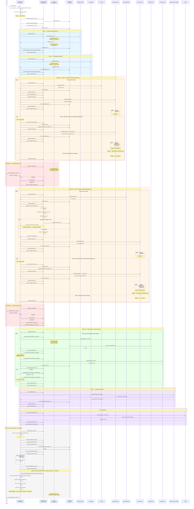

# Pipeline Sequence Diagram

> **Note:** Shows the full `L` (full) effort flow. Lower effort levels (S, M) skip labelled phases — see the [Effort-driven Flow](effort-flow.md) section.

```mermaid
sequenceDiagram
    actor User
    participant Orch as Orchestrator<br>(SKILL.md)
    participant SM as Go MCP server<br>(forge-state)
    participant Hook as Hooks<br>(pre/post/stop)
    participant FS as Workspace<br>(.specs/)
    participant SA as situation-analyst
    participant INV as investigator
    participant ARCH as architect
    participant DR as design-reviewer
    participant TD as task-decomposer
    participant TR as task-reviewer
    participant IMP as implementer
    participant IR as impl-reviewer
    participant CR as comprehensive-reviewer
    participant VER as verifier

    %% ── Input Validation ──
    User->>Orch: /forge <args>
    Orch->>Orch: mcp__forge-state__validate_input (deterministic checks)
    Orch->>Orch: LLM coherence check (semantic)
    Note over Orch: Invalid → stop with error

    %% ── Workspace Setup ──
    Orch->>SM: init {workspace} {spec-name}
    SM->>FS: create state.json
    Orch->>SM: set-effort {workspace} {effort}
    Orch->>SM: set-auto-approve (if --auto)
    Orch->>FS: write request.md

    %% ── Phase 1 ──
    rect rgb(230, 245, 255)
    Note over Orch,SA: Phase 1 — Situation Analysis (read-only)
    Orch->>SM: phase-start phase-1
    Orch->>SA: Agent(workspace)
    Note over Hook: PreToolUse blocks<br>Edit/Write on source files
    SA-->>Orch: analysis output
    Note over Hook: PostToolUse checks<br>output quality
    Orch->>FS: write analysis.md
    Orch->>SM: phase-log phase-1 {tokens} {duration} {model}
    Orch->>SM: phase-complete phase-1
    end

    %% ── Phase 2 ──
    rect rgb(230, 245, 255)
    Note over Orch,INV: Phase 2 — Investigation (read-only)
    Orch->>SM: phase-start phase-2
    Orch->>INV: Agent(workspace)
    Note over Hook: PreToolUse blocks<br>Edit/Write on source files
    INV-->>Orch: investigation output
    Orch->>FS: write investigation.md
    Orch->>SM: phase-log phase-2 {tokens} {duration} {model}
    Orch->>SM: phase-complete phase-2
    end

    %% ── Phase 3 + 3b Loop ──
    rect rgb(255, 245, 230)
    Note over Orch,DR: Phase 3/3b — Design + AI Review (APPROVE/REVISE loop)
    loop max 2 revision cycles
        Orch->>SM: phase-start phase-3
        Orch->>ARCH: Agent(workspace)
        ARCH-->>Orch: design output
        Orch->>FS: write design.md
        Orch->>SM: phase-log phase-3
        Orch->>SM: phase-complete phase-3

        Orch->>SM: phase-start phase-3b
        Orch->>DR: Agent(workspace)
        DR-->>Orch: review-design output
        Orch->>FS: write review-design.md
        Orch->>SM: phase-log phase-3b
        Orch->>SM: phase-complete phase-3b
        break verdict = APPROVE
            Note over DR: APPROVE
        end
        alt verdict = APPROVE_WITH_NOTES (MINOR findings only)
            Note over Orch: Inline revision path
            Orch->>SM: inline-revision-bump design
            Orch->>FS: read design.md
            Orch->>FS: apply MINOR fixes inline (Edit tool)
            Orch->>SM: phase-start phase-3b
            Orch->>DR: Agent(workspace) — re-review only
            DR-->>Orch: review-design output (2nd pass)
            Orch->>FS: write review-design.md
            Orch->>SM: phase-log phase-3b
            Orch->>SM: phase-complete phase-3b
            break verdict = APPROVE or APPROVE_WITH_NOTES
                Note over DR: proceed to Checkpoint A
            end
            Note over DR: REVISE → fall through to full REVISE path
        else verdict = REVISE (CRITICAL findings)
            Note over DR: REVISE → re-run Phase 3
            Orch->>SM: revision-bump design
        end
    end
    end

    %% ── Checkpoint A ──
    rect rgb(255, 230, 230)
    Note over Orch,User: Checkpoint A — Human Reviews Design
    Orch->>SM: checkpoint checkpoint-a
    Note over Hook: checkpoint guard:<br>phase-complete blocked<br>until awaiting_human
    Orch->>User: Present design + AI review
    User-->>Orch: Approved / Feedback
    alt rejected
        Orch->>SM: re-run Phase 3
    else approved
        Orch->>SM: phase-complete checkpoint-a
    end
    end

    %% ── Phase 4 + 4b Loop ──
    rect rgb(255, 245, 230)
    Note over Orch,TR: Phase 4/4b — Tasks + AI Review (APPROVE/REVISE loop)
    loop max 2 revision cycles
        Orch->>SM: phase-start phase-4
        Orch->>TD: Agent(workspace)
        TD-->>Orch: tasks output
        Orch->>FS: write tasks.md
        Orch->>SM: phase-log phase-4
        Orch->>SM: pipeline_report_result phase-4
        SM->>SM: ParseTasksMd
        SM->>SM: LoadRules (.specs/instructions.md)
        SM->>SM: Validate(tasks, rules)
        alt workflow-rule violations exist
            SM->>FS: write review-tasks.md
            SM-->>Orch: next_action_hint=revision_required
            Note over Orch,SM: Automatic REVISE — re-run task-decomposer
        else no violations
            SM->>SM: phase-complete phase-4
            SM-->>Orch: next_action_hint=proceed
        end

        Orch->>SM: phase-start phase-4b
        Orch->>TR: Agent(workspace)
        TR-->>Orch: review-tasks output
        Orch->>FS: write review-tasks.md
        Orch->>SM: phase-log phase-4b
        Orch->>SM: phase-complete phase-4b
        break verdict = APPROVE
            Note over TR: APPROVE
        end
        alt verdict = APPROVE_WITH_NOTES (MINOR findings only)
            Note over Orch: Inline revision path
            Orch->>SM: inline-revision-bump tasks
            Orch->>FS: read tasks.md
            Orch->>FS: apply MINOR fixes inline (Edit tool)
            Orch->>SM: phase-start phase-4b
            Orch->>TR: Agent(workspace) — re-review only
            TR-->>Orch: review-tasks output (2nd pass)
            Orch->>FS: write review-tasks.md
            Orch->>SM: phase-log phase-4b
            Orch->>SM: phase-complete phase-4b
            break verdict = APPROVE or APPROVE_WITH_NOTES
                Note over TR: proceed to Checkpoint B
            end
            Note over TR: REVISE → fall through to full REVISE path
        else verdict = REVISE (CRITICAL findings)
            Note over TR: REVISE → re-run Phase 4
            Orch->>SM: revision-bump tasks
        end
    end
    end

    %% ── Checkpoint B ──
    rect rgb(255, 230, 230)
    Note over Orch,User: Checkpoint B — Human Reviews Tasks
    Orch->>SM: checkpoint checkpoint-b
    Orch->>User: Present tasks + AI review
    User-->>Orch: Approved / Feedback
    alt rejected
        Orch->>SM: re-run Phase 4
    else approved
        Orch->>SM: phase-complete checkpoint-b
        Orch->>SM: task-init {workspace} {tasks JSON}
    end
    end

    %% ── Phase 5 + 6 (per task) ──
    rect rgb(230, 255, 230)
    Note over Orch,IR: Phase 5/6 — Implementation + Review (per task)
    Orch->>SM: phase-start phase-5
    loop for each task (sequential or parallel groups)
        Orch->>SM: task-update {N} implStatus in_progress
        Orch->>IMP: Agent(workspace, task N)
        Note over Hook: PreToolUse blocks<br>git commit during<br>parallel execution
        IMP->>FS: write code + impl-{N}.md
        IMP-->>Orch: done
        Orch->>SM: phase-log task-{N}-impl
        Orch->>SM: task-update {N} implStatus completed
        Note over Orch: batch git commit<br>(parallel groups only)

        Orch->>SM: task-update {N} reviewStatus in_progress
        Orch->>IR: Agent(workspace, task N)
        IR-->>Orch: review-{N} output
        Orch->>FS: write review-{N}.md
        Orch->>SM: phase-log task-{N}-review
        alt PASS
            Orch->>SM: task-update {N} reviewStatus completed_pass
        else FAIL (retry <= 2)
            Orch->>SM: task-update {N} reviewStatus completed_fail
            Note over Orch: re-run impl + review
        end
    end
    Orch->>SM: phase-complete phase-5
    Orch->>SM: phase-complete phase-6
    end

    %% ── Phase 7 ──
    rect rgb(240, 230, 255)
    Note over Orch,CR: Phase 7 — Comprehensive Review
    Orch->>SM: phase-start phase-7
    Orch->>CR: Agent(workspace, spec-name)
    CR->>FS: fix code directly (if needed)
    CR-->>Orch: comprehensive-review output
    Orch->>FS: write comprehensive-review.md
    Orch->>SM: phase-log phase-7
    Orch->>SM: phase-complete phase-7
    end

    %% ── Final Verification ──
    rect rgb(240, 230, 255)
    Note over Orch,VER: Final Verification
    Orch->>SM: phase-start final-verification
    Orch->>VER: Agent(workspace, spec-name)
    VER->>FS: fix failures directly (if needed)
    VER-->>Orch: verification result
    Orch->>SM: phase-log final-verification
    Orch->>SM: phase-complete final-verification
    end

    %% ── PR + Summary + Final Commit ──
    rect rgb(245, 245, 245)
    Note over Orch,User: PR Creation + Final Summary + Final Commit
    Orch->>SM: phase-start pr-creation
    Orch->>Orch: git push + gh pr create (placeholder body)
    Note over Orch: PR # is now known (summary.md not yet generated)
    Orch->>SM: phase-complete pr-creation

    Orch->>SM: phase-start final-summary
    Orch->>SM: phase-stats (get metrics)
    Orch->>FS: write summary.md (includes PR #)
    Orch->>FS: append ## Improvement Report to summary.md
    Orch->>SM: phase-complete final-summary

    Orch->>SM: phase-start post-to-source
    opt source_type = github_issue or jira_issue
        Orch->>Orch: post summary comment
    end
    Orch->>SM: phase-complete post-to-source

    Orch->>SM: phase-start final-commit
    Note over Orch,FS: pipeline_report_result called FIRST to advance state.json to "completed"
    Orch->>SM: phase-complete final-commit (via pipeline_report_result)
    Orch->>Orch: gh pr edit --body-file summary.md (replace placeholder)
    Orch->>Orch: git add summary.md state.json
    Orch->>Orch: git commit --amend --no-edit
    Orch->>Orch: git push --force-with-lease
    Note over Orch: PR body updated + branch includes summary.md + state.json
    Note over Hook: Stop hook: allows stop<br>only after summary.md exists
    Orch->>User: Present summary + PR link
    end
```
