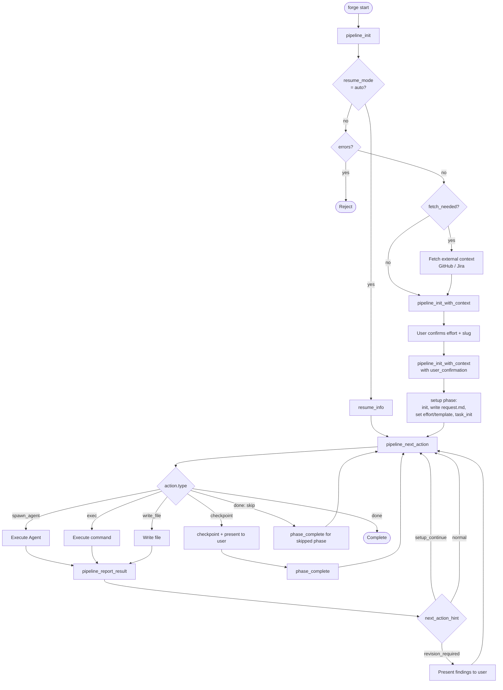
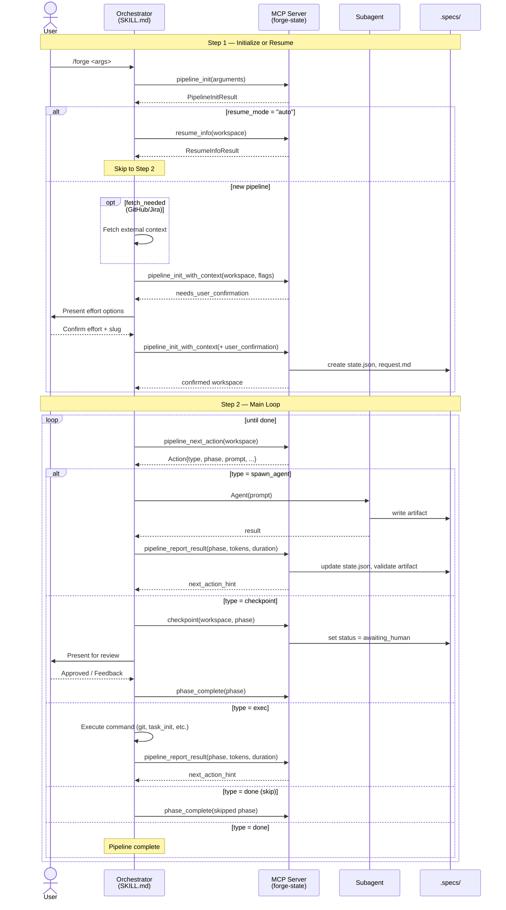
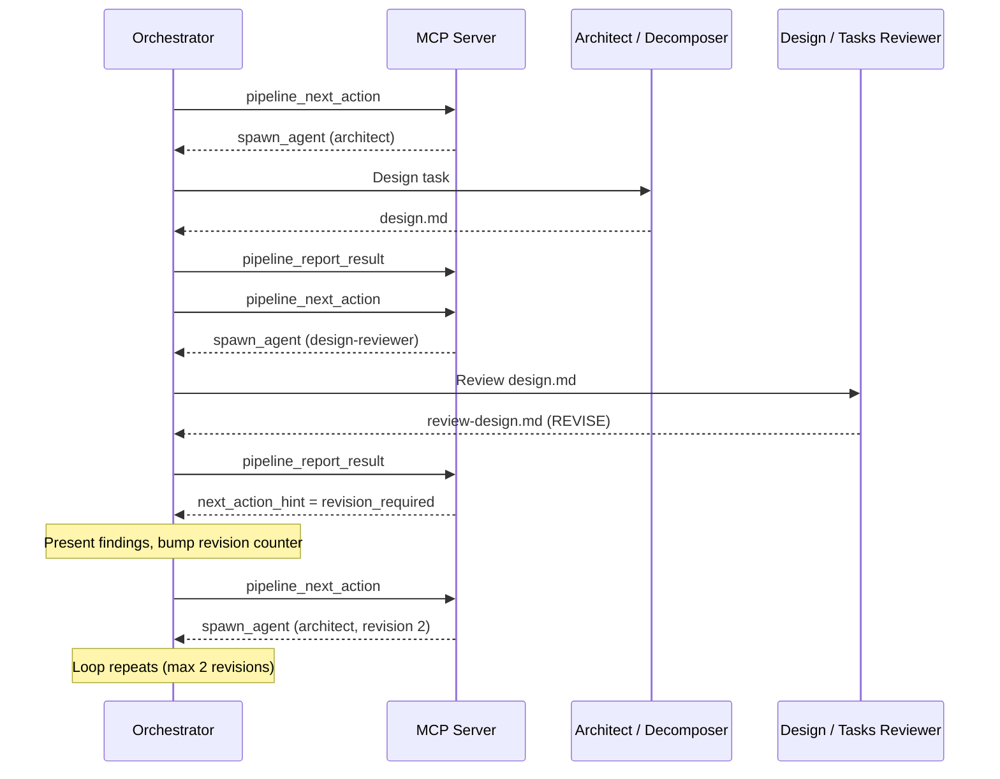
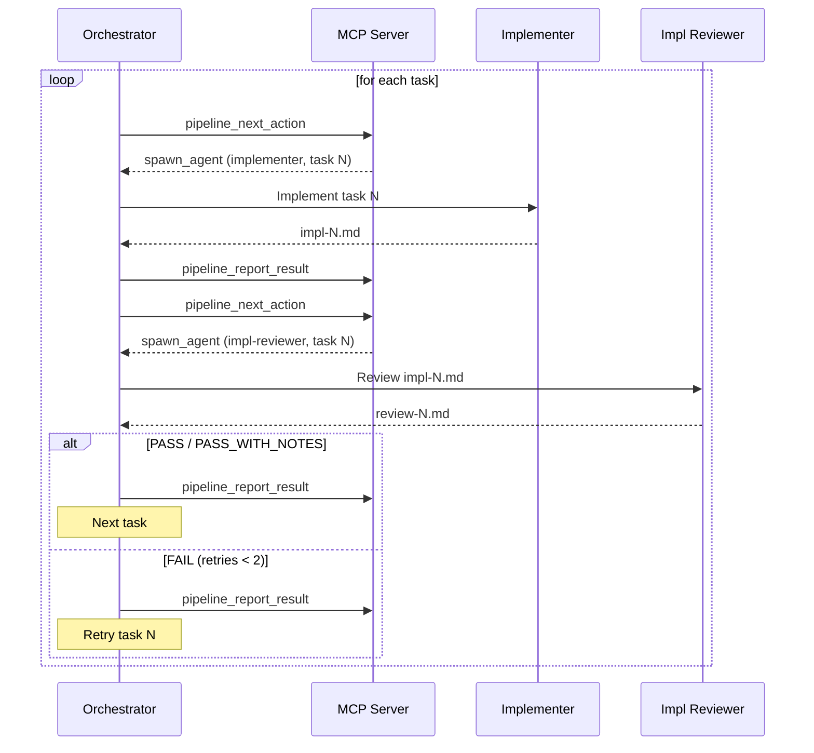

# Pipeline Flow

## Overview Diagram

## Phase Table

18 phases in execution order. Phases may be skipped based on effort level (flow template).

| # | Phase ID | Description | Actor | Artifact |
|---|----------|-------------|-------|----------|
| 1 | `setup` | Init workspace, write request.md, detect effort, set template | Orchestrator | request.md, state.json |
| 2 | `phase-1` | Situation Analysis — read-only codebase mapping | situation-analyst | analysis.md |
| 3 | `phase-2` | Investigation — deep-dive research, edge cases | investigator | investigation.md |
| 4 | `phase-3` | Design — architecture and approach | architect | design.md |
| 5 | `phase-3b` | Design Review — AI quality gate | design-reviewer | review-design.md |
| 6 | `checkpoint-a` | Human review of design | User | approval / revision |
| 7 | `phase-4` | Task Decomposition — numbered task list | task-decomposer | tasks.md |
| 8 | `phase-4b` | Tasks Review — AI quality gate | task-reviewer | review-tasks.md |
| 9 | `checkpoint-b` | Human review of tasks | User | approval / revision |
| 10 | `phase-5` | Implementation — TDD per task (sequential or parallel) | implementer | impl-N.md |
| 11 | `phase-6` | Code Review — per task, up to 2 retries | impl-reviewer | review-N.md |
| 12 | `phase-7` | Comprehensive Review — cross-cutting concerns | comprehensive-reviewer | comprehensive-review.md |
| 13 | `final-verification` | Full build + test suite verification | verifier | final-verification.md |
| 14 | `pr-creation` | Create PR via `gh pr create` | Orchestrator | PR URL |
| 15 | `final-summary` | Generate summary.md with PR number | Orchestrator | summary.md |
| 16 | `final-commit` | Amend last commit with summary.md + force-push | Orchestrator | — |
| 17 | `post-to-source` | Post summary to GitHub/Jira issue | Orchestrator | issue comment |
| 18 | `completed` | Pipeline done | — | — |

## Effort Levels and Skipped Phases

| Effort | Flow Template | Skipped Phases |
|--------|---------------|----------------|
| S | light | phase-4b (Tasks Review), checkpoint-b (Tasks Checkpoint), phase-7 (Comprehensive Review) |
| M | standard | phase-4b (Tasks Review), checkpoint-b (Tasks Checkpoint) |
| L | full | _(none)_ |

## Sequence Diagram — Orchestrator / MCP Server Interaction

## Revision Loop Detail

Design (phase-3/3b) and Tasks (phase-4/4b) phases support revision loops
when the AI reviewer returns a REVISE verdict. Maximum 2 revisions per loop.

## Implementation Loop Detail

Each task goes through implementation (phase-5) and code review (phase-6).
Failed reviews retry up to 2 times.

