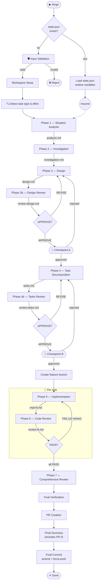
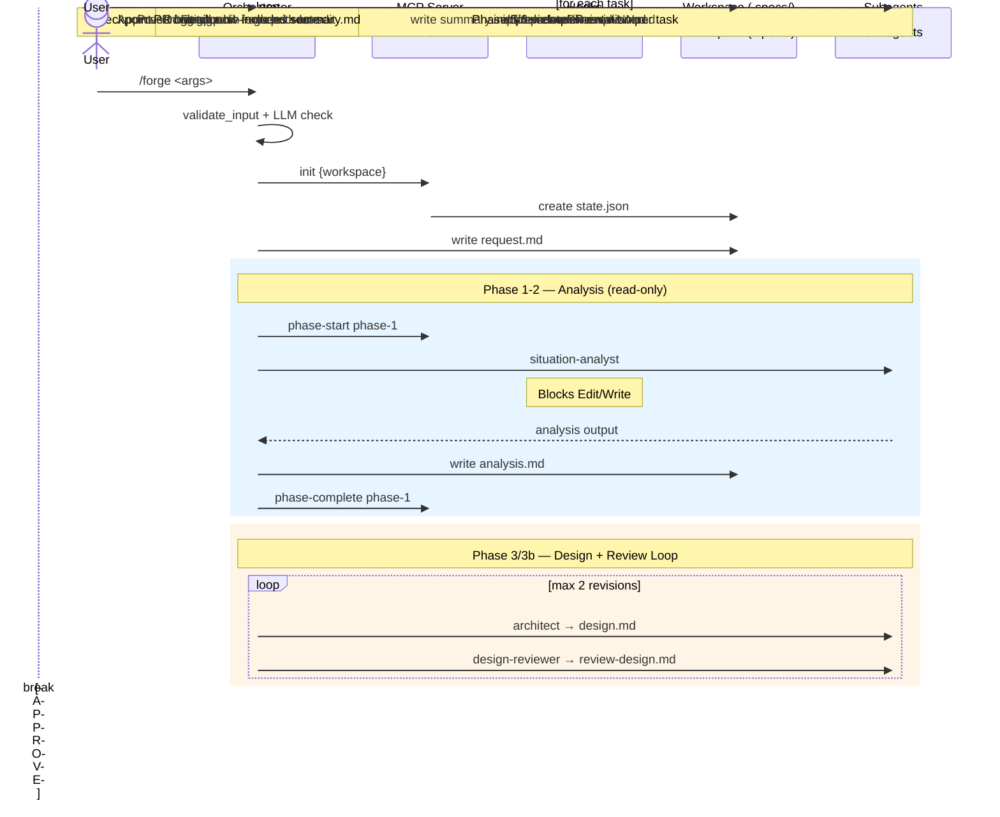

# Pipeline Flow

## Overview Diagram

## Phase Table

| Phase | Task | Agent | Input | Output | Human |
| ----- | ---- | ----- | ----- | ------ | ----- |
| 0 | Input Validation | validate-input + LLM | User input | validation result | No |
| 1 | Workspace Setup | orchestrator | validated input | request.md, state.json | Yes |
| 2 | Detect Task Type & Effort | orchestrator | request.md | state.json | Yes |
| 3 | Situation Analysis | situation-analyst | request.md | analysis.md | No |
| 4 | Investigation | investigator | analysis.md | investigation.md | No |
| 5 | Design | architect | investigation.md | design.md | No |
| 6 | Design Review | design-reviewer | design.md | review-design.md | No |
| 7 | Checkpoint A | human | design.md | approval / revision | Yes |
| 8 | Task Decomposition | task-decomposer | design.md | tasks.md | No |
| 9 | Tasks Review | task-reviewer | tasks.md | review-tasks.md | No |
| 10 | Checkpoint B | human | tasks.md | approval / revision | Yes |
| 11 | Implementation | implementer | task spec | impl-N.md | No |
| 12 | Code Review | impl-reviewer | impl-N.md | review-N.md | No |
| 13 | Comprehensive Review | comprehensive-reviewer | all impl + reviews | comprehensive-review.md | No |
| 14 | Final Verification | verifier | comprehensive-review.md | verification result | No |
| 15 | PR Creation | orchestrator | commits | PR (PR # confirmed) | No |
| 16 | Final Summary | orchestrator | all artifacts + PR # | summary.md (includes PR #) | No |
| 17 | Final Commit | orchestrator | summary.md, state.json | amend last commit + force-push | No |
| 18 | Post to Issue | orchestrator | summary.md | issue comment | No |
| 19 | Done | system | summary.md | — | No |

## Sequence Diagram

## Task Types

Different task types skip certain phases:

| Task Type | Description | Skipped Phases |
| --- | --- | --- |
| `feature` | New capability or behavior | _(none — full pipeline)_ |
| `bugfix` | Bug fix with known reproduction | Design Review (3b), Task Decomposition (4), Tasks Review (4b), Comprehensive Review (7) |
| `refactor` | Code restructuring without behavior change | Design Review (3b), Comprehensive Review uses different criteria |
| `docs` | Documentation-only changes | Investigation (2), Design (3), Design Review (3b), Task Decomposition (4), Tasks Review (4b) |
| `investigation` | Analysis-only — no code changes | All implementation phases (5-7, 14-15) — produces analysis only |
