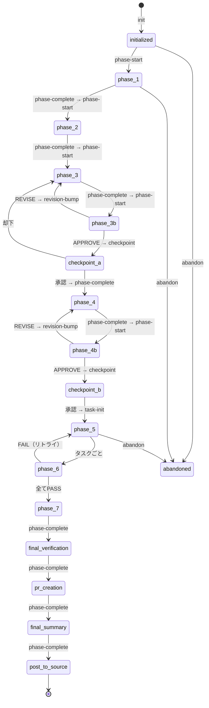

# 状態管理

## 概要

すべてのパイプライン状態は **Go MCPサーバー**（`forge-state`）を通じて管理され、44の型付きツールコールを公開しています。状態はワークスペースディレクトリ内の `state.json` に永続化されます。

## ステートマシン

## state.json の構造

`state.json` の主要フィールド：

| フィールド | 説明 |
| --- | --- |
| `specName` | ワークスペース名（例：`20260320-fix-auth`） |
| `workspace` | `.specs/{specName}/` のフルパス |
| `status` | 現在のステータス：`initialized`、`in_progress`、`completed`、`failed`、`abandoned` |
| `currentPhase` | アクティブなフェーズID（例：`phase-3`、`checkpoint-a`） |
| `effort` | 工数レベル：`S`、`M`、`L`（XSはサポート外） |
| `flowTemplate` | 選択されたテンプレート：`light`、`standard`、`full` |
| `branch` | Gitブランチ名 |
| `autoApprove` | ブーリアン、`--auto` フラグで設定（デフォルト：`false`） |
| `phases` | フェーズレコードの配列（ステータス、タイムスタンプ、ログ） |
| `tasks` | タスクレコードの配列（実装/レビューステータス） |
| `revisions` | アーティファクトごとのリビジョンカウンター |
| `skippedPhases` | フローテンプレートによりスキップされたフェーズ（例：`["phase-4b", "checkpoint-b", "phase-7"]`） |
| `phaseLog` | フェーズメトリクスの配列：`{phase, tokens, duration_ms, model, timestamp}` |

## MCPツールカテゴリ

Go MCPサーバーは8カテゴリにわたって **44の型付きツールコール** を公開しています：

| カテゴリ | ツール数 | 説明 |
| --- | --- | --- |
| ライフサイクル | 5 | パイプラインの初期化と進行（`init`、`pipeline_init`、`pipeline_next_action` など） |
| フェーズ管理 | 6 | フェーズ遷移（`phase_start`、`phase_complete`、`checkpoint`、`abandon` など） |
| リビジョン制御 | 4 | APPROVE/REVISEサイクル管理（`revision_bump`、`inline_revision_bump` など） |
| 設定 | 7 | ランタイム設定（`set_effort`、`set_auto_approve`、`set_branch` など） |
| タスク管理 | 2 | タスクごとの追跡（`task_init`、`task_update`） |
| メトリクス & クエリ | 9 | 状態クエリ、履歴検索、BM25パターンマッチング |
| 分析 | 3 | パイプライン統計とコスト予測 |
| バリデーション & ユーティリティ | 8 | 入力/アーティファクトバリデーション、AST分析、依存グラフ |

完全なツールリファレンスは [MCPツール](/ja/reference/mcp-tools) を参照してください。

### MCPハンドラーガード

MCPサーバーは以下のガードを決定論的に強制します（フック経由ではなく）：

| ガード | ツール | 条件 |
|--------|------|------|
| アーティファクト必須 | `phase_complete` | 期待されるアーティファクトファイルが欠落している場合ブロック |
| チェックポイント必須 | `phase_complete` | `awaiting_human` ステータスが設定されていない場合ブロック |
| フェーズ順序 | `phase_start` | 前のフェーズが完了していない場合ブロック |
