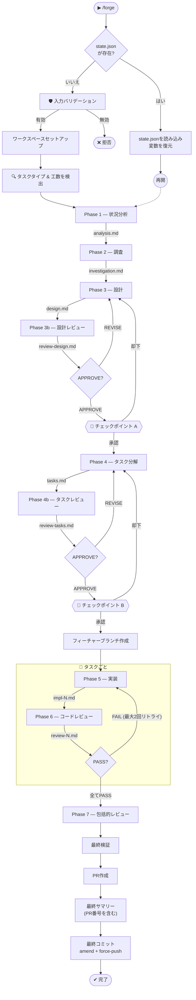
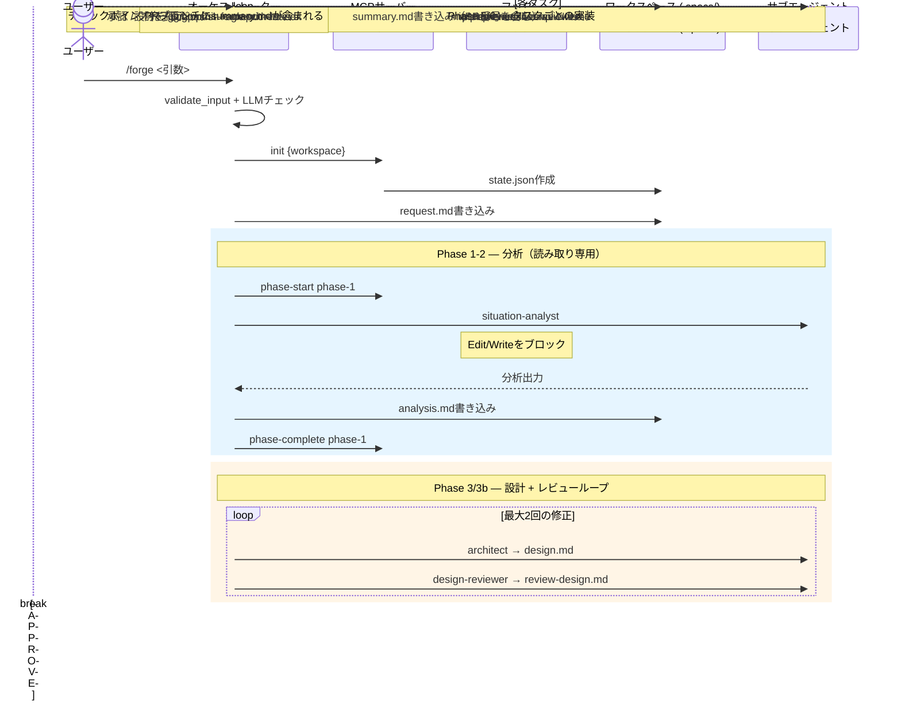

# パイプラインフロー

## 概要図

## フェーズテーブル

| フェーズ | タスク | エージェント | 入力 | 出力 | 人間の介入 |
| ----- | ---- | ----- | ----- | ------ | ----- |
| 0 | 入力バリデーション | validate-input + LLM | ユーザー入力 | バリデーション結果 | なし |
| 1 | ワークスペースセットアップ | オーケストレーター | 検証済み入力 | request.md, state.json | あり |
| 2 | タスクタイプ & 工数検出 | オーケストレーター | request.md | state.json | あり |
| 3 | 状況分析 | situation-analyst | request.md | analysis.md | なし |
| 4 | 調査 | investigator | analysis.md | investigation.md | なし |
| 5 | 設計 | architect | investigation.md | design.md | なし |
| 6 | 設計レビュー | design-reviewer | design.md | review-design.md | なし |
| 7 | チェックポイント A | 人間 | design.md | 承認 / 修正 | あり |
| 8 | タスク分解 | task-decomposer | design.md | tasks.md | なし |
| 9 | タスクレビュー | task-reviewer | tasks.md | review-tasks.md | なし |
| 10 | チェックポイント B | 人間 | tasks.md | 承認 / 修正 | あり |
| 11 | 実装 | implementer | タスク仕様 | impl-N.md | なし |
| 12 | コードレビュー | impl-reviewer | impl-N.md | review-N.md | なし |
| 13 | 包括的レビュー | comprehensive-reviewer | 全impl + レビュー | comprehensive-review.md | なし |
| 14 | 最終検証 | verifier | comprehensive-review.md | 検証結果 | なし |
| 15 | PR作成 | オーケストレーター | コミット | PR（PR番号確定） | なし |
| 16 | 最終サマリー | オーケストレーター | 全アーティファクト + PR番号 | summary.md（PR番号を含む） | なし |
| 17 | 最終コミット | オーケストレーター | summary.md, state.json | 最終commitをamend + force-push | なし |
| 18 | ソースへ投稿 | オーケストレーター | summary.md | Issueコメント | なし |
| 19 | 完了 | システム | summary.md | — | なし |

## シーケンス図

## タスクタイプ

タスクタイプによって特定のフェーズがスキップされます：

| タスクタイプ | 説明 | スキップされるフェーズ |
| --- | --- | --- |
| `feature` | 新機能や動作の追加 | _（なし — フルパイプライン）_ |
| `bugfix` | 再現手順が明確なバグ修正 | 設計レビュー (3b)、タスク分解 (4)、タスクレビュー (4b)、包括的レビュー (7) |
| `refactor` | 動作変更を伴わないコード再構成 | 設計レビュー (3b)、包括的レビューは異なる基準を使用 |
| `docs` | ドキュメントのみの変更 | 調査 (2)、設計 (3)、設計レビュー (3b)、タスク分解 (4)、タスクレビュー (4b) |
| `investigation` | 分析のみ — コード変更なし | 全実装フェーズ (5-7, 14-15) — 分析のみ出力 |
