# Development Pipeline

Execute a complete development workflow by delegating each phase to an isolated subagent. Files serve as the communication medium between phases, keeping the main agent as a thin orchestrator and preventing context accumulation.

## When to Use

When implementing a feature, fix, or refactoring task that spans multiple files or subsystems. The pipeline prevents context pollution that would otherwise degrade reasoning quality over a long session.

## Arguments

`$ARGUMENTS` — plain-English description of what to build or fix

---

## Hard Constraints

> **NEVER pass `isolation: "worktree"` to any Agent tool call in this pipeline.**
> Worktree isolation creates a detached copy of the repo. Implementation subagents on isolated
> worktrees cannot see changes made by predecessor tasks, and review subagents end up checking
> a stale copy rather than the live feature branch. All subagents MUST run directly on the
> shared feature branch with no isolation parameter.

---

## Architecture Principles

- **Files are the API**: Every phase writes its output to a file. Subsequent phases read only those files — never the conversation history.
- **Main agent is an orchestrator**: The main agent only routes work, presents summaries, and asks for human approval. It does not accumulate analysis results in its own context.
- **Human checkpoints**: The pipeline pauses after Design and after Task Decomposition. The user reviews and approves before execution continues.
- **Single feature branch for implementation**: All tasks run directly on one shared feature branch (not isolated worktrees). This ensures dependent tasks see the changes from their predecessors and review agents check the right location.
- **Parallel tasks do not self-commit**: When running parallel task groups, each agent writes its file changes but does NOT run `git commit`. The main agent does one batch commit after each parallel group completes, eliminating git race conditions.
- **Parallel where safe**: Independent implementation tasks within Phase 5 can run in parallel. Phases 1–4 are strictly sequential (each phase depends on the previous phase's output file).

---

## Agent Invocation Convention

All named agents are defined in `plugin/agents/` as `.md` files. Invoke each agent using the **Agent tool** with:
- `description`: short description of the phase
- `prompt`: phase-specific context (workspace path, task number, etc.)

The agent's `.md` file provides the system prompt (role, instructions, output format). The orchestrator's prompt passes only **runtime parameters** — do NOT duplicate the agent's instructions.

**File-writing responsibility:**
- **Phases 1–4b, 6**: The agent returns its output as a string. The **orchestrator** writes the return value to the appropriate file (e.g., `analysis.md`, `review-{N}.md`).
- **Phase 5 (implementer)**: The agent writes **code files** and `impl-{N}.md` directly, because it must interact with the filesystem as part of implementation.
- **Final Verification**: The verifier agent fixes issues directly and reports verbally. No artifact file is written.

---

## Architecture Overview

### Pipeline Flow

```mermaid
flowchart TD
    MA("**Main Agent — Orchestrator**<br>routes phases · presents summaries<br>holds checkpoints · batch-commits")

    MA --> WS
    WS --> P1
    P1 -->|analysis.md| P2
    P2 -->|investigation.md| P3
    P3 -->|design.md| P3R
    P3R -->|review-design.md| DREV
    DREV -->|"REVISE: re-spawn architect"| P3
    DREV -->|"APPROVE"| CPA
    CPA -->|approved| P4
    CPA -->|"rejected: re-spawn architect"| P3
    P4 -->|tasks.md| P4R
    P4R -->|review-tasks.md| TREV
    TREV -->|"REVISE: re-spawn task-decomposer"| P4
    TREV -->|"APPROVE"| CPB
    CPB -->|approved| P5loop
    CPB -->|"rejected: re-spawn task-decomposer"| P4
    P5loop -->|"impl-N.md  (after each task)"| P6loop
    P6loop -->|review-N.md| FAIL
    FAIL -->|"FAIL: re-spawn implementer + impl-reviewer"| P5loop
    FAIL -->|"all PASS"| FV
    FV --> FS

    WS["**Workspace Setup**<br>main agent · writes request.md"]

    P1["**Phase 1 — Situation Analysis**<br>① situation-analyst agent"]
    P2["**Phase 2 — Investigation**<br>① investigator agent"]
    P3["**Phase 3 — Design**<br>① architect agent"]
    P3R["**Phase 3b — Design AI Review**<br>① design-reviewer agent"]
    DREV{"APPROVE /<br>REVISE?"}
    CPA{"**Checkpoint A**<br>human review<br>sees design + AI review"}
    P4["**Phase 4 — Task Decomposition**<br>① task-decomposer agent"]
    P4R["**Phase 4b — Tasks AI Review**<br>① task-reviewer agent"]
    TREV{"APPROVE /<br>REVISE?"}
    CPB{"**Checkpoint B**<br>human review<br>sees tasks + AI review"}

    subgraph impl_loop["Phase 5 — Implementation  repeats per task"]
        P5loop["implementer agent<br>one invocation per task<br>parallel groups → main agent batch-commits"]
    end

    subgraph review_loop["Phase 6 — Review  repeats per task"]
        P6loop["impl-reviewer agent<br>one invocation per task"]
    end

    FAIL{"PASS / FAIL?"}
    FV["**Final Verification**<br>① verifier agent"]
    FS["**Final Summary**<br>main agent · writes summary.md"]
```



### Agent Roster

| Phase | Agent | Reads | Writes |
| --- | --- | --- | --- |
| Workspace Setup | **Main agent** | — | `request.md` |
| 1 — Situation Analysis | `situation-analyst` | `request.md` | `analysis.md` |
| 2 — Investigation | `investigator` | `request.md`, `analysis.md` | `investigation.md` |
| 3 — Design | `architect` | `request.md`, `analysis.md`, `investigation.md` | `design.md` |
| 3b — Design AI Review | `design-reviewer` | `request.md`, `analysis.md`, `investigation.md`, `design.md` | `review-design.md` |
| Checkpoint A | **Main agent** | `design.md`, `review-design.md` | — |
| 4 — Task Decomposition | `task-decomposer` | `request.md`, `design.md`, `investigation.md` | `tasks.md` |
| 4b — Tasks AI Review | `task-reviewer` | `request.md`, `design.md`, `tasks.md` | `review-tasks.md` |
| Checkpoint B | **Main agent** | `tasks.md`, `review-tasks.md` | — |
| 5 — Implementation | `implementer` | `request.md`, `design.md`, `tasks.md`, `review-{dep}.md` | code files, `impl-{N}.md` |
| 6 — Review | `impl-reviewer` | `request.md`, `tasks.md`, `design.md`, `impl-{N}.md`, code files | `review-{N}.md` |
| Final Verification | `verifier` | feature branch | — |
| Final Summary | **Main agent** | all `review-{N}.md` | `summary.md` |

**Key constraint:** The main agent never reads code files directly. It only reads the small artifact files
(`analysis.md`, `design.md`, `tasks.md`, `review-{N}.md`) to stay token-efficient.

**Each subagent invocation runs to completion** — subagents are not paused or resumed mid-task.
When a phase needs to be retried (rejection or FAIL), a *new* subagent is spawned from scratch
with the previous output as additional context.

---

## Workspace Setup

Before running any phase, establish the workspace:

1. Derive a short `{spec-name}` slug from `$ARGUMENTS` — 2–4 lowercase words joined by hyphens
   that capture the essence of the work (e.g. `yaml-workflow-loader`, `fix-auth-timeout`,
   `refactor-dry-run`). Do this now, before reading any code.
2. Run `date +"%Y%m%d"` and store the result as `{date}`.
3. Create directory: `.specs/{date}-{spec-name}/`
4. Write `.specs/{date}-{spec-name}/request.md` containing `$ARGUMENTS` and any relevant
   context extracted from the current conversation (git branch, relevant spec or issue links, etc.).
5. Store the workspace path as `{workspace}` — all subsequent phases read from and write to this
   directory. Use `{workspace}` as the shorthand in all prompts below.

---

## Phase Execution

### Phase 1 — Situation Analysis

**Agent**: `situation-analyst`
**Output**: Return value → orchestrator writes to `analysis.md`

Spawn the `situation-analyst` agent with:

```
{workspace} = {workspace}
```

Write the return value to `{workspace}/analysis.md`.

---

### Phase 2 — Investigation

**Agent**: `investigator`
**Output**: Return value → orchestrator writes to `investigation.md`

Spawn the `investigator` agent with:

```
{workspace} = {workspace}
```

Write the return value to `{workspace}/investigation.md`.

---

### Phase 3 — Design

**Agent**: `architect`
**Output**: Return value → orchestrator writes to `design.md`

Spawn the `architect` agent with:

```
{workspace} = {workspace}
```

If this is a revision, append: `This is a revision. Also read {workspace}/review-design.md for AI review findings to address.`

Write the return value to `{workspace}/design.md`.

---

### Phase 3b — Design AI Review

**Agent**: `design-reviewer`
**Output**: Return value → orchestrator writes to `review-design.md`

Immediately after Phase 3 completes, spawn the `design-reviewer` agent with:

```
{workspace} = {workspace}
```

Write the return value to `{workspace}/review-design.md`.

- If verdict is **REVISE**: re-run Phase 3 with revision context, then re-run Phase 3b. Max 2 cycles before escalating to the human.
- If verdict is **APPROVE**: continue to Checkpoint A.

---

### Checkpoint A — Design Review (Human)

**Do not proceed until the user approves.**

> **How resumption works:** The main agent pauses here and waits for the user's reply in the
> current conversation. When the user types `approve` (or any approval), the main agent reads
> that reply and continues directly to Phase 4 — no re-invocation of the skill needed.
> The workspace path `{workspace}` remains in the main agent's active context across this pause.
>
> **If the conversation is interrupted** (session reset, tab closed, etc.), the main agent's
> context is lost. To recover: re-invoke the skill and pass the existing workspace path as
> the argument, e.g. `@.specs/{date}-{spec-name}/design.md is done, go on next phase`.
> The main agent should read the existing artifact files to reconstruct state.

1. Read `{workspace}/review-design.md` for the AI reviewer's verdict and notes.
2. Present to the user:
   - Approach chosen and key changes (from `design.md`)
   - AI review verdict and any notes from `review-design.md`
   - The workspace path `{workspace}` (so the user can reference it if the session is interrupted)
3. Ask: "Does this design look right? Approve to continue to task decomposition, or share feedback to revise."
4. If the user requests changes: re-run Phase 3 with user feedback appended, then re-run Phase 3b, and re-present.
5. Once approved, continue.

---

### Phase 4 — Task Decomposition

**Agent**: `task-decomposer`
**Output**: Return value → orchestrator writes to `tasks.md`

Spawn the `task-decomposer` agent with:

```
{workspace} = {workspace}
```

If this is a revision, append: `This is a revision. Also read {workspace}/review-tasks.md for AI review findings to address.`

Write the return value to `{workspace}/tasks.md`.

---

### Phase 4b — Tasks AI Review

**Agent**: `task-reviewer`
**Output**: Return value → orchestrator writes to `review-tasks.md`

Immediately after Phase 4 completes, spawn the `task-reviewer` agent with:

```
{workspace} = {workspace}
```

Write the return value to `{workspace}/review-tasks.md`.

- If verdict is **REVISE**: re-run Phase 4 with revision context, then re-run Phase 4b. Max 2 cycles before escalating to the human.
- If verdict is **APPROVE**: continue to Checkpoint B.

---

### Checkpoint B — Task Review (Human)

**Do not proceed until the user approves.**

> **How resumption works:** Same as Checkpoint A — the main agent waits in the active
> conversation. Typing `approve` resumes directly. The workspace path `{workspace}` and the
> feature branch name stay in the main agent's context across this pause.
> If the session is interrupted, re-invoke with the workspace path as context.

1. Read `{workspace}/review-tasks.md` for the AI reviewer's verdict and notes.
2. Present to the user:
   - Task count, dependency graph summary, which tasks are parallel (from `tasks.md`)
   - AI review verdict and any notes from `review-tasks.md`
   - The workspace path `{workspace}` (for session-recovery reference)
3. Ask: "Do these tasks cover everything? Approve to start implementation, or share feedback to revise."
4. If the user requests changes: re-run Phase 4 with user feedback appended, then re-run Phase 4b, and re-present.
5. Once approved, continue.

---

### Phase 5 — Implementation

**Agent**: `implementer` (one per task)
**One agent per task** (parallel for `[parallel]` tasks, sequential for `[sequential]` tasks)

**Before the first task:** create a feature branch and check it out:
```
git checkout -b feature/{spec-name}
```
All implementation agents work on this branch. Do NOT use `isolation: worktree`.

**Commit strategy:**
- For `[sequential]` tasks: the agent commits its own changes before finishing.
- For `[parallel]` task groups: agents write file changes but do NOT commit (`git commit`).
  After all agents in the group finish, the main agent does one batch commit covering the
  whole group. This avoids git race conditions.

For each task, spawn the `implementer` agent with:

```
You are implementing Task {N}: {title}.
{workspace} = {workspace}
{spec-name} = {spec-name}
Task number: {N}
Commit mode: {sequential|parallel}

Dependencies completed: Tasks {deps}
Dependency review files: {for each dep: `{workspace}/review-{dep}.md`}

Acceptance criteria:
{paste the task's acceptance criteria}
```

For `[parallel]` tasks: launch all agents in the group simultaneously. Wait for all to finish,
then the main agent does one batch commit. Then start the next group.

For `[sequential]` tasks: launch one at a time and wait for completion (each agent self-commits).

---

### Phase 6 — Implementation Review

**Agent**: `impl-reviewer` (one per completed task)
**Output**: Return value → orchestrator writes to `review-{N}.md`

After each task's implementation agent completes, spawn the `impl-reviewer` agent with:

```
Review Task {N}.
{workspace} = {workspace}
Task number: {N}
```

Write the review output to `{workspace}/review-{N}.md`.

If a review returns `FAIL`: re-run Phase 5 for that task, passing the review file as additional context. Re-run Phase 6 after the fix. Max 2 attempts per task.

---

## Final Verification

**Agent**: `verifier`

Spawn the `verifier` agent with:

```
{workspace} = {workspace}
{spec-name} = {spec-name}
```

If new failures are found: the verifier will fix them. If it cannot, report to the user.

---

## Final Summary

After all tasks, reviews, and final verification are complete:

1. Read all `review-{N}.md` files.
2. Write a summary report to `{workspace}/summary.md` with this structure:
   ```markdown
   # Pipeline Summary

   **Request:** <one-line description from request.md>
   **Feature branch:** `feature/{spec-name}`
   **Date:** {date}

   ## Tasks

   | # | Title | Verdict |
   |---|-------|---------|
   | 1 | … | PASS / PASS_WITH_NOTES / FAIL |
   …

   ## Notes

   <Any PASS_WITH_NOTES items or observations worth recording>

   ## Test Results

   <Final pass/fail counts from the verification step>

   ## Next Steps

   <Suggested follow-up actions, e.g. open PR, run e2e tests>
   ```
3. Present the contents of `summary.md` to the user.

---

## Token Economy Rules

- **Never read implementation files in the main agent context** — only subagents read code. The main agent reads only the small artifact files (`analysis.md`, `design.md`, etc.).
- **Truncate subagent prompts to essentials** — do not paste file contents into prompts; pass file paths and instruct subagents to read them.
- **One subagent per phase** — do not chain phases inside a single subagent invocation.
- **Dedicated agents have their own system prompts** — do not duplicate agent instructions in the orchestrator prompts. Pass only phase-specific context (workspace path, task number, etc.).

---

## Error Handling

| Situation | Action |
|-----------|--------|
| Subagent returns empty or incoherent output | Retry once with the same prompt; if it fails again, report to user and stop |
| Design checkpoint rejected | Revise design with user feedback and re-present (max 2 revisions before asking user to clarify the request) |
| Task checkpoint rejected | Revise tasks and re-present |
| Implementation FAIL review | Re-implement with review as context (max 2 attempts per task) |
| Test suite fails after implementation | Stop; present the failure to the user and ask how to proceed |
| Final verification finds new failures | Fix before summarizing — do not leave a broken branch |
| Residual imports of deleted code found in final verification | Spawn a fix agent to update all callers; re-run verification |
