# Development Pipeline

Execute a complete development workflow by delegating each phase to an isolated subagent. Files serve as the communication medium between phases, keeping the main agent as a thin orchestrator and preventing context accumulation.

## When to Use

When implementing a feature, fix, or refactoring task that spans multiple files or subsystems. The pipeline prevents context pollution that would otherwise degrade reasoning quality over a long session.

## Arguments

`$ARGUMENTS` — plain-English description of what to build or fix

---

## Hard Constraints

> **NEVER pass `isolation: "worktree"` to any Agent tool call in this pipeline.**
> Worktree isolation creates a detached copy of the repo. Implementation subagents on isolated
> worktrees cannot see changes made by predecessor tasks, and review subagents end up checking
> a stale copy rather than the live feature branch. All subagents MUST run directly on the
> shared feature branch with no isolation parameter.

---

## Architecture Principles

- **Files are the API**: Every phase writes its output to a file. Subsequent phases read only those files — never the conversation history.
- **Main agent is an orchestrator**: The main agent only routes work, presents summaries, and asks for human approval. It does not accumulate analysis results in its own context.
- **Human checkpoints**: The pipeline pauses after Design and after Task Decomposition. The user reviews and approves before execution continues.
- **Single feature branch for implementation**: All tasks run directly on one shared feature branch (not isolated worktrees). This ensures dependent tasks see the changes from their predecessors and review agents check the right location.
- **Parallel tasks do not self-commit**: When running parallel task groups, each agent writes its file changes but does NOT run `git commit`. The main agent does one batch commit after each parallel group completes, eliminating git race conditions.
- **Parallel where safe**: Independent implementation tasks within Phase 5 can run in parallel. Phases 1–4 are strictly sequential (each phase depends on the previous phase's output file).

---

## Architecture Overview

### Pipeline Flow

```mermaid
flowchart TD
    MA("**Main Agent — Orchestrator**<br>routes phases · presents summaries<br>holds checkpoints · batch-commits")

    MA --> WS
    WS --> P1
    P1 -->|analysis.md| P2
    P2 -->|investigation.md| P3
    P3 -->|design.md| P3R
    P3R -->|review-design.md| DREV
    DREV -->|"REVISE: re-spawn Plan subagent"| P3
    DREV -->|"APPROVE"| CPA
    CPA -->|approved| P4
    CPA -->|"rejected: re-spawn Plan subagent"| P3
    P4 -->|tasks.md| P4R
    P4R -->|review-tasks.md| TREV
    TREV -->|"REVISE: re-spawn Plan subagent"| P4
    TREV -->|"APPROVE"| CPB
    CPB -->|approved| P5loop
    CPB -->|"rejected: re-spawn Plan subagent"| P4
    P5loop -->|"impl-N.md  (after each task)"| P6loop
    P6loop -->|review-N.md| FAIL
    FAIL -->|"FAIL: re-spawn impl + review"| P5loop
    FAIL -->|"all PASS"| FV
    FV --> FS

    WS["**Workspace Setup**<br>main agent · writes request.md"]

    P1["**Phase 1 — Situation Analysis**<br>① one Explore subagent · read-only"]
    P2["**Phase 2 — Investigation**<br>① one Explore subagent · read-only"]
    P3["**Phase 3 — Design**<br>① one Plan subagent<br>(new subagent spawned per revision)"]
    P3R["**Phase 3b — Design AI Review**<br>① one general-purpose subagent"]
    DREV{"APPROVE /<br>REVISE?"}
    CPA{"**Checkpoint A**<br>👤 human review<br>sees design + AI review"}
    P4["**Phase 4 — Task Decomposition**<br>① one Plan subagent<br>(new subagent spawned per revision)"]
    P4R["**Phase 4b — Tasks AI Review**<br>① one general-purpose subagent"]
    TREV{"APPROVE /<br>REVISE?"}
    CPB{"**Checkpoint B**<br>👤 human review<br>sees tasks + AI review"}

    subgraph impl_loop["Phase 5 — Implementation  🔁 repeats per task"]
        P5loop["general-purpose subagent<br>one invocation per task<br>parallel groups → main agent batch-commits"]
    end

    subgraph review_loop["Phase 6 — Review  🔁 repeats per task"]
        P6loop["general-purpose subagent<br>one invocation per task"]
    end

    FAIL{"PASS / FAIL?"}
    FV["**Final Verification**<br>① one general-purpose subagent<br>full typecheck + test suite"]
    FS["**Final Summary**<br>main agent · writes summary.md"]
```



### Agent Roles at a Glance

| Phase | Executor | Subagent type | Invocations | Reads | Writes |
| --- | --- | --- | --- | --- | --- |
| Workspace Setup | **Main agent** | — | 1 | — | `request.md` |
| 1 — Situation Analysis | Subagent | `Explore` | **1** | `request.md` | `analysis.md` |
| 2 — Investigation | Subagent | `Explore` | **1** | `request.md`, `analysis.md` | `investigation.md` |
| 3 — Design | Subagent | `Plan` | **1** (+ 1 per revision) | `request.md`, `analysis.md`, `investigation.md` | `design.md` |
| **3b — Design AI Review** | Subagent | `general-purpose` | **1** (+ 1 if REVISE triggers re-design) | `request.md`, `investigation.md`, `design.md` | `review-design.md` |
| Checkpoint A | **Main agent** | — | 1 | `design.md`, `review-design.md` | — |
| 4 — Task Decomposition | Subagent | `Plan` | **1** (+ 1 per revision) | `request.md`, `design.md` | `tasks.md` |
| **4b — Tasks AI Review** | Subagent | `general-purpose` | **1** (+ 1 if REVISE triggers re-decomposition) | `request.md`, `design.md`, `tasks.md` | `review-tasks.md` |
| Checkpoint B | **Main agent** | — | 1 | `tasks.md`, `review-tasks.md` | — |
| 5 — Implementation | Subagents | `general-purpose` | **1 per task** (parallel where safe; re-run on FAIL) | `request.md`, `design.md`, `tasks.md`, `review-{dep}.md` | code files, `impl-{N}.md` |
| 6 — Review | Subagents | `general-purpose` | **1 per task** (re-run after impl fix) | `tasks.md`, `design.md`, `impl-{N}.md`, code files | `review-{N}.md` |
| Final Verification | Subagent | `general-purpose` | **1** | feature branch | — |
| Final Summary | **Main agent** | — | 1 | all `review-{N}.md` | `summary.md` |

**Key constraint:** The main agent never reads code files directly. It only reads the small artifact files
(`analysis.md`, `design.md`, `tasks.md`, `review-{N}.md`) to stay token-efficient.

**Each subagent invocation runs to completion** — subagents are not paused or resumed mid-task.
When a phase needs to be retried (rejection or FAIL), a *new* subagent is spawned from scratch
with the previous output as additional context.

---

## Workspace Setup

Before running any phase, establish the workspace:

1. Derive a short `{spec-name}` slug from `$ARGUMENTS` — 2–4 lowercase words joined by hyphens
   that capture the essence of the work (e.g. `yaml-workflow-loader`, `fix-auth-timeout`,
   `refactor-dry-run`). Do this now, before reading any code.
2. Run `date +"%Y%m%d"` and store the result as `{date}`.
3. Create directory: `.specs/{date}-{spec-name}/`
4. Write `.specs/{date}-{spec-name}/request.md` containing `$ARGUMENTS` and any relevant
   context extracted from the current conversation (git branch, relevant spec or issue links, etc.).
5. Store the workspace path as `{workspace}` — all subsequent phases read from and write to this
   directory. Use `{workspace}` as the shorthand in all prompts below.

---

## Phase Execution

### Phase 1 — Situation Analysis

**Subagent**: `Explore` (fast, read-only — no file writes needed)
**Output**: Return value → write to `analysis.md`

Spawn an `Explore` subagent with this prompt structure:

```
Read `{workspace}/request.md` to understand the task.

Your job is to describe the CURRENT STATE of the codebase as it relates to this task.
Do NOT propose changes or solutions. Only describe what exists.

Cover:
1. Relevant files and directories (list with brief purpose)
2. Key interfaces, types, and data flows touched by the task
3. Existing tests for affected code
4. Any known constraints or technical debt visible in the code

Return a structured markdown report. Be concise — this is an index, not a full code read.
```

Write the return value to `{workspace}/analysis.md`.

---

### Phase 2 — Investigation

**Subagent**: `Explore` (can run after Phase 1 completes)
**Output**: Return value → write to `investigation.md`

Spawn an `Explore` subagent with this prompt structure:

```
Read the following files before starting:
- `{workspace}/request.md`
- `{workspace}/analysis.md`

Your job is to go DEEPER than the analysis. Investigate:
1. Root cause (for bugs) or integration points (for features)
2. Edge cases and risks — what could break?
3. External dependencies, API contracts, or shared interfaces affected
4. Prior art in the codebase — similar patterns already implemented
5. Any ambiguities in the request that need a decision
6. If any files/exports/constants will be DELETED or RENAMED: search the entire codebase
   (src/ AND tests/) for every import/reference to those items. List all callers — the
   design must address every one of them, not just the obvious ones.

Return a structured markdown report with findings and open questions.
```

Write the return value to `{workspace}/investigation.md`.

---

### Phase 3 — Design

**Subagent**: `Plan`
**Output**: Return value → write to `design.md`

Spawn a `Plan` subagent with this prompt structure:

```
Read the following files:
- `{workspace}/request.md`
- `{workspace}/analysis.md`
- `{workspace}/investigation.md`

Also read any project-wide conventions files present (e.g. `CLAUDE.md`, `.kiro/steering/`, `AGENTS.md`).

Your job is to produce a DESIGN document covering:
1. Chosen approach and rationale (why this approach vs alternatives)
2. Architectural changes — new files, modified interfaces, deleted code
3. Data model or type changes
4. Test strategy — what to test and at which layer
5. Risk mitigation for the issues identified in investigation.md
6. Any decisions made about the open questions from investigation.md

Format as a structured design document. Be specific about file paths and interface shapes.
```

Write the return value to `{workspace}/design.md`.

---

### Phase 3b — Design AI Review

**Subagent**: `general-purpose`
**Output**: Return value → write to `review-design.md`

Immediately after Phase 3 completes, spawn a review subagent:

```
Read the following files:
- `{workspace}/request.md`
- `{workspace}/investigation.md`
- `{workspace}/design.md`

Your job is to critically review the design BEFORE a human sees it. Output: APPROVE or REVISE.

Check for:
1. **Coverage** — does the design address every open question and risk from investigation.md?
2. **Completeness** — are all callers/importers of deleted or renamed items accounted for
   (src/ AND tests/)? List any that appear missing.
3. **Consistency** — do interface changes ripple correctly through all affected files listed?
4. **Test strategy** — is each changed layer tested? Are deleted test files replaced?
5. **Contradictions** — any decisions that conflict with each other or with project conventions?
6. **Scope creep** — does the design stay within the request, or does it over-engineer?

Output format:
- Verdict: APPROVE or REVISE
- If REVISE: numbered list of specific issues that must be fixed before proceeding
- If APPROVE: one-sentence confirmation and any minor notes for the human checkpoint
```

Write the return value to `{workspace}/review-design.md`.

- If verdict is **REVISE**: spawn a new `Plan` subagent for Phase 3 with the original prompt
  plus `review-design.md` appended as "AI review findings to address". Overwrite `design.md`,
  then re-run Phase 3b. Repeat until APPROVE (max 2 cycles before escalating to the human).
- If verdict is **APPROVE**: continue to Checkpoint A.

---

### Checkpoint A — Design Review (Human)

**Do not proceed until the user approves.**

> **How resumption works:** The main agent pauses here and waits for the user's reply in the
> current conversation. When the user types `approve` (or any approval), the main agent reads
> that reply and continues directly to Phase 4 — no re-invocation of the skill needed.
> The workspace path `{workspace}` remains in the main agent's active context across this pause.
>
> **If the conversation is interrupted** (session reset, tab closed, etc.), the main agent's
> context is lost. To recover: re-invoke the skill and pass the existing workspace path as
> the argument, e.g. `@.specs/{date}-{spec-name}/design.md is done, go on next phase`.
> The main agent should read the existing artifact files to reconstruct state.

1. Read `{workspace}/review-design.md` for the AI reviewer's verdict and notes.
2. Present to the user:
   - Approach chosen and key changes (from `design.md`)
   - AI review verdict and any notes from `review-design.md`
   - The workspace path `{workspace}` (so the user can reference it if the session is interrupted)
3. Ask: "Does this design look right? Approve to continue to task decomposition, or share feedback to revise."
4. If the user requests changes: spawn a new `Plan` subagent with the design prompt plus the
   user's feedback appended, overwrite `design.md`, re-run Phase 3b, and re-present.
5. Once approved, continue.

---

### Phase 4 — Task Decomposition

**Subagent**: `Plan`
**Output**: Return value → write to `tasks.md`

Spawn a `Plan` subagent with this prompt structure:

```
Read the following files:
- `{workspace}/request.md`
- `{workspace}/design.md`

Also read any project-wide conventions files present (e.g. `CLAUDE.md`, `.kiro/steering/`, `AGENTS.md`).

Your job is to decompose the design into a numbered task list suitable for sequential or parallel execution.

Each task must:
- Have a unique number (1, 2, 3…) and a short title
- Reference the design section it implements
- List its DEPENDENCIES (which tasks must complete first, if any)
- Specify the files to create or modify
- Include acceptance criteria (1–3 bullet points)
- Indicate whether it can run in PARALLEL with other tasks or must be SEQUENTIAL

Mark tasks that are safe to run in parallel with `[parallel]` and sequential ones with `[sequential]`.

Output a clean markdown task list.
```

Write the return value to `{workspace}/tasks.md`.

---

### Phase 4b — Tasks AI Review

**Subagent**: `general-purpose`
**Output**: Return value → write to `review-tasks.md`

Immediately after Phase 4 completes, spawn a review subagent:

```
Read the following files:
- `{workspace}/request.md`
- `{workspace}/design.md`
- `{workspace}/tasks.md`

Your job is to critically review the task list BEFORE a human sees it. Output: APPROVE or REVISE.

Check for:
1. **Design coverage** — does every section of design.md map to at least one task?
   List any design sections that have no corresponding task.
2. **Deletions** — are there explicit tasks to delete every file/export marked for removal
   in the design? Missing deletion tasks cause stale dead code.
3. **Test updates** — are there tasks to update or delete tests for every changed or removed
   unit? A code change with no test task is a gap.
4. **Dependencies** — are the listed task dependencies correct and complete? Would running
   tasks in the stated order ever access code that doesn't exist yet?
5. **Parallel safety** — do any `[parallel]` tasks write to the same file? If so, flag them
   as needing to be `[sequential]`.
6. **Acceptance criteria** — is each criterion specific and verifiable (not vague like
   "works correctly")? Flag any that are too broad.

Output format:
- Verdict: APPROVE or REVISE
- If REVISE: numbered list of specific gaps or errors that must be fixed
- If APPROVE: one-sentence confirmation and any minor notes for the human checkpoint
```

Write the return value to `{workspace}/review-tasks.md`.

- If verdict is **REVISE**: spawn a new `Plan` subagent for Phase 4 with the original prompt
  plus `review-tasks.md` appended as "AI review findings to address". Overwrite `tasks.md`,
  then re-run Phase 4b. Repeat until APPROVE (max 2 cycles before escalating to the human).
- If verdict is **APPROVE**: continue to Checkpoint B.

---

### Checkpoint B — Task Review (Human)

**Do not proceed until the user approves.**

> **How resumption works:** Same as Checkpoint A — the main agent waits in the active
> conversation. Typing `approve` resumes directly. The workspace path `{workspace}` and the
> feature branch name stay in the main agent's context across this pause.
> If the session is interrupted, re-invoke with the workspace path as context.

1. Read `{workspace}/review-tasks.md` for the AI reviewer's verdict and notes.
2. Present to the user:
   - Task count, dependency graph summary, which tasks are parallel (from `tasks.md`)
   - AI review verdict and any notes from `review-tasks.md`
   - The workspace path `{workspace}` (for session-recovery reference)
3. Ask: "Do these tasks cover everything? Approve to start implementation, or share feedback to revise."
4. If the user requests changes: spawn a new `Plan` subagent with the tasks prompt plus the
   user's feedback appended, overwrite `tasks.md`, re-run Phase 4b, and re-present.
5. Once approved, continue.

---

### Phase 5 — Implementation

**Subagent type**: `general-purpose` (no worktree isolation — all tasks share the feature branch)
**One subagent per task** (parallel for `[parallel]` tasks, sequential for `[sequential]` tasks)

**Before the first task:** create a feature branch and check it out:
```
git checkout -b feature/{spec-name}
```
All implementation agents work on this branch. Do NOT use `isolation: worktree` — worktree
isolation prevents dependent tasks from seeing each other's changes and causes review agents to
check the wrong location.

**Commit strategy:**
- For `[sequential]` tasks: the agent commits its own changes before finishing.
- For `[parallel]` task groups: agents write file changes but do NOT commit (`git commit`).
  After all agents in the group finish, the main agent does one batch commit covering the
  whole group. This avoids git race conditions.

For each task, spawn a `general-purpose` subagent with this prompt structure:

```
You are implementing Task {N}: {title}.

Read these files first (do NOT skip any):
- `{workspace}/request.md`
- `{workspace}/design.md`
- `{workspace}/tasks.md` (your task is Task {N})

Also read any project-wide conventions files present (e.g. `CLAUDE.md`, `.kiro/steering/`, `AGENTS.md`).

First, check out the feature branch: `git checkout feature/{spec-name}`

Dependencies: Tasks {deps} are already complete. Read their review files for context:
{for each dep: `{workspace}/review-{dep}.md`}

Implementation steps:
1. Read the files listed under "files to create or modify" in your task.
2. Write tests FIRST (TDD). Tests should fail before implementation.
3. Implement the code to make tests pass.
4. Run the test suite and verify no regressions.
5. Run the linter if a lint command is configured.
{IF sequential task}: 6. Commit your changes with a descriptive message.
{IF parallel task}: 6. Do NOT commit — the orchestrator will batch-commit after all parallel tasks complete.

Acceptance criteria from the task definition:
{paste the task's acceptance criteria}

Write a brief summary of what you did to `{workspace}/impl-{N}.md` before finishing.
```

For `[parallel]` tasks: launch all agents in the group simultaneously. Wait for all to finish,
then the main agent does one batch commit. Then start the next group.

For `[sequential]` tasks: launch one at a time and wait for completion (each agent self-commits).

---

### Phase 6 — Implementation Review

**Subagent type**: `general-purpose` (one per completed task)
**Output**: Return value → write to `review-{N}.md`

After each task's implementation subagent completes, spawn a review subagent:

```
Read these files:
- `{workspace}/tasks.md` (Task {N} definition)
- `{workspace}/design.md`
- `{workspace}/impl-{N}.md`

Also read the files that were created or modified by Task {N} (listed in tasks.md).

Review the implementation against:
1. Task acceptance criteria — are all met?
2. Design alignment — does the code match the design document?
3. Test quality — are tests meaningful, or just coverage padding?
4. Code quality — any obvious smells, missing error handling, or security issues?
5. No regressions — confirm test suite still passes

Output: a brief verdict (PASS / PASS_WITH_NOTES / FAIL) with specific findings.
If FAIL: list exactly what must be fixed.
```

Write the review output to `{workspace}/review-{N}.md`.

If a review returns `FAIL`: re-run Phase 5 for that task, passing the review file as additional context. Re-run Phase 6 after the fix.

---

## Final Verification

Before presenting the summary, spawn one `general-purpose` subagent to run a full clean check:

```
On branch `feature/{spec-name}`, run:
1. Full typecheck: the project's typecheck command (e.g. `make ts-lint`)
2. Full test suite: the project's test command (e.g. `bun test`)
3. Report: total pass/fail counts and any failures with their error messages.
   Distinguish pre-existing failures (present on `main` before this branch) from new ones.
```

If new failures are found: fix them before proceeding to the summary. Do not leave a broken
test suite — the feature branch must be green (or match the baseline on `main`).

---

## Final Summary

After all tasks, reviews, and final verification are complete:

1. Read all `review-{N}.md` files.
2. Write a summary report to `{workspace}/summary.md` with this structure:
   ```markdown
   # Pipeline Summary

   **Request:** <one-line description from request.md>
   **Feature branch:** `feature/{spec-name}`
   **Date:** {date}

   ## Tasks

   | # | Title | Verdict |
   |---|-------|---------|
   | 1 | … | PASS / PASS_WITH_NOTES / FAIL |
   …

   ## Notes

   <Any PASS_WITH_NOTES items or observations worth recording>

   ## Test Results

   <Final pass/fail counts from the verification step>

   ## Next Steps

   <Suggested follow-up actions, e.g. open PR, run e2e tests>
   ```
3. Present the contents of `summary.md` to the user.

---

## Token Economy Rules

- **Never read implementation files in the main agent context** — only subagents read code. The main agent reads only the small artifact files (`analysis.md`, `design.md`, etc.).
- **Truncate subagent prompts to essentials** — do not paste file contents into prompts; pass file paths and instruct subagents to read them.
- **One subagent per phase** — do not chain phases inside a single subagent invocation.
- **Exploration agents are read-only** — use `Explore` or `Plan` for phases 1–4 to prevent accidental writes.

---

## Error Handling

| Situation | Action |
|-----------|--------|
| Subagent returns empty or incoherent output | Retry once with the same prompt; if it fails again, report to user and stop |
| Design checkpoint rejected | Revise design with user feedback and re-present (max 2 revisions before asking user to clarify the request) |
| Task checkpoint rejected | Revise tasks and re-present |
| Implementation FAIL review | Re-implement with review as context (max 2 attempts per task) |
| Test suite fails after implementation | Stop; present the failure to the user and ask how to proceed |
| Final verification finds new failures | Fix before summarizing — do not leave a broken branch |
| Residual imports of deleted code found in final verification | Spawn a fix agent to update all callers; re-run verification |