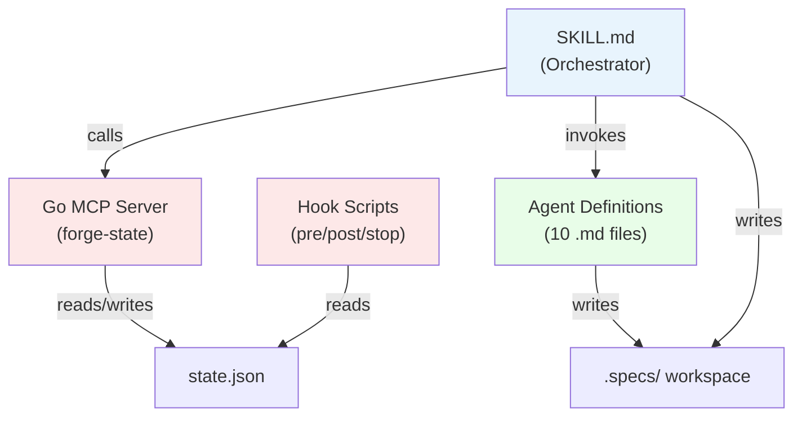

# Architecture Overview

claude-forge decomposes software development into isolated phases, each executed by a specialized subagent. The main agent acts as a thin orchestrator — routing work, presenting summaries, and managing state — while subagents handle all code reading and writing.

## Component Diagram



## How the Pieces Connect

```
SKILL.md (orchestrator)
  ├── calls mcp__forge-state__* MCP tools for state transitions
  ├── invokes agents/ by name via Agent tool
  └── hooks/ enforce constraints automatically
       ├── pre-tool-hook.sh  → blocks writes in Phase 1-2,
       │                        blocks git commit in parallel Phase 5,
       │                        blocks checkout to main/master
       ├── post-agent-hook.sh → warns on bad agent output
       ├── post-bash-hook.sh  → auto-commits summary.md + state.json (v1 legacy; v2 uses Engine exec action)
       └── stop-hook.sh       → blocks premature stop
```

## Responsibility Matrix

| Responsibility | Owner |
|---------------|-------|
| Phase sequencing & control flow | SKILL.md (orchestrator) |
| State transitions | Go MCP server (`mcp__forge-state__*` tools) |
| Constraint enforcement | Hook scripts (automatic) |
| Domain expertise (analysis, design, code) | Agent .md files |
| Runtime parameters | Orchestrator → Agent prompt |
