## Pipeline flow

```mermaid
flowchart TD
    START(["▶ /forge &lt;input&gt;"])

    %% ── Initialisation ──
    START --> PARSE["🛡️ Input parsing &<br>resume detection"]
    PARSE --> ISRESUME{Resume?}
    ISRESUME -->|yes| RESUME(("Resume at<br>current phase"))
    ISRESUME -->|no| VALID{Input valid?}
    VALID -->|no| REJECT(["❌ Reject — show error"])
    VALID -->|yes| DETECT["🔍 Effort auto-detection<br>& branch state check"]
    DETECT --> ASK{{"👤 Confirm all at once:<br>1. Effort S / M / L<br>2. Branch: new or current<br>3. Workspace slug"}}
    ASK --> INIT["📂 Workspace init<br>state.json + request.md"]
    INIT --> BRANCH["🌿 Create feature branch"]

    %% ── Analysis & Design ──
    BRANCH --> P1
    RESUME -.-> P1
    P1["🔍 Phase 1 — Situation Analysis<br><i>situation-analyst → analysis.md</i>"]
    P1 --> P2
    P2["🔍 Phase 2 — Investigation<br><i>investigator → investigation.md</i>"]
    P2 --> P3

    P3["📐 Phase 3 — Design<br><i>architect → design.md</i>"]
    P3 --> P3R
    P3R["🔎 Phase 3b — Design Review<br><i>design-reviewer → review-design.md</i>"]
    P3R --> DREV{APPROVE?}
    DREV -->|REVISE| P3
    DREV -->|APPROVE| CPA

    CPA{{"👤🔊 Checkpoint A<br>Human reviews design"}}
    CPA -->|approved| P4
    CPA -->|rejected| P3

    %% ── Task Planning ──
    P4["📋 Phase 4 — Task Decomposition<br><i>task-decomposer → tasks.md</i>"]
    P4 --> P4R
    P4R["🔎 Phase 4b — Tasks Review<br><i>task-reviewer → review-tasks.md</i>"]
    P4R --> TREV{APPROVE?}
    TREV -->|REVISE| P4
    TREV -->|APPROVE| CPB

    CPB{{"👤🔊 Checkpoint B<br>Human reviews tasks"}}
    CPB -->|approved| P5
    CPB -->|rejected| P4

    %% ── Implementation ──
    subgraph loop ["🔄 Repeat for each task"]
        P5["⚙️ Phase 5 — Implementation<br><i>implementer → impl-N.md</i>"]
        P5 --> P6
        P6["🔎 Phase 6 — Code Review<br><i>impl-reviewer → review-N.md</i>"]
        P6 --> RESULT{PASS?}
        RESULT -->|"FAIL (≤2 retries)"| P5
    end
    RESULT -->|all PASS| P7

    %% ── Finalisation ──
    P7["🔬 Phase 7 — Comprehensive Review<br><i>comprehensive-reviewer → comprehensive-review.md</i>"]
    P7 --> FV

    FV["✅ Final Verification<br><i>verifier → final-verification.md</i>"]
    FV --> PR["🚀 PR Creation<br>git push · gh pr create"]
    PR --> FS["📝 Final Summary<br><i>verifier → summary.md<br>(includes PR # + Improvement Report)</i>"]
    FS --> FC["🔒 Final Commit<br>amend + force-push<br>(summary.md → PR branch)"]
    FC --> POST{"Source type?"}
    POST -->|GitHub Issue| GH["💬 Post to GitHub Issue"]
    POST -->|Jira Issue| JIRA["💬 Post to Jira Issue"]
    POST -->|Plain text| DONE(["✔🔊 Done"])
    GH --> DONE
    JIRA --> DONE
```

> **Effort level** determines which phases are skipped: Phase 4b and Checkpoint B are skipped for S and M; Phase 7 is additionally skipped for S. See [Effort Levels](#effort-levels-and-skipped-phases) for details.
>
> **Branch creation** happens immediately after workspace init — before any analysis phase begins. The branch name is derived from the workspace slug confirmed by the user.

---
