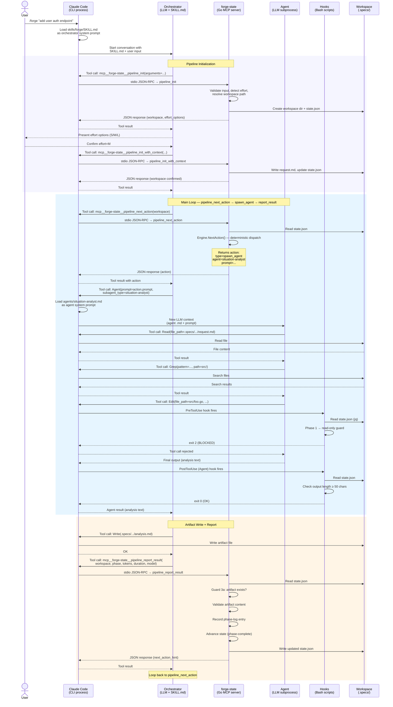

# Runtime Processing Flow

The following diagram shows how the seven runtime components interact during a single pipeline phase. This is the lower-level view that complements the phase-level [Pipeline Sequence](pipeline-sequence.md).

## Components

| Component | Runtime form | Role |
|-----------|-------------|------|
| **User** | Human at terminal | Invokes `/forge`, reviews checkpoints |
| **Claude Code** | CLI process (`claude`) | Hosts the conversation, dispatches hooks, manages tool permissions |
| **Orchestrator (LLM)** | Claude LLM loaded with `SKILL.md` as system prompt | Thin control loop: calls MCP tools, spawns agents, presents results |
| **forge-state (MCP)** | Go binary (`forge-state-mcp`) running as stdio child process | State machine + orchestration engine. All 47 tools registered here |
| **Agent (LLM)** | Subagent spawned via `Agent` tool (separate LLM context) | Domain expert (analysis, design, implementation, review) |
| **Hooks** | Bash scripts triggered by Claude Code hook system | Deterministic guardrails (pre-tool, post-tool, stop) |
| **Workspace (.specs/)** | Files on disk | Artifact storage, `state.json`, all pipeline outputs |

## Processing Flow — Single Phase



## Key Observations

1. **SKILL.md is not code — it is an LLM system prompt.** Claude Code loads it as the orchestrator's instructions. The LLM follows it non-deterministically (hence the need for hook/guard enforcement).

2. **MCP server communicates via stdio JSON-RPC.** Claude Code spawns `forge-state-mcp` as a child process. All `mcp__forge-state__*` tool calls are routed through this channel.

3. **Agents are separate LLM contexts.** Each `Agent` tool call creates a new Claude LLM subprocess with its own agent `.md` as the system prompt. The agent has no access to the orchestrator's conversation history.

4. **Hooks fire synchronously on tool calls.** Claude Code invokes hook scripts before/after specific tool types. Hooks read `state.json` from disk — they share state with the MCP server but through the filesystem, not direct communication.

5. **The Engine (`orchestrator/engine.go`) is the brain.** `pipeline_next_action` calls `Engine.NextAction()` which makes all dispatch decisions deterministically from `state.json`. The LLM orchestrator merely executes the returned action — it does not choose what to do next.

6. **Three control planes coexist:**
   - **MCP handlers + Engine** → state transitions, action dispatch (deterministic)
   - **Hooks** → tool-call guardrails (deterministic, fail-open)
   - **SKILL.md** → orchestration protocol (non-deterministic, LLM-interpreted)

## MCP Pipeline Tool — Use-Case Mapping

The four `pipeline_*` MCP tools drive the entire pipeline lifecycle. Each tool name maps to a concrete use case that the orchestrator (SKILL.md) performs:

| MCP Tool | Use Case | What Happens |
|---|---|---|
| `pipeline_init` | **Input parsing & resume detection** | Parse `/forge <input>`, detect source type (GitHub/Jira/text), check `.specs/` for existing workspace to resume, validate input. Returns workspace path, flags, and whether external data fetch is needed. |
| `pipeline_init_with_context` (1st call) | **External data fetch & effort detection** | Fetch GitHub/Jira context if needed. Auto-detect effort level (S/M/L) from task scope. Detect current branch state. Returns effort options and branch info for user confirmation. |
| `pipeline_init_with_context` (2nd call) | **Workspace finalisation & state init** | Receive user's confirmed effort, branch decision, and workspace slug. Create workspace directory, write `request.md` and `state.json`. Record branch setting. After this call, the workspace is ready and the branch is created. |
| `pipeline_next_action` | **Next action dispatch** | Read current `state.json`, run `Engine.NextAction()` to deterministically select the next action (spawn_agent, checkpoint, exec, write_file, or done). Enrich agent prompts with 4-layer assembly. |
| `pipeline_report_result` | **Phase result recording & state transition** | Record phase-log entry, validate artifact exists and meets content constraints, parse review verdicts (APPROVE/REVISE/PASS/FAIL), advance pipeline state to next phase. |

## Ideal Initialisation Flow

The initialisation flow is designed to minimise user interruptions by batching all confirmation questions into a single prompt:

```
/forge <input>
    │
    ▼
pipeline_init ─── Input parsing & resume detection
    │                (validate input, detect source type, check for resume)
    │
    ▼
pipeline_init_with_context (1st) ─── External data fetch & effort detection
    │                                  (fetch GitHub/Jira data, auto-detect effort)
    │
    ▼
👤 Single user prompt:
    ├── Effort level: S / M / L
    ├── Branch: create new / use current
    └── Workspace slug confirmation
    │
    ▼
pipeline_init_with_context (2nd) ─── Workspace finalisation & state init
    │                                  (write state.json + request.md,
    │                                   return branch name + create_branch flag)
    │
    ▼
Orchestrator: git checkout -b <branch>  (if create_branch is true)
    │
    ▼
pipeline_next_action loop begins (Phase 1)
```

**Branch creation timing:** `pipeline_init_with_context` (2nd call) derives the branch name deterministically and returns it with `create_branch: true`. The orchestrator (SKILL.md) then runs `git checkout -b` immediately — not deferred to Phase 5. This ensures all subsequent phases operate on the feature branch from the start.
