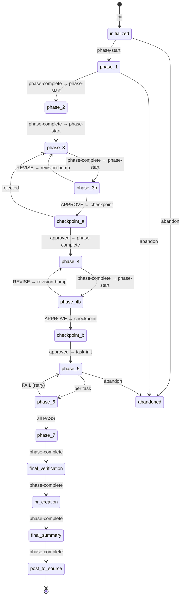

# State Management

## Overview

All pipeline state is managed through the **Go MCP server** (`forge-state`), which exposes 47 typed tool calls. State is persisted in `state.json` within the workspace directory.

## State Machine

## state.json Structure

Key fields in `state.json`:

| Field | Description |
| --- | --- |
| `specName` | Workspace name (e.g., `20260320-fix-auth`) |
| `workspace` | Full path to `.specs/{specName}/` |
| `status` | Current status: `initialized`, `in_progress`, `completed`, `failed`, `abandoned` |
| `currentPhase` | Active phase ID (e.g., `phase-3`, `checkpoint-a`) |
| `effort` | Effort level: `S`, `M`, `L` (XS is not supported) |
| `flowTemplate` | Selected template: `light`, `standard`, `full` |
| `branch` | Git branch name |
| `autoApprove` | Boolean; set via `--auto` flag (defaults to `false`) |
| `phases` | Array of phase records (status, timestamps, logs) |
| `tasks` | Array of task records (impl/review status) |
| `revisions` | Revision counters per artifact |
| `skippedPhases` | Phases skipped by flow template (e.g., `["phase-4b", "checkpoint-b", "phase-7"]` for effort S) |
| `phaseLog` | Array of phase metrics: `{phase, tokens, duration_ms, model, timestamp}` |

## MCP Tool Categories

The Go MCP server exposes **47 typed tool calls** across 8 categories:

| Category | Tools | Description |
| --- | --- | --- |
| Lifecycle | 5 | Pipeline initialization and advancement (`init`, `pipeline_init`, `pipeline_next_action`, etc.) |
| Phase Management | 6 | Phase transitions (`phase_start`, `phase_complete`, `checkpoint`, `abandon`, etc.) |
| Revision Control | 4 | APPROVE/REVISE cycle management (`revision_bump`, `inline_revision_bump`, etc.) |
| Configuration | 7 | Runtime settings (`set_effort`, `set_auto_approve`, `set_branch`, etc.) |
| Task Management | 2 | Per-task tracking (`task_init`, `task_update`) |
| Metrics & Query | 9 | State queries, history search, BM25 pattern matching |
| Analytics | 3 | Pipeline statistics and cost predictions |
| Validation & Utility | 8 | Input/artifact validation, AST analysis, dependency graphs |

For the complete tool reference with descriptions, see [MCP Tools](/reference/mcp-tools).

### MCP Handler Guards

The MCP server enforces these guards deterministically (not via hooks):

| Guard | Tool | Condition |
|-------|------|-----------|
| Artifact required | `phase_complete` | Blocks if expected artifact file is missing |
| Checkpoint required | `phase_complete` | Blocks unless `awaiting_human` status set |
| Phase ordering | `phase_start` | Blocks if previous phase not completed |
