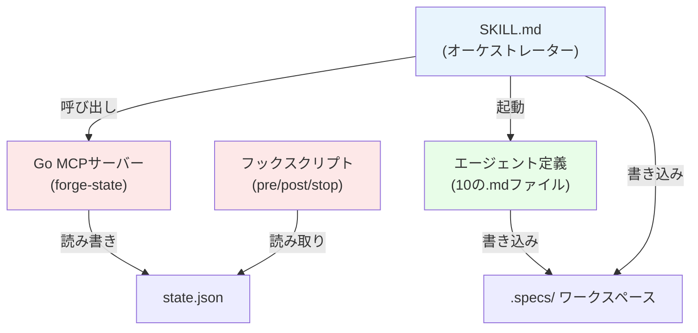

claude-forge はソフトウェア開発を隔離されたフェーズに分解し、各フェーズを専門のサブエージェントが実行します。メインエージェントは薄いオーケストレーターとして機能し — 作業のルーティング、サマリーの提示、状態の管理を行い — サブエージェントがすべてのコード読み書きを担当します。

## コンポーネント図



## コンポーネントの接続

```
SKILL.md (オーケストレーター)
  ├── mcp__forge-state__* MCPツールで状態遷移を呼び出し
  ├── Agent ツールでエージェントを名前で起動
  └── hooks/ が自動的に制約を強制
       ├── pre-tool-hook.sh  → Phase 1-2で書き込みブロック、
       │                        並列Phase 5でgit commitブロック、
       │                        main/masterへのcheckoutブロック
       ├── post-agent-hook.sh → 不正なエージェント出力を警告
       ├── post-bash-hook.sh  → summary.md + state.jsonの自動コミット（v1レガシー; v2はEngine execアクションを使用）
       └── stop-hook.sh       → 途中終了を防止
```

## 責任マトリクス

| 責任 | オーナー |
|------|---------|
| フェーズの順序制御とフロー | SKILL.md（オーケストレーター） |
| 状態遷移 | Go MCPサーバー（`mcp__forge-state__*` ツール） |
| 制約の強制 | フックスクリプト（自動） |
| ドメイン専門知識（分析、設計、コード） | Agent .md ファイル |
| ランタイムパラメータ | オーケストレーター → エージェントプロンプト |

## ディレクトリ構造
