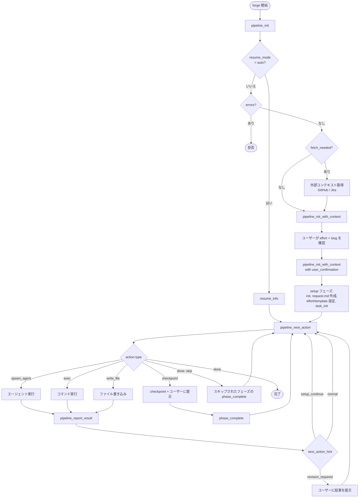
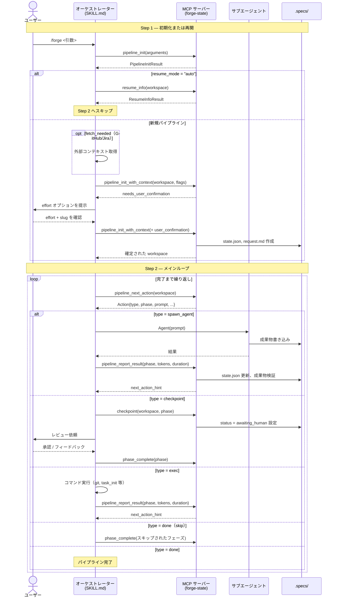
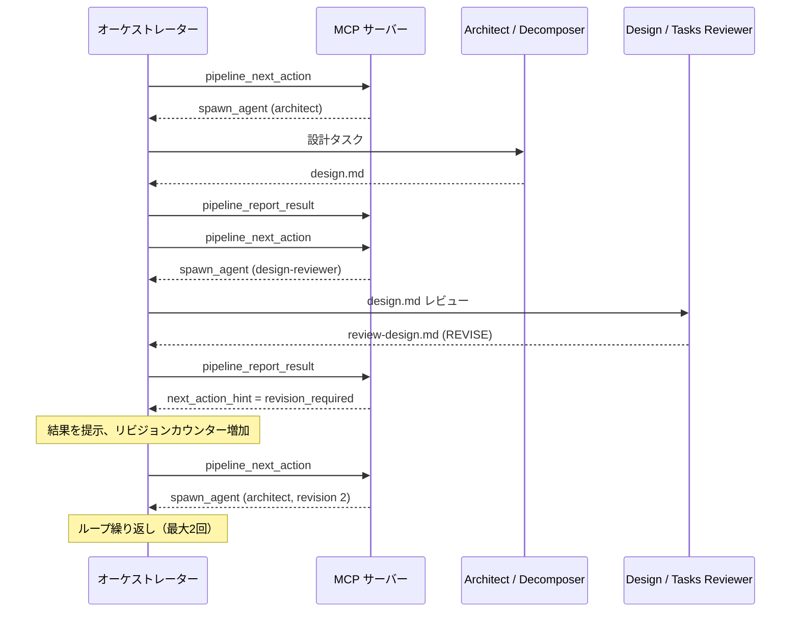
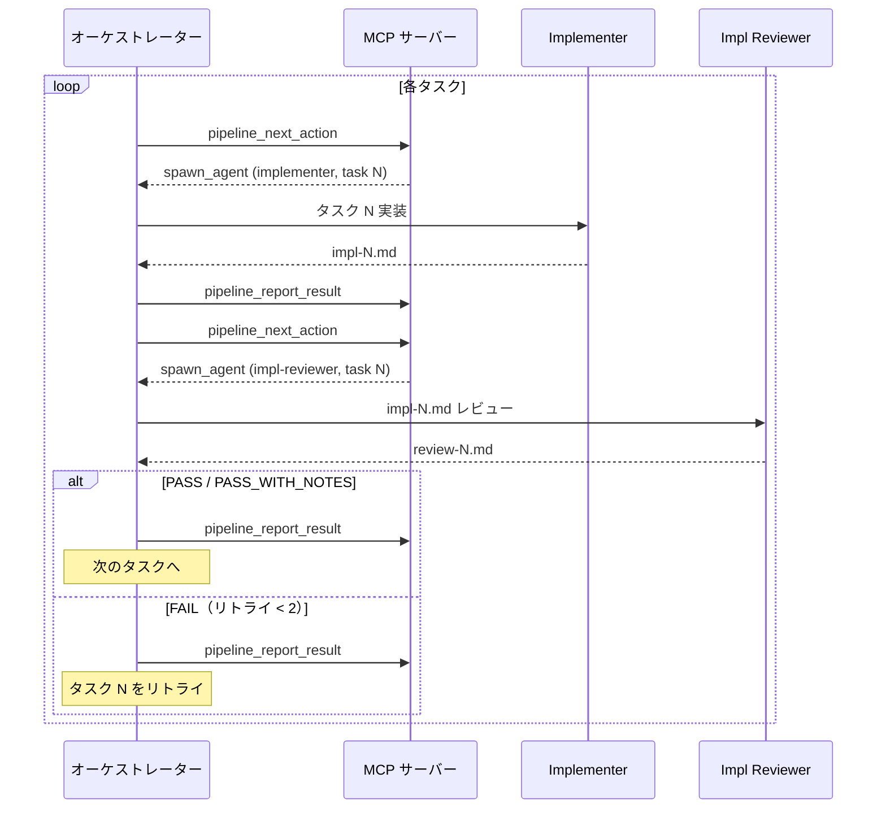

## 概要図

## フェーズテーブル

実行順の18フェーズ。effort レベル（フローテンプレート）に応じてスキップされるフェーズあり。

| # | フェーズ ID | 説明 | アクター | 成果物 |
|---|----------|-------------|-------|----------|
| 1 | `setup` | ワークスペース初期化、request.md 作成、effort 検出、テンプレート設定 | オーケストレーター | request.md, state.json |
| 2 | `phase-1` | 状況分析 — 読み取り専用のコードベースマッピング | situation-analyst | analysis.md |
| 3 | `phase-2` | 調査 — 詳細調査、エッジケース | investigator | investigation.md |
| 4 | `phase-3` | 設計 — アーキテクチャとアプローチ | architect | design.md |
| 5 | `phase-3b` | 設計レビュー — AI 品質ゲート | design-reviewer | review-design.md |
| 6 | `checkpoint-a` | 設計の人間によるレビュー | ユーザー | 承認 / 修正 |
| 7 | `phase-4` | タスク分解 — 番号付きタスクリスト | task-decomposer | tasks.md |
| 8 | `phase-4b` | タスクレビュー — AI 品質ゲート | task-reviewer | review-tasks.md |
| 9 | `checkpoint-b` | タスクの人間によるレビュー | ユーザー | 承認 / 修正 |
| 10 | `phase-5` | 実装 — タスクごとの TDD（逐次または並列） | implementer | impl-N.md |
| 11 | `phase-6` | コードレビュー — タスクごと、最大2回リトライ | impl-reviewer | review-N.md |
| 12 | `phase-7` | 包括的レビュー — 横断的な懸念事項 | comprehensive-reviewer | comprehensive-review.md |
| 13 | `final-verification` | フルビルド + テストスイート検証 | verifier | final-verification.md |
| 14 | `pr-creation` | `gh pr create` による PR 作成（summary.md は未生成） | オーケストレーター | PR URL |
| 15 | `final-summary` | PR 番号・実行統計・改善レポートを含む summary.md 生成 | オーケストレーター | summary.md |
| 16 | `final-commit` | PR body を summary.md で更新 + 最終コミット amend + force-push | オーケストレーター | — |
| 17 | `post-to-source` | GitHub/Jira Issue にサマリーを投稿 | オーケストレーター | Issue コメント |
| 18 | `completed` | パイプライン完了 | — | — |

## Effort レベルとスキップされるフェーズ

| Effort | フローテンプレート | スキップされるフェーズ |
|--------|---------------|----------------|
| S | light | phase-4b（タスクレビュー）、checkpoint-b（タスクチェックポイント）、phase-7（包括的レビュー） |
| M | standard | phase-4b（タスクレビュー）、checkpoint-b（タスクチェックポイント） |
| L | full | _（なし）_ |

## シーケンス図 — オーケストレーター / MCP サーバー間のやり取り

## リビジョンループの詳細

設計（phase-3/3b）とタスク（phase-4/4b）フェーズでは、AI レビュワーが REVISE 判定を返した場合にリビジョンループが発生します。ループあたり最大2回のリビジョン。

## 実装ループの詳細

各タスクは実装（phase-5）とコードレビュー（phase-6）を経ます。
レビュー失敗時は最大2回リトライ。

