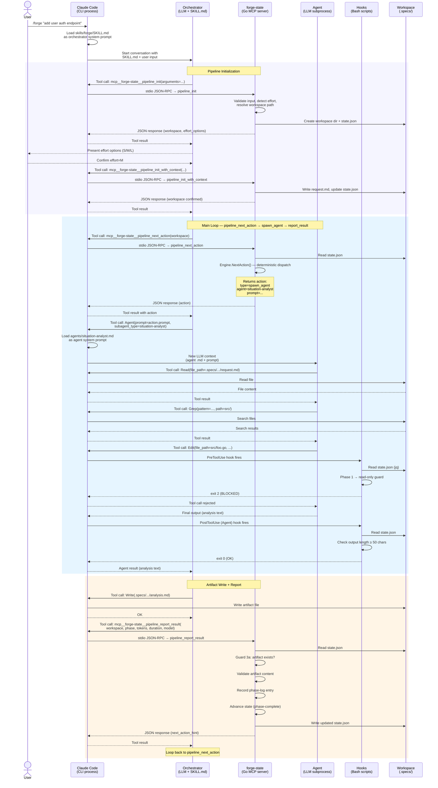

以下の図は、7つのランタイムコンポーネントが単一のパイプラインフェーズ中にどのように相互作用するかを示しています。これは、フェーズレベルの[パイプラインシーケンス](pipeline-sequence)を補完する低レベルビューです。

## コンポーネント

| コンポーネント | ランタイム形態 | 役割 |
|-----------|-------------|------|
| **ユーザー** | ターミナルの人間 | `/forge` を起動し、チェックポイントをレビューする |
| **Claude Code** | CLIプロセス（`claude`） | 会話をホストし、フックをディスパッチし、ツールのパーミッションを管理する |
| **オーケストレーター（LLM）** | `SKILL.md` をシステムプロンプトとして読み込んだ Claude LLM | 薄い制御ループ：MCPツールを呼び出し、エージェントを起動し、結果を提示する |
| **forge-state（MCP）** | stdio子プロセスとして起動する Go バイナリ（`forge-state-mcp`） | ステートマシン＋オーケストレーションエンジン。44のツールがここに登録されている |
| **エージェント（LLM）** | `Agent` ツールで起動されるサブエージェント（独立した LLM コンテキスト） | ドメインエキスパート（分析、設計、実装、レビュー） |
| **フック** | Claude Code フックシステムによって起動される Bash スクリプト | 決定的なガードレール（pre-tool、post-tool、stop） |
| **ワークスペース（.specs/）** | ディスク上のファイル | アーティファクトストレージ、`state.json`、すべてのパイプライン出力 |

## 処理フロー — 単一フェーズ



## 主要な観察事項

1. **SKILL.md はコードではなく、LLM のシステムプロンプトです。** Claude Code はこれをオーケストレーターの指示として読み込みます。LLM は非決定的にこれに従います（そのためフック/ガードによる強制が必要です）。

2. **MCP サーバーは stdio JSON-RPC で通信します。** Claude Code は `forge-state-mcp` を子プロセスとして起動します。すべての `mcp__forge-state__*` ツール呼び出しはこのチャネルを通じてルーティングされます。

3. **エージェントは独立した LLM コンテキストです。** 各 `Agent` ツール呼び出しは、エージェントの `.md` をシステムプロンプトとした新しい Claude LLM サブプロセスを作成します。エージェントはオーケストレーターの会話履歴にアクセスできません。

4. **フックはツール呼び出し時に同期的に発火します。** Claude Code は特定のツール種別の前後にフックスクリプトを呼び出します。フックはディスクの `state.json` を読み取ります — MCP サーバーとファイルシステム経由で状態を共有しますが、直接通信はしません。

5. **エンジン（`orchestrator/engine.go`）が頭脳です。** `pipeline_next_action` は `Engine.NextAction()` を呼び出し、`state.json` から決定的にすべてのディスパッチ判断を行います。LLM オーケストレーターは返されたアクションを実行するだけで、次に何をするかを自ら選択しません。

6. **3つの制御プレーンが共存します：**
   - **MCP ハンドラー＋エンジン** → 状態遷移、アクションディスパッチ（決定的）
   - **フック** → ツール呼び出しガードレール（決定的、フェイルオープン）
   - **SKILL.md** → オーケストレーションプロトコル（非決定的、LLM が解釈）

## MCP パイプラインツール — ユースケースマッピング

4つの `pipeline_*` MCP ツールがパイプラインのライフサイクル全体を駆動します。各ツール名は、オーケストレーター（SKILL.md）が実行する具体的なユースケースに対応しています：

| MCP ツール | ユースケース | 何が起きるか |
|---|---|---|
| `pipeline_init` | **入力解析＆再開検出** | `/forge <input>` を解析し、ソースタイプ（GitHub/Jira/テキスト）を検出し、再開する既存ワークスペースの `.specs/` を確認し、入力を検証する。ワークスペースパス、フラグ、外部データフェッチが必要かどうかを返す。 |
| `pipeline_init_with_context`（1回目） | **外部データフェッチ＆工数検出** | 必要に応じて GitHub/Jira コンテキストをフェッチする。タスクのスコープから工数レベル（S/M/L）を自動検出する。現在のブランチ状態を検出する。ユーザー確認用の工数オプションとブランチ情報を返す。 |
| `pipeline_init_with_context`（2回目） | **ワークスペース確定＆状態初期化** | ユーザーが確認した工数、ブランチ決定、ワークスペーススラッグを受け取る。ワークスペースディレクトリを作成し、`request.md` と `state.json` を書き込む。ブランチ設定を記録する。この呼び出し後、ワークスペースは準備完了でブランチが作成されている。 |
| `pipeline_next_action` | **次のアクションディスパッチ** | 現在の `state.json` を読み取り、`Engine.NextAction()` を実行して次のアクション（spawn_agent、checkpoint、exec、write_file、または done）を決定的に選択する。4層アセンブリでエージェントプロンプトを充実させる。 |
| `pipeline_report_result` | **フェーズ結果記録＆状態遷移** | フェーズログエントリを記録し、アーティファクトが存在してコンテンツ制約を満たしているか検証し、レビュー判定（APPROVE/REVISE/PASS/FAIL）を解析し、パイプライン状態を次のフェーズに進める。 |

## 理想的な初期化フロー

初期化フローは、すべての確認質問を1つのプロンプトにまとめることで、ユーザーへの割り込みを最小限に抑えるよう設計されています：

```
/forge <input>
    │
    ▼
pipeline_init ─── 入力解析＆再開検出
    │                (入力の検証、ソースタイプの検出、再開確認)
    │
    ▼
pipeline_init_with_context (1回目) ─── 外部データフェッチ＆工数検出
    │                                   (GitHub/Jira データのフェッチ、工数の自動検出)
    │
    ▼
👤 単一のユーザープロンプト：
    ├── 工数レベル: S / M / L
    ├── ブランチ: 新規作成 / 現在のブランチを使用
    └── ワークスペーススラッグの確認
    │
    ▼
pipeline_init_with_context (2回目) ─── ワークスペース確定＆状態初期化
    │                                   (state.json + request.md を書き込み、
    │                                    ブランチ名 + create_branch フラグを返す)
    │
    ▼
Orchestrator: git checkout -b <branch>  (create_branch が true の場合)
    │
    ▼
pipeline_next_action ループ開始 (Phase 1)
```

**ブランチ作成のタイミング：** `pipeline_init_with_context`（2回目の呼び出し）はブランチ名を決定的に導出し、`create_branch: true` とともに返します。オーケストレーター（SKILL.md）はその後すぐに `git checkout -b` を実行します — Phase 5 まで延期されません。これにより、後続のすべてのフェーズが最初からフィーチャーブランチ上で動作することが保証されます。
